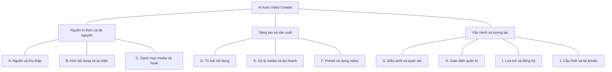

# AI Auto Video Creator - Bản đồ phân hệ

**Cập nhật giai đoạn kiến trúc:** [08-architecture.md](./08-architecture.md) và [ADR index](./adr/README.md) đã ánh xạ 10 phân hệ vào hybrid/monorepo theo ủy quyền kỹ thuật. Các câu chưa chọn repo/topology ở bản đồ dưới đây mô tả ranh giới của bước 08; quyền sở hữu A-J tiếp tục có hiệu lực, gồm F sở hữu preset và J sở hữu cấu hình.

**Giai đoạn:** 08 - Chia hệ thống thành các phân hệ  
**Ngày lập:** 12-09-2026  
**Trạng thái:** R21 đã duyệt 10 phân hệ logic A-J và phân công trách nhiệm; cập nhật phạm vi theo R01-R25  
**Kết luận đã duyệt:** 10 phân hệ logic A-J; D là phân hệ cốt lõi về nội dung sáng tạo  
**Căn cứ:** [Charter](./00-project-charter.md), [Đặc tả sản phẩm](./01-product-spec.md), [Bản đồ dữ liệu](./02-data-model.md), [Yêu cầu chất lượng](./03-quality-requirements.md), [Nghiên cứu năng lực](./05-technology-research.md) và đề xuất A-H mới nhất của người dùng.

## 1. Ý nghĩa và phạm vi

**Phân hệ là một khu vực chịu trách nhiệm về một nhóm công việc có liên quan.** Mỗi phân hệ có mục đích, dữ liệu thuộc trách nhiệm của mình, kết quả phải bàn giao và giới hạn rõ ràng.

Tài liệu trả lời: việc gì thuộc về ai, ai được quyết định thay đổi dữ liệu nào, các khu vực cần phối hợp ở đâu và có thể đánh giá riêng như thế nào.

| Khái niệm | Ý nghĩa trong bước này |
|---|---|
| Phân hệ | Ranh giới trách nhiệm logic, có thể gồm nhiều năng lực bên trong |
| Công đoạn | Một bước có thể chạy, quan sát và tạo lại; một phân hệ có thể cung cấp nhiều công đoạn |
| Chủ sở hữu dữ liệu | Phân hệ chịu trách nhiệm về ý nghĩa, tính hợp lệ và thay đổi chính thức của dữ liệu |
| Nơi lưu dữ liệu | Quyết định lưu vật lý; để bước kiến trúc đánh giá |
| Repo | Nơi tổ chức và quản lý phiên bản mã nguồn; chưa quyết định dùng chung hay riêng |
| Dịch vụ/tiến trình/máy chạy | Đơn vị thực thi và triển khai; chưa ánh xạ một-một với phân hệ |

Ranh giới đã được duyệt theo R21; phạm vi điều chỉnh bởi R01-R25 tại [07-data-flow.md](./07-data-flow.md), mục 2. Công nghệ, repo, API, hàng đợi và nơi chạy vẫn để bước sau; không suy ra mười dịch vụ từ mười phân hệ.

Việc người dùng chuyển sang bước 08 cho phép tiếp tục phân tích; không được hiểu là đã chọn tất cả công nghệ trong tài liệu 05. Đặc biệt, vai trò của Google Sheets trong lưu trữ vẫn để bước kiến trúc đánh giá theo lưu ý của người dùng.

## 2. Đối chiếu các điểm mới với phạm vi đã duyệt

| Điểm trong đề xuất A-H | Căn cứ đã có | Cách xử lý trong bản đồ này |
|---|---|---|
| A có bước “xác minh” | R01 | Chỉ kiểm tra dữ liệu và truy nguồn, không kiểm chứng đa nguồn bắt buộc |
| H có “sửa script” | R02 | Không sửa script trực tiếp; chỉ xem và tạo lại |
| H có “duyệt script” | R02 | Không có bước duyệt script |
| H có “thay prompt” | R16 | Cho sửa; job chưa bắt đầu script dùng bản mới, job đã bắt đầu giữ cấu hình cũ |
| UI thân thiện, tiếng Việt chuẩn | `FR-UI-*`, `QR-UX-*` | Giữ trách nhiệm trực tiếp tại H, đối chiếu các ngưỡng đã duyệt |
| Cấu hình API phù hợp SaaS | Charter chỉ yêu cầu chuẩn bị cho SaaS, chưa vận hành nhiều người dùng | Bổ sung khu vực J quản lý cấu hình/tài khoản/bí mật; mô hình khóa của nền tảng hay khóa khách hàng chưa chọn |
| E/F có subtitle | R03 | E tạo tiếng Anh/timing từng từ; F gắn karaoke bắt buộc vào video; sai số còn mở |
| C giữ bản gốc và bản đã xử lý | R13 | Giữ bản gốc/bản xử lý dùng lại được; voice/subtitle riêng có thể dọn khi xong, giữ lịch sử |

Bản đầu giữ các ý tưởng mới ở trạng thái mở. Lần cập nhật này áp dụng R01-R25 và đồng bộ tài liệu nguồn; chi tiết kỹ thuật còn thiếu không được biến thành yêu cầu đã duyệt.

## 3. Cơ sở nghiên cứu và so sánh cách chia

### 3.1. Nguyên tắc dùng để phân chia

Nhóm trách nhiệm theo công việc nghiệp vụ, dữ liệu cần bảo vệ và lý do thường phải thay đổi. Cách phân tích này phù hợp với hướng dẫn domain analysis của Microsoft: tìm năng lực nghiệp vụ và quan hệ trước khi chọn công nghệ. Đây là tham khảo phương pháp, không phải lựa chọn Azure hay microservices. [Nguồn chính thức](https://learn.microsoft.com/en-us/azure/architecture/microservices/model/domain-analysis).

C4 cũng phân biệt nhóm chức năng với cách đóng gói và đơn vị triển khai. Bản đồ hiện tại chỉ dùng ý tưởng tách các loại ranh giới; chưa tự gọi mỗi phân hệ là một C4 component hoặc container. [Nguồn C4](https://c4model.com/abstractions/component).

Áp dụng vào dự án:

- Một kết quả chính thức có một chủ sở hữu nghiệp vụ, dù nhiều phân hệ tham gia tạo nó.
- Công việc có vòng đời hoặc điều kiện thất bại riêng được ghi rõ để có thể kiểm tra độc lập.
- Các trách nhiệm cần thay đổi cùng nhau được nhóm lại; phần chỉ dùng chung một thư viện không mặc nhiên phải thuộc cùng phân hệ.
- Phần AI có trách nhiệm về quyết định nội dung; việc dùng AI trong TTS hoặc nhận diện ảnh không tự động chuyển trách nhiệm đó sang D.
- Lưu byte của tệp, quản lý danh tính tài nguyên và quyết định dùng tài nguyên là ba công việc khác nhau.

### 3.2. Ba phương án đã đánh giá

| Phương án | Cách chia | Ưu điểm | Điểm yếu và rủi ro phối hợp | Công sức dự kiến |
|---|---|---|---|---|
| P1: 8 phân hệ | Giữ A-H; ghép lưu trữ vào C/F, cấu hình và bí mật vào G/H | Gần bản đề xuất ban đầu, ít tên gọi, dễ bắt đầu mô tả | C/F dễ cùng quyết định xóa tệp; H/G dễ cùng giữ khóa và cấu hình; G có nguy cơ ôm quá nhiều trách nhiệm | Ít hồ sơ hơn nhưng phải xử lý nhiều ngoại lệ ở ranh giới |
| P2: 10 phân hệ | Giữ A-H, thêm I lưu trữ/vòng đời tệp và J cấu hình/tài khoản/bí mật | Tách rõ các trách nhiệm ảnh hưởng phục hồi, đồng bộ và SaaS; giữ TTS và ảnh trong E với các nhóm nội bộ | Cần mô tả kỹ C-I và G-J; D vẫn cần được chia thành nhóm nhiệm vụ nội bộ | Thêm hai hồ sơ, đổi lại dễ phân công kiểm thử và bảo trì |
| P3: 13 phân hệ | Từ P2, tách âm thanh khỏi E, chất lượng nội dung khỏi D, quan sát vận hành khỏi G | Chuyên môn hóa mạnh, phù hợp khi các nhóm có quy trình hoặc chủ sở hữu độc lập | Nhiều điểm bàn giao khi script/voice thay đổi; dễ tạo các nhóm quá nhỏ ở quy mô một người dùng | Nhiều hợp đồng, tài liệu và phối hợp hơn; lợi ích hiện tại chưa rõ |

Thang điểm 1-10, cao hơn là phù hợp hơn. Trọng số được điều chỉnh cho **phân chia trách nhiệm**: đúng/đủ năng lực 25%, ít rủi ro tích hợp 20%, dễ hiện thực hóa 10%, ảnh hưởng hiệu năng 5%, rõ trách nhiệm vận hành 10%, bảo trì 15%, tiết kiệm công sức 10%, dễ kiểm chứng 5%. Hiệu năng đều chấm trung tính vì chưa có topology hoặc benchmark; số phân hệ không quyết định tốc độ hay hóa đơn cloud.

| Tiêu chí | Trọng số | P1: 8 | P2: 10 | P3: 13 |
|---|---:|---:|---:|---:|
| Đúng và đủ năng lực | 25% | 7 | 9 | 9 |
| Ít rủi ro tích hợp | 20% | 6 | 8 | 6 |
| Dễ hiện thực hóa | 10% | 9 | 8 | 6 |
| Ảnh hưởng hiệu năng | 5% | 5 | 5 | 5 |
| Rõ trách nhiệm vận hành | 10% | 7 | 9 | 8 |
| Khả năng bảo trì | 15% | 6 | 9 | 8 |
| Tiết kiệm công sức | 10% | 9 | 8 | 5 |
| Dễ kiểm chứng | 5% | 8 | 9 | 7 |
| **Tổng có trọng số** | **100%** | **7,00** | **8,40** | **7,15** |

Điểm số là đánh giá kỹ thuật của người lập tài liệu, không phải kết quả thực nghiệm hay xác suất thành công. **Đề nghị chọn P2.** Hai trách nhiệm bổ sung I/J đã tồn tại trong sản phẩm; việc tách chúng không bổ sung một sản phẩm lưu trữ hoặc SaaS mới.

### 3.3. Vì sao chưa tách thêm

- **TTS:** có công đoạn và phép đo riêng trong E; chưa cần một phân hệ cấp cao chỉ vì dùng model khác.
- **Xử lý ảnh nhạy cảm:** thuộc E, có kết quả đánh giá riêng; chưa cần một hệ kiểm duyệt clip hoặc một phân hệ compliance.
- **Chất lượng:** mỗi phân hệ kiểm tra kết quả của mình; G tổng hợp điều kiện hoàn thành. Tách thành một phân hệ duyệt mọi thứ có thể làm mờ trách nhiệm chất lượng gốc.
- **Monitoring:** G chịu trách nhiệm tập hợp nhật ký và tiến độ; các phân hệ phát sinh bằng chứng lỗi. Một công cụ giám sát riêng sau này không tự tạo thêm phân hệ nghiệp vụ.
- **AI gateway:** J quản lý quyền dùng tài khoản và giới hạn; D/E chịu trách nhiệm tác vụ AI. Việc có cần gateway riêng thuộc kiến trúc.
- **SaaS:** hiện cần chỗ quản lý cấu hình và bí mật rõ ràng, chưa có yêu cầu đủ cụ thể để lập phân hệ khách hàng/thanh toán/thuê bao.

## 4. Danh sách 10 phân hệ

| Mã | Tên phân hệ | Câu hỏi phân hệ phải trả lời | Kết quả cốt lõi |
|---|---|---|---|
| A | Nguồn và thu thập nội dung | Lấy được gì, từ đâu, khi nào, có lỗi thu thập gì? | Gói bài/media phát hiện cùng xuất xứ và báo cáo lượt quét |
| B | Kho nội dung và tri thức sự kiện | Hệ thống đang biết gì về bài, sự kiện, nhân vật và diễn biến? | Bài/phiên bản và hồ sơ sự kiện có thể truy xuất |
| C | Danh mục media và hook | Có tài nguyên nào, nội dung gì, thuộc phiên bản nào, dùng trong ngữ cảnh nào? | Danh mục và chỉ mục tài nguyên có nguồn gốc |
| D | Trí tuệ nội dung và kế hoạch sáng tạo | Nên kể điều gì, theo góc nào, dùng gì để kể và vì sao? | Kịch bản, hook selection, kế hoạch nội dung và lịch sử biến thể |
| E | Phân tích và xử lý media, âm thanh | Làm thế nào để tài nguyên và lời đọc sẵn sàng cho dựng? | Tệp đã xử lý, voice, timing và kết quả phân tích |
| F | Preset, dựng video và kiểm tra đầu ra | Làm thế nào để biến phương án thành video đúng yêu cầu? | Video render, preset có phiên bản và báo cáo kiểm tra |
| G | Điều phối công việc và quan sát vận hành | Công việc đang ở đâu, bước nào được chạy, bước nào cần tiếp tục? | Lô, job, lịch, tiến độ, lịch sử lần chạy và log |
| H | Giao diện quản trị | Người dùng xem, cấu hình và ra lệnh bằng cách nào? | Trải nghiệm quản trị tiếng Việt và thao tác debug |
| I | Lưu trữ, đồng bộ và vòng đời tệp | Byte của tệp đang ở đâu, đã lưu chắc chưa, khi nào được dọn? | Tệp sẵn sàng, xác nhận đồng bộ và kết quả dọn tệp |
| J | Cấu hình, tài khoản dịch vụ và bí mật | Đang dùng cấu hình/tài khoản nào, cho vai trò nào, với giới hạn nào? | Cấu hình có phiên bản, tham chiếu bí mật và tình trạng dịch vụ |

### Sơ đồ phân nhóm trách nhiệm

Đây là sơ đồ **thành phần trách nhiệm**, không biểu diễn thứ tự gọi API, đường truyền dữ liệu hoặc vị trí triển khai.

Ba nhóm trên chỉ giúp đọc bản đồ, không phải ba phân hệ bổ sung.

## 5. Hồ sơ trách nhiệm từng phân hệ

### A. Nguồn và thu thập nội dung

**Mục đích:** cung cấp dữ liệu đầu vào có thể truy vết, duy trì khả năng thích ứng khi nguồn đổi cách xuất bản.

**Công việc thuộc A:**

- Quản lý nguồn trực tiếp từ H, bỏ tệp text; nguồn bị xóa ngừng thu thập và bị chặn tự thêm lại tới khi khôi phục, dữ liệu cũ vẫn dùng (R15/R24).
- Tự phát hiện nguồn; quản lý Tier, loại nguồn, tình trạng truy cập và phạm vi chủ đề theo chính sách được duyệt.
- Đọc RSS, trích xuất bài báo và ghi nhận nội dung/ảnh/clip từ bài hoặc trang chính thức của nhân vật.
- Chuẩn hóa URL, thời điểm, văn bản và thông tin xuất xứ; phân biệt thời điểm nguồn đăng với lúc thu thập.
- Nhận biết việc tải lại cùng đầu vào để hạn chế xử lý thừa; gửi dấu hiệu trùng hoặc thay đổi cho B quyết định danh tính bài/phiên bản.
- Kiểm tra lỗi lấy dữ liệu: trang trống, nội dung thiếu, metadata mâu thuẫn hoặc tài nguyên không truy cập được; ghi rõ phần chưa biết.
- Nhận yêu cầu tìm bổ sung tài nguyên cho câu chuyện; cung cấp ứng viên mới cho C và kết quả thu thập cho B.

**Nhận:** danh sách/chính sách nguồn, yêu cầu thu thập hoặc làm giàu từ G, cấu hình và quyền truy cập từ J, dấu vết lần trước từ B/C khi cần.

**Trả:** nội dung đã chuẩn hóa kèm nguồn gốc; ứng viên ảnh/clip; dấu hiệu nguồn sửa bài; báo cáo `CollectionRun`. B sở hữu bài đã nhập; C sở hữu tài nguyên đã đăng ký. Tệp tải được bàn giao I quản lý vị trí/vòng đời, không phát sinh cơ chế sync dài hạn riêng trong A.

**Sở hữu:** `Source`, `CollectionRun`. G điều phối thời điểm chạy và retry; A báo kết quả nghiệp vụ của lượt quét. `last_collection_at` thuộc A; lịch và tiến độ thực thi liên nguồn thuộc G.

**Giới hạn:** không gộp sự kiện, viết kịch bản hoặc chọn video render tiếp; chỉ kiểm tra dữ liệu/truy nguồn (R01). Mở rộng Tier khi chưa đủ tin mới theo chủ đề/ngày (R04/R23); làm giàu theo job được chạy ngoài lượt định kỳ (R05).

**Quan sát/kiểm tra riêng:** H cho chạy lại lượt thu thập của một nguồn; xem dữ liệu lấy được, lỗi, số bài mới/sửa. Kiểm tra một nguồn hỏng không làm mất kết quả của nguồn khác và quét lại không sinh bài trùng vô hạn. Liên quan `QR-REL-002`, `QR-AVL-001`, `QR-AVL-003`.

### B. Kho nội dung và tri thức sự kiện

**Mục đích:** giữ kiến thức có nguồn của sản phẩm trong nhiều năm, đủ để khai thác lại và nhận biết diễn biến mới.

**Công việc thuộc B:**

- Nhận kết quả A, phân biệt bài mới, sửa bài và đăng lại trùng. Bài trùng không thành tin độc lập hay EventUpdate; giữ tin đại diện/xuất xứ, chuyển media mới phù hợp sang C (R07/R22).
- Giữ bài độc lập, lịch sử phiên bản và tham chiếu tới nội dung nguồn đã dùng.
- Quản lý chủ đề, nhân vật/đối tượng, bí danh, trang chính thức, hồ sơ sự kiện và trục thời gian.
- Tiếp nhận kết quả phân loại/liên kết do D đề xuất; áp dụng quy tắc toàn vẹn trước khi ghi thành dữ liệu chính thức.
- Sở hữu liên kết bài-sự kiện và EventUpdate. Chỉ tình tiết/diễn biến mới đủ điều kiện; liên kết chưa chắc giữ riêng. Nguồn mâu thuẫn chọn theo Tier, không coi đã kiểm chứng (R06-R08).
- Cung cấp tìm kiếm theo bài, sự kiện, thời gian, nhân vật, chủ đề; cung cấp hồ sơ ứng viên để G/D khai thác.
- Giữ tham chiếu lịch sử khai thác từ D/G; cập nhật trạng thái nghiệp vụ sự kiện dựa trên kết quả thực tế.

**Nhận:** gói thu thập từ A, kết quả phân loại/liên kết từ D, kết quả khai thác từ G và yêu cầu tra cứu qua H/D.

**Trả:** phiên bản bài có định danh ổn định, hồ sơ sự kiện, thông tin diễn biến mới và kết quả tìm kiếm. Với một lần sáng tạo cụ thể, cung cấp tập phiên bản nguồn xác định để D không trộn nội dung cũ/mới trong lúc đang tạo.

**Sở hữu:** `Article`, `ArticleRevision`, `Topic`, `Subject`, `Event`, `ArticleEventLink`, `EventUpdate`. Các vị trí tệp trong dữ liệu là tham chiếu tới kết quả lưu trữ của I.

**Giới hạn:** B không là cơ sở dữ liệu chung cho mọi phân hệ. Kịch bản và biến thể thuộc D; trạng thái job thuộc G; byte của tệp thuộc I. Tìm kiếm nội dung là trách nhiệm B, dù kỹ thuật tìm kiếm có thể dùng chung với C ở bước kiến trúc.

**Quan sát/kiểm tra riêng:** xem lịch sử bài và các bài liên quan sự kiện; truy từ video cũ về đúng revision. Đánh giá không gộp nhầm ít nhất 95% mẫu liên kết theo `QR-DATA-009`, bảo toàn danh tính bài theo `DR-001/002/003`.

### C. Danh mục media và hook

**Mục đích:** trả lời chính xác tài nguyên nào tồn tại và phù hợp để được xem xét, giúp D lựa chọn dựa trên chỉ mục.

**Công việc thuộc C:**

- Đăng ký ảnh, clip, audio, nhạc, SFX, hook và tài nguyên được sinh trong quá trình sản xuất khi cần truy vết.
- Quản lý danh tính, nguồn gốc, trạng thái quyền sử dụng, metadata kỹ thuật, mô tả và tag.
- Quản lý liên kết tài nguyên với bài, nhân vật, sự kiện và vai trò minh họa/thumbnail/bối cảnh.
- Quản lý kho video hook và audio hook riêng; ghi nhận hook người dùng đã làm mờ sẵn.
- Sở hữu quan hệ bản gốc-bản đã xử lý và phiên bản chỉ mục. Nội dung này cần bổ sung chi tiết vào data model khi chốt giao tiếp, không mặc định ghi đè bản gốc.
- Cung cấp tìm kiếm và tập ứng viên dựa trên tiêu chí của D; giữ tham chiếu kết quả phân tích từ E và mô tả ngữ nghĩa từ D.
- Phản ánh trạng thái có sẵn của tệp từ I, để “có metadata” không bị hiểu nhầm là “tệp đã sẵn sàng”.

**Nhận:** ứng viên từ A, hook/tài nguyên người dùng nhập từ H, metadata và bản phái sinh từ E, mô tả/liên kết đề xuất từ D, vị trí và trạng thái tệp từ I.

**Trả:** bộ mô tả ứng viên cùng định danh, xuất xứ, phiên bản, trạng thái nhạy cảm và mức sẵn sàng; kết quả đăng ký/lập chỉ mục phục vụ debug.

**Sở hữu:** `MediaAsset`, `AssetAssociation`, `HookVisual`, `HookAudio`. Số lần hook được dùng được cập nhật từ lịch sử lựa chọn/hoàn thành, với định nghĩa bộ đếm cần làm rõ ở bước dữ liệu chi tiết.

**Giới hạn:** C không quyết định hook cuối cho video, không tự blur ảnh, không sở hữu kết luận kiểm tra nhạy cảm của E và không tự xóa tệp. Phát hiện mặt để xử lý ảnh không đồng nghĩa nhận dạng danh tính nhân vật; bằng chứng gán tài nguyên cho nhân vật phải được giữ rõ.

**Quan sát/kiểm tra riêng:** thêm hook, xem chỉ mục, nguồn gốc, bản gốc/bản đã xử lý và nguyên nhân tài nguyên chưa dùng được. Một tài nguyên có thể phục vụ nhiều video mà không mất danh tính hoặc bị xóa khi video đầu tiên xong.

### D. Trí tuệ nội dung và kế hoạch sáng tạo

**Mục đích:** tạo giá trị chính của sản phẩm: biến tin thành câu chuyện hấp dẫn, đa dạng và có căn cứ, rồi lập phương án thể hiện bằng tài nguyên thực có trong kho.

**Ba nhóm trách nhiệm bên trong D:**

| Nhóm | Công việc | Kết quả để kiểm tra độc lập |
|---|---|---|
| D1. Hiểu và làm giàu nội dung | Đọc nguồn; phân loại; nhận biết nhân vật, quan hệ và diễn biến; đề xuất liên kết sự kiện; mô tả ý nghĩa media/hook khi cần | Đề xuất phân loại/liên kết cho B; mô tả/chỉ mục đề xuất cho C, kèm nguồn và mức chưa chắc chắn |
| D2. Sáng tạo và lập phương án | Chọn góc kể, tạo kịch bản/lời dẫn, chọn hook/thumbnail/media/nhạc/SFX/giọng, chọn preset, cấu trúc cảnh, title và hashtag | `StoryAngle`, `ScriptVersion`, `HookSelection`, `ProductionPlan` và phương án biến thể |
| D3. Kiểm tra nội dung và khác biệt | So kịch bản với nguồn, kiểm tra dấu suy luận, nhất quán tên/mốc thời gian, độ phù hợp asset, trùng kịch bản và biến thể | Kết quả đạt/chưa đạt cùng lý do, yêu cầu sửa phương án và dấu vết các lần kiểm tra |

Đây là ba nhóm công việc trong một phân hệ; không khẳng định cần ba AI agent, ba model hoặc ba dịch vụ. B/C vẫn sở hữu dữ liệu đã chấp nhận; D sở hữu kết quả phân tích và sáng tạo.

**Quy tắc D chịu trách nhiệm:**

- Kịch bản tiếng Anh, hướng khán giả Mỹ; có câu mở đầu, nhịp kể và chỉ dẫn giọng phù hợp.
- Một lượt 1-3 video có góc kể khác nhau; không dùng lại nguyên trạng kịch bản gần nhất; các lượt sau khác ít nhất một yếu tố và không hoàn toàn giống video cũ.
- Kể theo bài độc lập hoặc tổng hợp bài không trùng, liên kết đủ chắc. Chỉ kể “từ lúc đó đến nay” khi có tình tiết/diễn biến mới, không chỉ thêm nguồn (R06/R07).
- Phân biệt phần có nguồn và phần suy luận; không dùng độ tự tin của model làm bằng chứng tin đã được xác minh.
- Chọn cả clip và ảnh phù hợp sau hook khi có; hook luôn có visual, audio và thumbnail câu chuyện, với vai trò minh họa rõ.
- Chọn một trong năm nhóm preset của F, điều chỉnh trong phạm vi được phép; không tự tạo nhóm layout thứ sáu.
- Xem metadata trước để chọn ứng viên, nhưng vẫn đối chiếu phiên bản, nội dung liên quan và khả năng dùng thực tế; thiếu asset thì trả nhu cầu làm giàu, không tự bịa asset ID.

**Nhận:** bài/phiên bản/sự kiện từ B, ứng viên từ C, danh mục preset và khả năng dựng từ F, kết quả kỹ thuật/thời lượng voice từ E khi cần điều chỉnh, cấu hình phiên bản từ J và yêu cầu công việc từ G.

**Trả:** kế hoạch sáng tạo có thể kiểm tra, lý do chọn góc/tài nguyên, kịch bản và chỉ dẫn âm thanh, title/3-4 hashtag, kết quả consistency, nhu cầu bổ sung đầu vào nếu chưa đủ.

**Sở hữu:** `StoryAngle`, `ScriptVersion`, `ScriptSegment`, `HookSelection`, `ProductionPlan`, `VariantSignature`. D quản lý nội dung prompt chuyên môn; J quản lý cơ chế lưu và chọn phiên bản cấu hình.

**Giới hạn:** không tự crawl, không tạo tệp voice, không render, không chọn thời điểm cấp GPU, không lưu khóa API và không quyết định xóa tệp. D3 kiểm tra chất lượng nội dung, không mặc nhiên mở thêm quy trình kiểm chứng đa nguồn bắt buộc.

**Quan sát/kiểm tra riêng:** H hiển thị nguồn đã dùng, từng góc kể, lời dẫn, lý do chọn asset/hook, phần suy luận và khác biệt so với lần trước; G cho chạy lại từng nhóm công việc. Các ngưỡng 90% phân loại, 90% tài nguyên/hook phù hợp, khác góc và gắn nhãn suy luận được đối chiếu theo `QR-DATA-*`, `QR-CONT-*`.

R02 không bổ sung sửa/duyệt script. R09/R16 yêu cầu giữ nguồn/cấu hình ở mốc bắt đầu script; cập nhật chỉ tác động job chưa qua mốc này. Người dùng vẫn xem/tạo lại theo R17.

### E. Phân tích và xử lý media, âm thanh

**Mục đích:** tạo các thành phần nghe nhìn có thể đưa vào video, với thông tin kỹ thuật và lịch sử xử lý rõ ràng.

| Nhóm công việc | Trách nhiệm của E |
|---|---|
| Phân tích tệp | Đọc thông số, trích frame, phát hiện điểm chuyển cảnh khi cần, cung cấp bằng chứng cho việc lập chỉ mục ở C |
| Ảnh | Crop, resize, tạo thumbnail theo chỉ dẫn, nhận diện yếu tố nhạy cảm và xử lý vùng ảnh |
| Clip | Cắt đoạn, crop, resize, transcode và chuẩn bị tệp phù hợp yêu cầu dựng |
| Lời đọc | TTS theo đúng phiên bản script, giọng và chỉ dẫn; trả tệp âm thanh cùng thời lượng thực |
| Audio | Chuẩn hóa mức âm, chuẩn bị nhạc/SFX/hook audio theo yêu cầu; báo lỗi im lặng hoặc méo âm phát hiện được |
| Subtitle bắt buộc | Tạo phụ đề tiếng Anh và timing từng từ theo voice/script thực dùng; F hiển thị karaoke (R03) |

**Nhận:** tài nguyên cụ thể từ C/I, chỉ dẫn nội dung/giọng từ D, yêu cầu tương thích từ F, cấu hình chuyên môn từ J, quyền chạy công đoạn từ G.

**Trả:** tệp mới và metadata đo được, kết quả đánh giá nhạy cảm, quan hệ với đầu vào và thông tin đủ để kiểm tra công đoạn. C đăng ký bản phái sinh; I quản lý tệp được tạo ra.

**Sở hữu:** `ImageSafetyAssessment` và kết quả xử lý/phân tích. Voice, subtitle timing và phép biến đổi có dấu vết đầu vào, cấu hình, công cụ/model thực dùng; mô tả logic bổ sung tại tài liệu 02 mục 16, schema chi tiết vẫn chờ bước giao tiếp.

**Ranh giới bắt buộc từ yêu cầu hiện hành:** chỉ xử lý nhạy cảm trên **ảnh**, không blur/kiểm duyệt nhạy cảm clip nguồn hoặc làm mờ lại hook. Việc cắt/transcode clip vẫn thuộc E và không mâu thuẫn với phạm vi đó. E nhận diện vùng mặt phục vụ xử lý; độ chắc chắn về trẻ em và vùng cần che phải được kiểm tra riêng, không suy từ việc phát hiện được mặt.

E không tự sửa lời dẫn; E trả thời lượng thực, D điều chỉnh trong ngữ cảnh nguồn/cấu hình đã giữ, G điều phối lại. R12/R25 cho dùng ảnh gốc còn đọc được khi nhận diện chưa chắc, kiểm tra lỗi hoặc xử lý thất bại; giữ kết luận/lỗi và bản thực dùng, không đổi thành xử lý thành công và không bỏ bước nhận diện/xử lý.

**Quan sát/kiểm tra riêng:** nghe voice, xem trước/sau ảnh, metadata clip, timing và lỗi; chạy lại TTS hoặc một ảnh độc lập. Ngưỡng phát hiện ảnh nhạy cảm ít nhất 95% thuộc E theo `QR-SAFE-005`; độ nghe hiểu của video hoàn chỉnh còn cần F đánh giá sau mix.

### F. Preset, dựng video và kiểm tra đầu ra

**Mục đích:** biến kế hoạch và thành phần đã chuẩn bị thành video hoàn chỉnh, rồi xác nhận các đặc tính kỹ thuật của video thực tế.

**Công việc thuộc F:**

- Quản lý định nghĩa và phiên bản của đúng năm nhóm preset: layout, vùng chữ, cách hiển thị hook, chuyển cảnh, giới hạn hiệu ứng và quy tắc trình bày âm thanh.
- Cung cấp mô tả/selection tags và phạm vi tham số cho D chọn; H/J chỉ giúp chọn preset/cấu hình, không sở hữu định nghĩa template.
- Kiểm tra phương án D gửi có nằm trong khả năng preset và có đủ tham chiếu tài nguyên để dựng.
- Tính timeline thực từ plan/voice; dựng ảnh, clip, hook visual/audio, thumbnail, overlay, phụ đề tiếng Anh karaoke bắt buộc, nhạc và SFX.
- Thực hiện mix âm thanh cuối, encode/mux video và kiểm tra tệp đầu ra.
- Xác định video có phát được, dài 61-70 giây, có đủ thành phần hook và không mất lời dẫn; kết quả cần dựa trên video thực tế, không chỉ sự tồn tại của tham chiếu trong plan.
- Cung cấp thông tin thực dựng để D ghi nhận biến thể và G đánh giá job.

**Nhận:** phiên bản `ProductionPlan` từ D, preset do F quản lý, tài nguyên/voice/timing từ E/C với tệp sẵn sàng từ I, cấu hình đầu ra từ J và lệnh từ G.

**Trả:** `RenderOutput`, báo cáo đạt/lỗi, thông tin thực dùng trong render. I cấp/quản lý vị trí tệp và tên hợp lệ từ title/hashtag D đề xuất; F ghi lại tên/vị trí đó trong đầu ra.

**Sở hữu:** `Preset`, `RenderOutput` và kết luận chất lượng kỹ thuật của lần render. Trạng thái toàn job thuộc G; trạng thái đồng bộ thuộc I.

**Giới hạn:** không tự viết kịch bản khác, đổi góc kể hoặc âm thầm thay asset; không gọi TTS để sửa nội dung; không tự đánh dấu đã đồng bộ hoặc xóa bản local. E chuẩn bị thành phần riêng; F thực hiện composition cuối, dù cùng một công cụ kỹ thuật có thể được dùng ở cả hai nơi.

**Quan sát/kiểm tra riêng:** xem video, preset/version, timeline thực dùng và báo cáo kiểm tra; render lại trên cùng bộ đầu vào còn hợp lệ. Kiểm tra `QR-OUT-001` đến `QR-OUT-006`, `DR-007/008`; cùng G/E/I đo mục tiêu 100 video/12 giờ. Không suy tốc độ hệ thống từ riêng thời gian encode.

### G. Điều phối công việc và quan sát vận hành

**Mục đích:** giữ được tiến độ, chạy đúng việc, quan sát được lỗi và tiếp tục sau gián đoạn.

**Công việc thuộc G:**

- Quản lý phiên desktop, lô, job, từng lần chạy công đoạn, lịch thu thập và hàng chờ.
- Thực hiện lịch theo Tier/ngưỡng tin mới từng chủ đề, chỉ mở rộng khi còn thiếu. Nguồn bỏ qua có lý do, không coi như mất lịch; nơi chạy để kiến trúc chọn (R04/R23).
- Điều phối nền không phụ thuộc VideoJob/phiên desktop. Desktop tắt chỉ chuẩn bị tin/media/chỉ mục; script/plan/voice chờ máy hoạt động. AI lỗi thì việc không cần AI tiếp tục, phần cần AI chờ phục hồi hoặc local; không tự thêm dịch vụ trả phí (R18/R19).
- Quản lý vòng khai thác qua nhiều phiên; mỗi lượt 1-3 video khác góc rồi chuyển tin. Lô chạy tới mục tiêu hoàn thành hoặc hết việc đủ điều kiện, không đếm lần thử/output chưa sync (R10/R17).
- Thực hiện lệnh chạy riêng/tạo lại từ H; phân biệt retry kỹ thuật với yêu cầu tạo phương án mới.
- Quyết định công việc được chạy trước/sau, đang chờ đầu vào/tài khoản/tài nguyên máy nào, dựa trên cấu hình và kết quả phân hệ chuyên môn.
- Ghi tiến độ và đầu vào/đầu ra có phiên bản; phục hồi từ mốc còn hợp lệ, không tự khởi động lại tin đầu tiên.
- Phối hợp I chuẩn bị tài nguyên gần lượt render cho khoảng năm video và cho phép tải trước khi đang render.
- Cô lập job lỗi; phân biệt lỗi riêng với sự cố dùng chung như mất Drive, hết dung lượng hoặc dịch vụ AI không sẵn sàng.
- Tập hợp log, thời gian, số lần thử, chi phí quan sát được và trạng thái để H hiển thị; cảnh báo dự báo chi phí vượt 80% theo yêu cầu đã duyệt.

**Nhận:** lệnh H, dữ liệu đủ điều kiện từ B/C/D, kết quả của A-F/I và cấu hình/quota/tình trạng tài khoản từ J.

**Trả:** lệnh công đoạn, quyết định tiếp tục/retry/chờ/bỏ qua, trạng thái job/lô/phiên và log đã che bí mật. Ngưỡng retry/timeout/concurrency chưa được định nghĩa ở bước này.

**Sở hữu:** `Batch`, `VideoJob`, `StageRun`, `AppSession`, `LogEntry` và tiến độ lịch/hàng chờ. Mỗi phân hệ tạo mô tả lỗi chuyên môn; G giữ lịch sử liên kết, H hiển thị, J cung cấp quy tắc xử lý bí mật.

**Giới hạn:** G không là nơi viết quy tắc chọn nội dung, nhận diện ảnh, render hoặc quản lý chi tiết bí mật. Phân hệ chuyên môn xác định kết quả đủ điều kiện hay chưa; G thực hiện chính sách chuyển bước.

**Quan sát/kiểm tra riêng:** tắt ứng dụng ở nhiều công đoạn, mở lại và xem job tiếp tục; upload lỗi thì không chạy lại render đã hợp lệ. Đánh giá `QR-REL-*`, `QR-AVL-004`, `QR-OBS-*`, `QR-PERF-001/003` và mục tiêu 95% video đủ đầu vào hoàn thành tự động. Retry không được biến thành vòng tạo video không giới hạn cho một tin.

### H. Giao diện quản trị

**Mục đích:** cho người dùng hiểu hệ thống đang làm gì, xem kết quả và ra lệnh thuận tiện bằng tiếng Việt.

| Khu vực trên giao diện | Trách nhiệm H | Phân hệ chịu trách nhiệm dữ liệu/hành động |
|---|---|---|
| Nguồn và lượt quét | Xem/thêm/xóa/khôi phục, sửa metadata, chạy/quét lại, xem lỗi; bỏ tệp text | A; G cho lệnh chạy |
| Tin, sự kiện, nhân vật | Xem, tìm dữ liệu theo phạm vi thao tác đã duyệt, chọn tin để xử lý | B; G cho lệnh xử lý |
| Media và hook | Xem nguồn gốc/phiên bản, thêm hook, xem kết quả xử lý | C/E/I |
| Kịch bản và phương án | Xem góc, script, lựa chọn asset, lý do và khác biệt; tạo lại | D; G theo dõi lần chạy |
| Công đoạn, job và lô | Bắt đầu, tiếp tục, tạo lại, xem trạng thái và log lỗi qua rê chuột | G và phân hệ thực hiện |
| Video đầu ra | Xem sản phẩm, lỗi render và tình trạng đồng bộ | F/I/G |
| Cấu hình API và tài khoản | Nhập/thay thông tin xác thực an toàn, chọn vai trò/dịch vụ theo cấu hình được hỗ trợ, xem tình trạng | J |
| Prompt và preset | Hiển thị/điều chỉnh các lựa chọn đã được cho phép | J cùng D/E/F; phạm vi chỉnh prompt còn mở |

**Sở hữu:** cách trình bày, trạng thái tương tác tạm thời và thông báo trên giao diện. H không sở hữu bản tin, script, job hay bí mật; thao tác quản trị chuyển tới phân hệ có thẩm quyền.

**Yêu cầu hiện hành:** tiếng Việt đầy đủ dấu, màn hình từ 1080p, trạng thái và lỗi rõ, có nút theo từng công đoạn, không chồng lấn. Phản hồi hữu ích trong 2 giây cho 95% thao tác thường; xác nhận nhận lệnh bắt đầu/tạo lại trong 1 giây. Những ngưỡng này không yêu cầu render hoặc gọi AI phải hoàn tất trong thời gian đó.

**Trải nghiệm bảng:** R14 cho sửa metadata quản trị, không sửa bài gốc/script/quan hệ sự kiện. Chi tiết cột/chọn nhiều/nhóm/thao tác hàng loạt còn mở; không tự chọn Sheets hay grid.

**Phạm vi đã chốt:** không sửa/duyệt script (R02); sửa prompt theo R16; tách thử lại/tạo biến thể mới (R17). H/J quản lý API; mức SaaS-ready chi tiết còn mở, không tự thêm login/nhiều khách/billing.

**Quan sát/kiểm tra riêng:** dùng kết quả mẫu của từng phân hệ để kiểm tra xem tin, thêm hook, chạy công đoạn, xem lỗi, thay cấu hình và mở video. H phải thông báo chưa sẵn sàng/lỗi thay vì hiển thị dữ liệu cũ như mới; phương thức cập nhật và thời hạn làm mới thuộc thiết kế sau.

### I. Lưu trữ, đồng bộ và vòng đời tệp

**Mục đích:** bảo đảm tệp cần dùng còn truy cập được và chỉ dọn dữ liệu khi điều kiện bảo toàn sản phẩm đã thỏa mãn.

**Công việc thuộc I:**

- Quản lý khu vực lưu trữ, vị trí tệp, tải lên/xuống, đồng bộ và xác nhận kết quả lưu.
- Tiếp nhận tệp do A/E/F tạo hoặc H nhập; báo lại vị trí thực tế cho chủ sở hữu nghiệp vụ.
- Quản lý kho dài hạn trên Google Drive theo yêu cầu hiện có; việc phân loại dữ liệu giữa bốn tài khoản chưa chốt.
- Chuẩn bị staging cho các công việc gần lượt do G xác định; cung cấp trạng thái thiếu/đang tải/sẵn sàng.
- Xác nhận bản lưu dài hạn trước khi xóa video local; giữ bản local khi upload chưa được xác nhận.
- Giữ media gốc/bản xử lý dùng lại được; voice/subtitle riêng có thể dọn khi xong và không còn job cần tệp; giữ lịch sử/version, không xóa đầu vào dùng chung (R13).
- Quản lý tên thư mục phiên `YY-MM-DD` và hậu tố; chuẩn hóa tên tệp từ title/hashtag của D theo quy tắc sẽ được duyệt.
- Phân biệt thư mục làm việc tạm với thư mục đầu ra hợp lệ. Việc bật/tắt app không có video hoàn thành không tạo các thư mục đầu ra rỗng nối tiếp.
- Theo dõi dung lượng khả dụng và lỗi lưu trữ; báo G để quyết định chờ/giới hạn xử lý theo cấu hình.

**Nhận:** tệp và yêu cầu lưu từ A/E/F/H qua công việc thích hợp; cửa sổ staging từ G; danh tính và quan hệ cần giữ từ B/C/D/F; quyền truy cập từ J.

**Trả:** vị trí tệp, bằng chứng xác nhận đồng bộ, trạng thái sẵn sàng, kết quả dọn hoặc nguyên nhân chưa được dọn.

**Sở hữu:** `StorageArea`, `SyncRecord`, vị trí thực tế và vòng đời byte của tệp. Trường vị trí nằm trong `MediaAsset`, `RenderOutput` hoặc tên thư mục trong `AppSession` là dữ liệu phản ánh kết quả của I; không trao quyền xóa độc lập cho C/F/G.

**Giới hạn:** I không xóa lịch sử bài, script, góc kể, job hoặc dấu biến thể chỉ vì xóa tệp staging. I không xác nhận video có đủ hook hoặc nội dung hay; đó là F/D. Kho dài hạn không mặc nhiên được nhân bản thêm một hệ backup có chi phí ngoài yêu cầu đã duyệt.

**Quan sát/kiểm tra riêng:** ngắt mạng giữa đồng bộ, tải tiếp, video đã xong render nhưng upload chưa xong, hai job dùng chung asset, hết dung lượng và app đóng trước upload. Đánh giá `QR-REL-005/006`, `QR-PERF-004`, `DR-009/010/011/015`.

### J. Cấu hình, tài khoản dịch vụ và bí mật

**Mục đích:** quản lý lựa chọn vận hành và quyền truy cập dịch vụ theo cách có thể mở rộng sang SaaS, có dấu vết phiên bản và không làm lộ bí mật.

**Công việc thuộc J:**

- Quản lý cấu hình dùng chung, cấu hình công đoạn/lô và phiên bản đã áp dụng.
- Lưu tham chiếu tài khoản AI/lưu trữ, nhãn phân biệt, vai trò được phép dùng và tình trạng sẵn sàng.
- Quản lý việc tiếp nhận/thay thông tin xác thực, tham chiếu bí mật và kiểm tra khả năng truy cập khi phù hợp.
- Cung cấp cấu hình provider/model và danh sách fallback được phép cho tác vụ; không đánh giá nội dung đầu ra thay D/E.
- Ghi nhận quota/chi phí có thể quan sát từ dịch vụ; chia sẻ với G để điều phối và cảnh báo.
- Quản lý chính sách bảo vệ bí mật khi truyền, lưu và phát sinh lỗi theo yêu cầu đã duyệt; bảng và log chỉ chứa reference/nhãn.
- Hỗ trợ ghi nhận phiên bản prompt/cấu hình; D/E/F xác định nội dung và phạm vi tham số chuyên môn hợp lệ.

**Nhận:** cấu hình và thông tin xác thực qua H, giới hạn vai trò đã duyệt, dữ liệu sử dụng/thất bại từ các phân hệ gọi dịch vụ.

**Trả:** cấu hình đã xác định phiên bản, reference tài khoản/bí mật, tình trạng truy cập và quota quan sát được. Cách cấp bí mật cho nơi thực thi và cách mã hóa cụ thể thuộc bước kiến trúc/giao tiếp.

**Sở hữu:** `ConfigurationProfile`, `ExternalAccountRef`, phiên bản cấu hình vận hành và tham chiếu bí mật. `StorageArea` thuộc I; nội dung preset thuộc F; nội dung script/prompt kể chuyện thuộc D.

**Giới hạn:** J không tự chạy toàn bộ lô, không là một “AI tổng” chọn cách kể, không tự phân loại nguồn thành Tier và không là nơi giữ mọi dữ liệu nghiệp vụ. Quota chưa biết phải thể hiện là chưa biết, không được diễn giải thành không giới hạn.

**Quan sát/kiểm tra riêng:** cấu hình bốn nhãn tài khoản, đổi khóa, tài khoản lỗi/quá quota, chọn fallback được phép và xem config dùng cho job cũ. Kiểm tra không có token đầy đủ trong UI/log, đổi cấu hình không sửa ngược lịch sử. Liên quan `QR-SEC-*`, `QR-COST-002/003`, `QR-MNT-005/006`.

## 6. Quyền sở hữu dữ liệu và trách nhiệm bàn giao

### 6.1. Toàn bộ đối tượng trong bản đồ dữ liệu bước 05

Chủ sở hữu dưới đây là chủ sở hữu **logic**. Một hoặc nhiều nơi lưu vật lý vẫn có thể phục vụ các phân hệ sau khi kiến trúc được quyết định. “Ghi chính thức” có thể thực hiện tự động theo quy tắc, không mặc nhiên đòi người dùng duyệt từng bản ghi.

| Đối tượng đã có | Chủ sở hữu | Phân hệ cung cấp hoặc sử dụng | Quyền quyết định chính |
|---|---|---|---|
| `Source` | A | H, D, J, G | Danh tính nguồn, Tier và tình trạng nguồn |
| `CollectionRun` | A | G, H | Kết quả nghiệp vụ lượt thu thập; G giữ lịch thực thi |
| `Article` | B | A, D, H | Danh tính bài và phiên bản hiện hành |
| `ArticleRevision` | B | A, D, I | Nội dung lịch sử và tham chiếu nguồn được dùng |
| `Topic` | B | A, D, H | Danh mục chủ đề và trạng thái được phép sử dụng |
| `Subject` | B | A, C, D, H | Danh tính đối tượng, bí danh và nguồn chính thức |
| `Event` | B | D, G, H | Hồ sơ và trạng thái khai thác sự kiện |
| `ArticleEventLink` | B | D | Liên kết được chấp nhận giữa bài và sự kiện |
| `EventUpdate` | B | A, D, G | Tình tiết/diễn biến mới đủ điều kiện tái kể; không phải nguồn đăng lại |
| `MediaAsset` | C | A, D, E, I, H | Danh tính, mô tả và phiên bản tài nguyên; vị trí thực do I báo |
| `AssetAssociation` | C | B, D, E | Quan hệ tài nguyên với bài/sự kiện/đối tượng |
| `ImageSafetyAssessment` | E | C, D, G, H | Kết quả phát hiện và xử lý ảnh nhạy cảm |
| `HookVisual` | C | H, D, E, I | Danh mục video hook, xác nhận xử lý sẵn và khả năng dùng |
| `HookAudio` | C | H, D, E, I | Danh mục audio hook và khả năng dùng |
| `HookSelection` | D | C, F, G | Tổ hợp visual/audio/thumbnail cho một phương án video |
| `StoryAngle` | D | B, G, H | Góc kể, nguồn và lượt khai thác |
| `ScriptVersion` | D | E, F, G, H | Phiên bản lời dẫn và trạng thái nội dung |
| `ScriptSegment` | D | B, E, F | Đoạn có nguồn/suy luận và cách thể hiện |
| `Preset` | F | D, J, H | Định nghĩa và phiên bản của năm nhóm trình bày |
| `ProductionPlan` | D | C, E, F, G | Kế hoạch nội dung; F cung cấp kết quả kiểm tra khả năng dựng |
| `VariantSignature` | D | E, F, G | Dấu khác biệt được đối chiếu với thành phần thực dùng |
| `Batch` | G | H, J | Tiến độ và kết quả lô |
| `VideoJob` | G | B-F, H-J | Trạng thái toàn bộ công việc video |
| `StageRun` | G | A-F, I, J, H | Từng lần chạy, đầu vào, đầu ra, lỗi và số lần thử |
| `RenderOutput` | F | D, G, I, H | Kết quả render và kiểm tra kỹ thuật; không tự xác nhận sync |
| `SyncRecord` | I | C, F, G, H | Xác nhận đồng bộ và dọn local |
| `AppSession` | G | H, I | Phiên ứng dụng và tổng kết; tên thư mục phản ánh kết quả từ I |
| `LogEntry` | G | Tất cả phân hệ | Nhật ký liên kết công việc; tác giả lỗi là phân hệ phát sinh |
| `ConfigurationProfile` | J | A-I | Phiên bản cấu hình được chọn và phạm vi hiệu lực |
| `ExternalAccountRef` | J | A, D, E, G, I, H | Tài khoản, vai trò, quota quan sát và tham chiếu bí mật |
| `StorageArea` | I | J, C, B, F, G, H | Khu vực và trạng thái lưu; J quản lý thông tin xác thực liên quan |

### 6.2. Những chỗ dễ chồng lấn

| Công việc | Ai quyết định | Ai hỗ trợ | Ranh giới cần giữ |
|---|---|---|---|
| Phát hiện trùng khi crawl | A đưa dấu hiệu; B chấp nhận danh tính bài/phiên bản | D hỗ trợ gần nghĩa khi cần | Cùng chủ đề không mặc nhiên cùng bài hoặc sự kiện |
| Phân loại/liên kết sự kiện | D phân tích; B kiểm tra quy tắc và ghi kết quả | A cấp nguồn; G điều phối | B không phải gọi AI mới trả được mọi truy vấn; kết quả phân tích được lưu và tái sử dụng |
| Làm giàu media | D nêu nhu cầu; A tìm thêm; C đăng ký | E phân tích, I giữ tệp, G sắp xếp | D không tự crawl hoặc tạo vòng gọi vô hạn khi thiếu media |
| Chọn hook/clip | D chọn cuối trong phương án | C tìm ứng viên, E báo thông số, I báo sẵn sàng | C không thay lựa chọn của D khi chuẩn bị file |
| Tạo voice | D quyết định script/giọng/chỉ dẫn; E thực hiện | J cấp cấu hình dịch vụ; G cấp lượt chạy | E không tự viết lại script |
| Định thời gian | D quyết định ý đồ kể; E đo voice/timing; F dựng timeline | G điều phối sửa khi không khớp | F không đổi nội dung để ép thời lượng mà không có phương án mới từ D |
| Thay provider/model | D/E xác nhận khả năng đáp ứng vai trò; J xác nhận tài khoản/quota; G thực hiện fallback | H quan sát | Fallback không sửa lịch sử phiên bản đã dùng |
| Quản lý cấu hình API | J quản lý cấu hình/bí mật; phân hệ gọi dịch vụ xử lý chức năng chuyên môn | H là nơi thao tác | Không dồn mọi adapter RSS, AI, TTS và Drive vào H hoặc J |
| Xóa tài nguyên local | I xác nhận đủ điều kiện | G báo job đang dùng, C/D/F cung cấp liên hệ tài nguyên | Hoàn tất một job không cho phép xóa tệp còn cần cho job khác |
| Xác định video hoàn thành | G tổng hợp kết quả D/F/I | H hiển thị | Render đạt ở F và upload đạt ở I là hai kết luận riêng |
| Retry và tạo lại | G phân biệt mục đích; phân hệ chuyên môn thực hiện | J cung cấp cấu hình áp dụng | Retry kỹ thuật giữ phương án còn hợp lệ; tạo biến thể mới là yêu cầu nội dung riêng |

### 6.3. Kết quả mỗi công đoạn cần bàn giao

Đây là yêu cầu về **ý nghĩa thông tin để chia trách nhiệm**, chưa phải định dạng API hoặc schema:

- Công việc/lần chạy liên quan và kết quả đạt, chưa đủ đầu vào hoặc lỗi.
- Tham chiếu đến đúng phiên bản đầu vào và cấu hình đã dùng.
- Tham chiếu kết quả đã tạo cùng phân hệ sở hữu kết quả đó.
- Thời gian, nguyên nhân lỗi và phần có thể dùng lại khi thử tiếp.
- Thông tin cần thiết để G xác định các bước bị ảnh hưởng, I quản lý tệp và H hiển thị debug.

Không yêu cầu sao chép toàn bộ bài, media hoặc khóa API vào mọi kết quả bàn giao. Giao thức, tên trạng thái, cách lưu và cơ chế bảo đảm tính nhất quán sẽ được chốt ở bước 09-11.

## 7. Tình huống dùng để kiểm tra ranh giới

Các tình huống dưới đây kiểm tra phân công trách nhiệm, chưa mô tả thuật toán điều phối hay thiết kế luồng dữ liệu chi tiết của bước 09.

| Tình huống | Phân công đề nghị | Điều cần chứng minh khi kiểm thử sau này |
|---|---|---|
| Tin mới khi desktop tắt | G giữ lịch; A thu thập; B lưu bài; C nhận media; D/E thực hiện phần làm giàu được bố trí trên môi trường sẵn sàng; I lưu tệp | Tri thức và tài nguyên tiếp tục được bổ sung; mở H không phải điều kiện khởi chạy thu thập |
| Nguồn sửa một bài cũ | A phát hiện; B tạo revision/diễn biến nếu phù hợp; D dùng revision mới cho lần sản xuất sau | Video cũ vẫn truy được nguồn cũ; không tự ghi đè script/output cũ |
| Không đủ hook hoặc asset | C/I báo thiếu; D trả nhu cầu hoặc phương án hợp lệ khác; G điều phối A/E hoặc ghi lỗi/chờ | F không render thiếu hook và G không giữ cả lô mắc ở một tin vô hạn |
| Một ảnh nhạy cảm xử lý lỗi | E báo lỗi; C giữ trạng thái; D được dùng bản gốc đọc được theo R25; G ghi cảnh báo | Không coi ảnh lỗi là đã an toàn, không bỏ ngưỡng đánh giá, không mở rộng sang clip |
| Voice vượt thời lượng | E trả thời lượng; F xác định khả năng đưa vào preset; D điều chỉnh phương án; G chạy lại các phần bị ảnh hưởng | Không phát hành video ngoài 61-70 giây; số vòng thử cần cấu hình sau |
| Tạo lại voice hoặc script | H ra lệnh qua G; E/D tạo phiên bản kết quả mới; G đánh giá ảnh hưởng tới timing, plan, render; I giữ tệp còn cần | Không trộn script mới với voice/subtitle cũ. Các bước nguồn không phải chạy lại khi vẫn hợp lệ |
| Render đạt nhưng upload lỗi | F giữ render hợp lệ; I giữ file local và lỗi sync; G chờ/thử lại đồng bộ | Không tính job hoàn thành hoặc xóa local trước xác nhận; không render lại vô cớ |
| Mạng/Drive lỗi kéo dài, ổ local gần đầy | I báo khả năng lưu; G giới hạn công việc cần thêm dung lượng theo chính sách sẽ chốt | Không xóa output chưa sync để ép đạt cửa sổ staging năm video |
| Hai job dùng chung ảnh hoặc hook | C giữ một danh tính tài nguyên; G ghi các job đang dùng; I quản lý dọn | Hoàn tất job thứ nhất không làm job thứ hai mất đầu vào |
| Desktop bị tắt giữa render | G giữ kết quả đã xong; F đánh giá output dở; I giữ các tệp còn cần | Có thể phải chạy lại lần encode dở, nhưng không quay lại thu thập hoặc viết lại script đã hợp lệ |
| Provider AI lỗi | D/E báo lỗi theo vai trò; J cung cấp fallback được phép; G thử lại công đoạn | Không mất hàng chờ; không giả định model local được chọn có thể làm mọi vai trò |
| Người dùng đổi prompt hoặc khóa | H gửi thay đổi tới J; D/E/F kiểm tra phạm vi chuyên môn; G xác định cấu hình của công việc mới | Lô/video cũ vẫn giữ phiên bản cấu hình; chính sách áp dụng thay đổi giữa lô phải được làm rõ |
| Tin đã hết bộ kịch bản ban đầu | B cung cấp lịch sử; G quản lý vòng/lượt; D đề xuất phương án mới | Không dùng lại nguyên trạng script gần nhất; góc khác trong cùng lượt, ít nhất một yếu tố khác giữa lượt |

**Phân biệt ba mốc:** F xác nhận video đạt kỹ thuật; I xác nhận đồng bộ; G xác nhận hoàn thành công việc theo các điều kiện sản phẩm. Xóa local là trạng thái riêng do I thực hiện và báo cáo. Nếu thao tác xóa lỗi, phải giữ lỗi dọn tệp riêng, không làm mất bằng chứng video đã render và đồng bộ thành công.

**Đã xác nhận R17:** render lại cùng đầu vào để debug/khắc phục lỗi là lần thử, không phải biến thể mới. Tạo biến thể mới phải qua kiểm tra khác biệt D và hoàn thành theo G mới tính sản lượng; không hứa AI tái tạo giống từng byte.

“Tiếp tục sau gián đoạn” áp dụng đến công đoạn/kết quả còn hợp lệ; không hứa tiếp tục encode đúng frame bị dừng. “Tái lập” nghĩa là truy ra được đầu vào, cấu hình và phiên bản công cụ đã dùng, không bảo đảm AI tạo lại từng byte giống hệt.

## 8. Bao phủ chức năng và chất lượng đã duyệt

### 8.1. Các nhóm yêu cầu chức năng

| Nhóm yêu cầu trong product spec | Phân hệ chính | Phối hợp |
|---|---|---|
| `FR-SRC-*` Quản lý nguồn | A | H, G, J |
| `FR-COL-*` Thu thập | A | G, B, C, I; D cho tiêu chí lựa chọn nội dung |
| `FR-CLS-*` Phân loại | D cho phân tích; B cho dữ liệu chính thức | A, C, H |
| `FR-EVT-*` Bài và sự kiện | B | D, G |
| `FR-AST-*` Làm giàu tài nguyên | C cho danh mục; A cho thu thập bổ sung | D, E, I, G |
| `FR-HOOK-*` Kho và chọn hook | C cho kho; D cho lựa chọn | H, F, I |
| `FR-SCR-*` Kịch bản/góc kể | D | B, G, H |
| `FR-VAR-*` Đa dạng hóa/chống lặp | D | B, C, E, F, G |
| `FR-PRS-*` Preset/trình bày | F cho preset; D cho kế hoạch | E, H, J |
| `FR-SEN-*` Nhạy cảm | E | C, D, G |
| `FR-AUD-*` Âm thanh | E cho voice/xử lý; F cho mix cuối | D chọn âm thanh; C/J hỗ trợ |
| `FR-CTL-*` Điều khiển công đoạn | G | H và phân hệ thực hiện |
| `FR-BAT-*` Lô/hàng chờ | G | B, D, I, J |
| `FR-REN-*` Render/kiểm tra | F | D, E, G, I |
| `FR-SYN-*` Đồng bộ/dọn | I | G, C, F |
| `FR-OUT-*` Tệp/thư mục | I cho quy tắc tên; D cho title/hashtag | F, G |
| `FR-UI-*` UI | H | Tất cả phân hệ cung cấp dữ liệu/trạng thái |
| `FR-LOG-*` Nhật ký | G | Các phân hệ tạo bằng chứng lỗi; J che bí mật; H hiển thị |
| `FR-CFG-*` Cấu hình/fallback | J | G thực hiện; D/E/F kiểm tra khả năng chuyên môn; H thao tác |

### 8.2. Các nhóm yêu cầu chất lượng

| Nhóm chất lượng | Trách nhiệm chủ trì | Ranh giới trách nhiệm |
|---|---|---|
| `QR-PERF-*` Hiệu năng | G | F/E/I báo tốc độ và tài nguyên; H chịu phản hồi UI; đo toàn chu trình cho 100 video/12 giờ |
| `QR-REL-*` Độ ổn định | G | Mỗi phân hệ cô lập lỗi của mình; I bảo toàn output chưa sync |
| `QR-AVL-*` Sẵn sàng/phục hồi | G | A/B/C/D/E/I phải có khả năng phục vụ phần nền được yêu cầu; nơi chạy và mức fallback còn mở |
| `QR-DATA-*` Toàn vẹn dữ liệu | B cho tri thức; D cho nội dung/biến thể | C giữ danh tính asset; I không xóa dấu vết nghiệp vụ; G liên kết job |
| `QR-CONT-*` Phù hợp nội dung | D | B/C cấp nguồn và chỉ mục; người dùng đánh giá mẫu |
| `QR-SAFE-*` An toàn ảnh | E | C phản ánh trạng thái, D chọn asset phù hợp, G cô lập lỗi |
| `QR-OUT-*` Chất lượng đầu ra | F | D chịu ngôn ngữ/nội dung; E chịu voice/timing; các chuẩn video còn mở được giữ mở |
| `QR-UX-*` Trải nghiệm | H | G phản hồi nhận lệnh; B/C/D/J cung cấp dữ liệu quản trị |
| `QR-OBS-*` Quan sát | G | Từng phân hệ cung cấp log chuyên môn, H hiển thị, J bảo vệ bí mật |
| `QR-SEC-*` Bảo mật | J | H không lộ khóa; mọi phân hệ tuân thủ kênh truyền và log đã che |
| `QR-COST-*` Chi phí | G theo dõi/cảnh báo; J cấu hình/quota | A/D/E/F/I báo sử dụng; R20 chốt chỉ tính chi phí bổ sung, hạn mức từng công đoạn còn mở |
| `QR-SCALE-*` Mở rộng | Từng chủ sở hữu chức năng | G/I/J/H phối hợp; số repo/dịch vụ không phải tiêu chí mở rộng ở bước này |
| `QR-MNT-*` Bảo trì | Từng chủ sở hữu chức năng | Các ranh giới và kết quả bàn giao phải cho phép đánh giá riêng |
| `QR-COMP-*` Tương thích | H/F/I theo UI/video/lưu trữ | D/E cho tiếng Anh; J cho cấu hình; Google Sheets còn để kiến trúc quyết định |

## 9. Cấu hình API theo hướng SaaS

Yêu cầu mới về cấu hình API được đặt tại H/J, với G và phân hệ gọi dịch vụ phối hợp. Trong phiên bản một người dùng, dữ liệu vẫn phải mô tả rõ nhà cung cấp, nhãn tài khoản, vai trò được dùng và tham chiếu bí mật; các phần này đã có cơ sở trong `ExternalAccountRef`.

**Đề xuất ranh giới cần giữ ngay:**

- H tiếp nhận cấu hình và hiển thị nhãn/tình trạng; bí mật đã lưu không được trả về bảng để sửa như dữ liệu thường.
- J tách danh tính tài khoản dịch vụ khỏi prompt và dữ liệu nội dung; thay khóa không buộc sửa script/preset hoặc mã nguồn.
- D/E gọi dịch vụ theo năng lực cần dùng; G biết dịch vụ được phép và tình trạng khả dụng, nhưng không nhúng khóa vào dữ liệu job/log.
- Mỗi lần chạy ghi cấu hình/provider/model thực dùng và chi phí có thể đo được; đổi cấu hình không sửa lịch sử.
- Phạm vi chủ sở hữu cấu hình cần được thể hiện được khi mở rộng. Chưa tự thêm mô hình tenant, hệ thống phân quyền hoặc bảng khách hàng vào phiên bản đầu.

**Chưa quyết định:** khóa do nền tảng cung cấp hay khách hàng tự mang; khóa dùng chung hay riêng từng khách; người nào được thay khóa; giới hạn chi phí theo khách; vị trí lưu bí mật; chính sách xoay khóa và thu hồi khi mở SaaS. Các quyết định này cần bổ sung yêu cầu trước thiết kế kiến trúc tương ứng, không thể suy ra chỉ từ cụm “SaaS-ready”.

## 10. Khoảng thiếu dữ liệu cần mang sang bước sau

| Mã | Điểm phát hiện khi phân hệ | Chủ trì | Cần làm rõ ở bước sau |
|---|---|---|---|
| MAP-DATA-001 | `StageRun` hiện gắn với `VideoJob`, nhưng thu thập/làm giàu nền có thể chưa có video | G phối hợp A/E/D | Cách liên kết lần chạy nền, lượt thu thập và nhật ký mà không tạo video giả |
| MAP-DATA-002 | Quan hệ bản gốc/phái sinh và phiên bản media chưa đầy đủ | C phối hợp E/I | Phiên bản, nguồn biến đổi, chính sách giữ và quan hệ dùng chung |
| MAP-DATA-003 | Voice, timing phụ đề và phân tích kỹ thuật cần được tham chiếu có phiên bản | E phối hợp C/D/F | Cách lưu kết quả sinh/xử lý và xác định script/voice tương ứng |
| MAP-DATA-004 | Kịch bản, plan, prompt và kết quả kiểm tra consistency chưa đủ quan hệ phiên bản | D phối hợp J/G | Cấu hình dùng lúc tạo, các lần kiểm tra, ảnh hưởng của thay đổi lên kết quả đã dùng |
| MAP-DATA-005 | Dấu biến thể trong data model cần đối chiếu phần thực dựng, gồm thumbnail và SFX | D phối hợp E/F | Phân biệt phương án dự kiến với kết quả thực tế; tránh coi đổi ID là đủ khác nội dung |
| MAP-DATA-006 | Một số tên trạng thái như `RenderOutput.completion_status` dễ lẫn với hoàn thành job | F phối hợp G/I | Tách trạng thái render, kiểm tra, sync và cleanup; một nơi có thẩm quyền cho mỗi trạng thái |
| MAP-DATA-007 | Vị trí tệp xuất hiện ở nhiều đối tượng | I phối hợp B/C/F/G | Cách phản ánh vị trí và trạng thái từ I, tránh các bản ghi tự mâu thuẫn |
| MAP-DATA-008 | Cửa sổ staging năm video chưa giải quyết output tồn khi upload lỗi | I phối hợp G | Giới hạn dung lượng, trạng thái chờ, chống xóa đầu vào dùng chung; không thay đổi hard gate bảo toàn output |
| MAP-DATA-009 | Phiên mở app và vòng khai thác là hai vòng đời khác nhau | G phối hợp B/D/I | Giữ vị trí vòng qua nhiều phiên; tên thư mục và session không được làm hàng chờ chạy lại từ đầu |

Các hàng trên là **đề xuất cần bổ sung mô tả**, chưa phải tên bảng/schema mới. Tài liệu 02 mục 16 và tài liệu 07 đã mô tả quan hệ/luồng tương ứng để duyệt cùng bước 09; cấu trúc vật lý và hợp đồng chi tiết vẫn thuộc bước sau.

## 11. Các vấn đề chưa quyết định và trạng thái giả định

| Mã | Điều chưa biết | Tác động và nơi chịu trách nhiệm |
|---|---|---|
| MAP-OPEN-001 - ĐÃ ĐÓNG | R01: kiểm tra dữ liệu/truy nguồn, không kiểm chứng đa nguồn bắt buộc | A/B/D/G |
| MAP-OPEN-002 - ĐÃ ĐÓNG | R02: không sửa/duyệt script trực tiếp | H/D/G |
| MAP-OPEN-003 - CÒN MỘT PHẦN | R16 chốt sửa prompt và hiệu lực; còn danh sách prompt/tham số, hoàn nguyên UI | J/D/E/F/H/G |
| MAP-OPEN-004 | Mức chuẩn bị cấu hình API cho SaaS ngay ở phiên bản đầu | J/H; nối `TECH-OPEN-014`, `QUALITY-OPEN-012`, `DATA-OPEN-018` |
| MAP-OPEN-005 - CÒN MỘT PHẦN | R03 bắt buộc karaoke/timing từng từ; còn sai số và trình bày | E/F/D |
| MAP-OPEN-006 - CÒN MỘT PHẦN | R13 giữ media dùng lại, dọn voice/subtitle riêng khi xong; còn TTL log/tệp lỗi và mức lưu bản chụp nguồn | C/E/I/B |
| MAP-OPEN-007 | Quy tắc tên, múi giờ, hành vi thư mục khi có output đang chờ sync | I/G; nối `DATA-OPEN-015/016`, `QUALITY-OPEN-014` |
| MAP-OPEN-008 - CÒN MỘT PHẦN | R18/R19 chốt phạm vi desktop tắt và chờ AI; topology/model còn mở | G/A/D/E/I/J |
| MAP-OPEN-009 - CÒN MỘT PHẦN | R06-R08/R22 chốt trùng/liên kết/diễn biến/mâu thuẫn; R23 chốt tin mới theo chủ đề; ngưỡng và trending proxy còn mở | B/D/A/G |
| MAP-OPEN-010 - CÒN MỘT PHẦN | R19/R20/R25 chốt chờ AI/ngân sách/ngoại lệ ảnh; còn retry/timeout/đồng thời/dung lượng | G/I/J/E |

**Không có GIẢ ĐỊNH nào được chuyển thành yêu cầu chính thức trong tài liệu này.** Các thông tin chưa biết ở trên được giữ mở; để kiểm tra ranh giới, bản đồ dùng yêu cầu đã duyệt làm cơ sở và chỉ xác định nơi tiếp nhận những khả năng mới nếu được xác nhận.

“Người dùng chấp nhận tám ý tưởng ban đầu”, “xác minh tin bắt buộc”, “sửa/duyệt script đã nằm trong MVP”, “mọi lời gọi AI đều qua một gateway”, “Google Sheets chỉ là giao diện phụ” và “mười phân hệ là mười repo” đều **không phải** các quyết định đã xác nhận. Bản đồ này không dựa vào các giả định đó.

## 12. Kết quả rà soát bản phân chia

| Hạng mục audit | Kết quả trong bản đồ |
|---|---|
| Bao phủ ý tưởng A-H | Giữ cả tám nhóm, điều chỉnh tên/trách nhiệm và thêm I/J cho các nghĩa vụ đã có |
| Bao phủ yêu cầu chức năng | Có phân công cho đủ 19 nhóm `FR-*` trong product spec |
| Bao phủ dữ liệu | Có một chủ sở hữu cho đủ 31 đối tượng trong data model hiện hành |
| Bao phủ chất lượng | Có phân công cho đủ 14 nhóm `QR-*`; không thay các ngưỡng đã duyệt |
| Bảo vệ trọng tâm nội dung | D có trách nhiệm rõ, ba nhóm bên trong và kết quả có thể đánh giá riêng |
| Tránh chồng lấn C/D/E/F | C quản lý danh mục; D chọn và lập phương án; E chuẩn bị thành phần; F dựng cuối |
| Tránh bỏ sót TTS/phụ đề/preset | TTS/timing ở E, preset và hiển thị phụ đề ở F, ý đồ kể ở D |
| Tránh mất tệp khi render xong | I giữ quyền xác nhận sync/dọn; G không chỉ dựa vào render để đánh dấu job hoàn thành |
| Quan sát và debug | Mỗi phân hệ có kết quả kiểm tra riêng; G theo dõi công đoạn, H cung cấp thao tác |
| Không phụ thuộc phiên desktop cho nền | G/A phục vụ lịch/thu thập; hồ sơ dữ liệu ghi rõ khoảng thiếu cho tác vụ nền |
| Cấu hình API theo hướng SaaS | H/J có trách nhiệm cụ thể; mô hình nhiều khách, khóa và auth chưa được tự chọn |
| Repo, dịch vụ, công nghệ và Sheets | Giữ nguyên quyết định mở cho các bước phù hợp |
| Điểm mới mâu thuẫn phạm vi cũ | Đã cập nhật R01-R25; giữ mở phần kỹ thuật chưa chốt, không khởi động code |

Đây là audit tài liệu về trách nhiệm và tính nhất quán; chưa phải kiểm thử hệ thống, đo hiệu năng hoặc chứng minh một ứng viên công nghệ đạt mục tiêu. Chi phí và sản lượng phải được kiểm chứng sau khi có thiết kế và quyền triển khai.

## 13. Bàn giao sang bước 09

**R21 đã duyệt 10 phân hệ A-J và quyền sở hữu ở mục 6.** Không đồng nghĩa mười repo/dịch vụ. Luồng đề xuất tiếp theo tại [07-data-flow.md](./07-data-flow.md).

Công việc tiếp theo trong **09 - Thiết kế luồng dữ liệu tổng thể**:

1. Diễn tả đường đi của bài, revision, media, kịch bản, voice, video và trạng thái giữa các chủ sở hữu đã thống nhất.
2. Xác định điểm tiếp tục, đầu vào có phiên bản, điều kiện chuyển bước và ảnh hưởng của việc tạo lại.
3. Làm rõ các khoảng thiếu `MAP-DATA-*`, cập nhật data model theo các quyết định được duyệt.
4. Ghi rõ nhánh của các `MAP-OPEN-*` trước khi biến chúng thành chức năng/gate bắt buộc.

Bước 10 mới chọn kiến trúc và nơi chạy; bước 11 mới định nghĩa giao tiếp chi tiết; bước 12 mới hoàn thiện thiết kế kiểm thử. Quyết định tổ chức repo được đưa ra khi đã có đủ các ranh giới và ràng buộc liên quan. Việc lập tài liệu này chưa khởi động triển khai mã nguồn.
