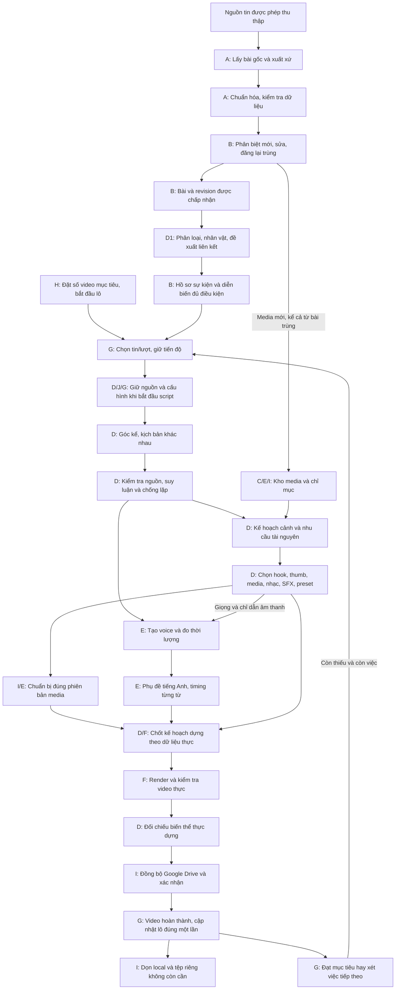
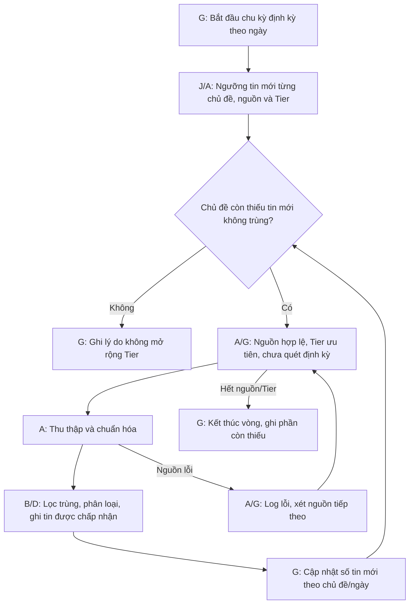
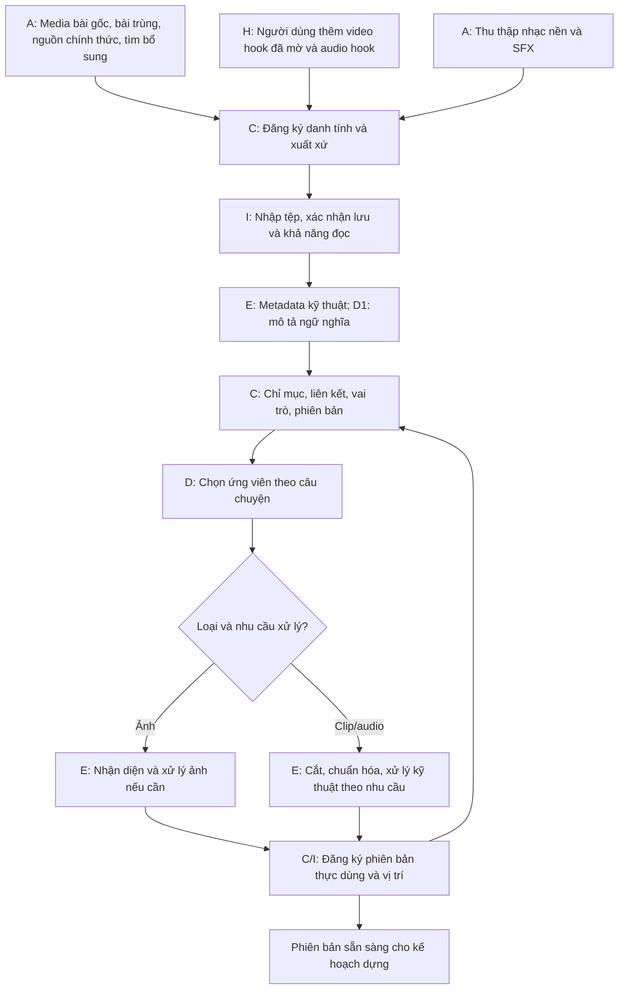
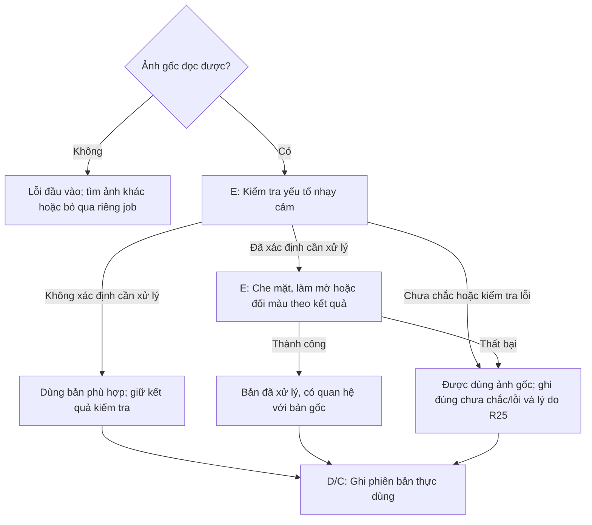
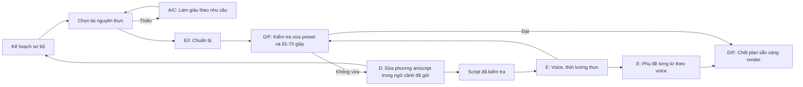
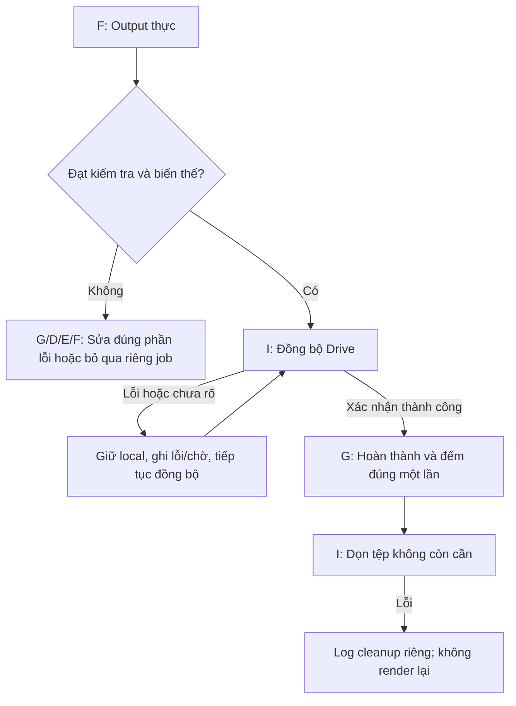

# AI Auto Video Creator - Luồng dữ liệu xuyên suốt hệ thống

**Cập nhật sau audit kiến trúc:** [08-architecture.md](./08-architecture.md) và [ADR](./adr/README.md) cụ thể hóa các điểm bàn giao bằng snapshot, transactional outbox, execution generation, completion ledger và cleanup authorization. Các câu “chưa chọn” trong tài liệu này mô tả phạm vi bước 09; baseline kỹ thuật hiện hành tra tại ADR, không làm thay đổi R01-R25.

**Giai đoạn:** 09 - Thiết kế luồng dữ liệu tổng thể  
**Trạng thái:** Đã được user chấp thuận làm baseline; quyết định nghiệp vụ R01-R25 đã được xác nhận  
**Căn cứ:** [Charter](./00-project-charter.md), [Đặc tả sản phẩm](./01-product-spec.md), [Bản đồ dữ liệu](./02-data-model.md), [Yêu cầu chất lượng](./03-quality-requirements.md), [Nghiên cứu công nghệ](./05-technology-research.md), [Bản đồ phân hệ](./06-system-map.md).

## 1. Mục đích và ranh giới

Tài liệu trả lời dữ liệu bắt đầu từ đâu, ai tiếp nhận, biến đổi thành gì, điều kiện đi tiếp, nơi giữ kết quả và cách kết thúc hoặc tiếp tục sau lỗi.

Đây là **thiết kế logic được đề xuất**, không phải hệ thống đã triển khai. Chưa chọn cơ sở dữ liệu, framework, provider/model, giao thức, schema vật lý, số repo, số dịch vụ hoặc topology cloud/desktop. Nơi lưu chính và vai trò Google Sheets vẫn để bước kiến trúc đánh giá. “Kho” trong sơ đồ là khu vực trách nhiệm dữ liệu, không mặc định một database riêng.

Phần đã xác nhận được truy vết bằng Rxx và FR/DR/QR. Các tên kết quả, điểm bàn giao và cách tổ chức sơ đồ là **ĐỀ XUẤT THIẾT KẾ**, cần duyệt cùng tài liệu. Không có **GIẢ ĐỊNH** nào được dùng làm quyết định chính thức. Các tham số chưa biết được giữ mở ở mục 14.

## 2. Quyết định đầu vào đã xác nhận

Bảng này ghi lại quyết định thay thế hoặc làm rõ yêu cầu cũ. Không phải danh sách câu hỏi còn mở.

| Quyết định | Nội dung có hiệu lực | Tác động tới luồng |
|---|---|---|
| R01 | Kiểm tra đủ dữ liệu và truy nguồn; không kiểm chứng đa nguồn bắt buộc | Không có cửa chờ xác minh sự thật |
| R02 | Chỉ xem/tạo lại script; không sửa trực tiếp hoặc duyệt | Không có nhánh người dùng duyệt script |
| R03 | Phụ đề tiếng Anh gắn vào video, timing từng từ để karaoke | Phải có script, voice và timing khớp trước render |
| R04 | Chỉ sang Tier sau khi thiếu; nguồn đang bật có thể không được quét trong ngày | Quét có điều kiện, không bắt mọi nguồn chạy mỗi ngày |
| R05 | Được tìm/tải bổ sung theo từng video ngoài lượt định kỳ | Có nhánh làm giàu theo yêu cầu |
| R06 | Liên kết sự kiện chưa chắc thì giữ riêng, vẫn làm từng bài | Không tổng hợp bài liên kết chưa đủ chắc |
| R07 | Thông tin mới là diễn biến có tình tiết mới; bài đăng lại không đủ | Lọc trùng trước khai thác, không tạo EventUpdate từ URL/nguồn mới đơn thuần |
| R08 | Nguồn mâu thuẫn thì dùng phiên bản từ nguồn ưu tiên Tier | Giữ nguồn đã chọn và dấu vết mâu thuẫn |
| R09 | Job đã bắt đầu script giữ bộ nguồn tới khi xong | Revision mới không sửa job đang làm |
| R10 | Người dùng đặt số video hoàn thành mục tiêu cho lô | Kết thúc khi đạt hoặc không còn việc đủ điều kiện |
| R11 | Người dùng cung cấp audio hook; hệ thống tìm/thu thập nhạc và SFX | Tách luồng nhập hook khỏi thu thập âm thanh |
| R12 | Ảnh chưa chắc vẫn được dùng, người dùng chấp nhận rủi ro | Không tự tạo gate duyệt ảnh |
| R13 | Giữ gốc và bản xử lý dùng lại được; voice/subtitle riêng có thể dọn khi xong | Tách tài nguyên lâu dài khỏi tệp riêng theo video |
| R14 | Sửa metadata quản trị; không sửa bài gốc/quan hệ sự kiện | UI chỉ ghi vào phạm vi được phép |
| R15 | Bỏ tệp text riêng; thêm/xóa nguồn trên UI | Không còn luồng đồng bộ tệp nguồn |
| R16 | Cho sửa prompt, áp dụng job chưa bắt đầu script kể cả trong lô | Mốc giữ cấu hình cùng mốc bắt đầu script |
| R17 | Thử lại giữ đầu vào khác với tạo biến thể mới | Lần thử không tăng sản lượng |
| R18 | Desktop tắt vẫn chuẩn bị tin/media/chỉ mục; script/plan/voice chờ desktop | Hai vòng đời nền và sản xuất tách nhau |
| R19 | AI lỗi khi desktop tắt: phần không cần AI chạy, phần cần AI chờ | Chờ phục hồi hoặc local khi online, không tự thêm dịch vụ trả phí |
| R20 | Dưới 50 USD/tháng chỉ tính chi phí bổ sung | Loại gói Gemini/Drive đã có, điện, Internet, phần cứng khỏi phạm vi ngân sách |
| R21 | Duyệt 10 phân hệ logic A-J và phân công ở tài liệu 06 | Dùng làm chủ sở hữu các điểm bàn giao |
| R22 | Bài trùng vẫn lấy media mới phù hợp và ghi xuất xứ | Kho media phong phú hơn nhưng không tăng số tin mới |
| R23 | Đủ dữ liệu theo lượng tin mới không trùng mỗi ngày, từng chủ đề | Ngưỡng cụ thể chờ nghiên cứu; không dùng số video làm bộ đếm thu thập |
| R24 | Xóa nguồn: ngừng thu thập, không tự thêm lại tới khi khôi phục; dữ liệu cũ vẫn dùng | Giữ ý định loại bỏ, không xóa dây chuyền lịch sử |
| R25 | Nhận diện chưa chắc, kiểm tra lỗi, xử lý lỗi đều được dùng ảnh gốc đọc được | Giữ nguyên trạng thái chưa chắc/lỗi; không gán đã xử lý thành công |

## 3. Những phân biệt phải giữ

| Khái niệm | Không được nhầm với |
|---|---|
| Tin mới không trùng trong ngày | Bài đăng lại, ảnh mới của bài cũ, số video đã làm |
| Bài khác về cùng sự kiện | Bản đăng lại cùng nội dung; không bỏ mọi bài cùng vụ việc như tin trùng |
| Diễn biến mới | URL mới, nguồn mới hoặc đổi cách viết về thông tin cũ |
| Phân tích để lập chỉ mục | Tạo script: phân tích nền vẫn có thể chạy khi desktop tắt |
| Có metadata của media | Tệp đã tải, còn đọc được hoặc đúng phiên bản cần dựng |
| Được dùng ảnh theo R25 | Kết luận ảnh an toàn hoặc xử lý thành công |
| Kế hoạch cảnh sơ bộ | Kế hoạch dựng đã chốt với asset cụ thể và thời lượng thực |
| Thử lại cùng job | Tạo thêm sản phẩm hợp lệ mới |
| Render đạt | Video đã sync, job hoàn thành hoặc local đã dọn |
| Phiên mở app | Lô và vòng khai thác; đóng app không làm vòng quay lại tin đầu |

## 4. Luồng tổng thể

Sơ đồ trên là đường đi thành công. TTS và chuẩn bị media có thể độc lập sau khi có đủ chỉ dẫn; chưa quyết định số công việc đồng thời. Phân tích nền D1 khác với sáng tạo D2. H không phải điều kiện để vòng nền chạy.

Điểm hoàn thiện so với ý tưởng ban đầu: tạo **nhu cầu cảnh sơ bộ** trước, chọn tài nguyên thực rồi mới chốt kế hoạch dựng. Không thể chốt timeline chỉ từ thời lượng dự kiến của script; phải phản hồi từ voice và media thực. Các vòng điều chỉnh được mô tả ở mục 8.

## 5. DF-01: Thu thập, chuẩn hóa và tri thức sự kiện

### 5.1. Lịch và Tier

- Nguồn đã bị người dùng loại bỏ không được đưa lại vào ứng viên quét hoặc làm giàu; khôi phục phải đến từ H qua A.
- Mỗi nguồn được chọn có một lượt định kỳ/ngày; lần thử phục hồi thuộc lượt đó, không tự tăng số lượt định kỳ. Ngưỡng retry vẫn mở.
- Chỉ tin mới không trùng được chấp nhận mới tham gia bộ đếm R23. Sửa bài không tự thành bài mới; phát hiện tình tiết mới có bộ phận EventUpdate riêng.
- Nếu AI phân loại/lọc trùng đang chờ, số tin đó chưa được xác nhận là đạt chỉ tiêu. Không báo “đủ” dựa trên tổng URL tải được. Nhịp tiếp tục lấy thêm khi có tồn chờ sẽ được giới hạn theo cấu hình vận hành, chưa đặt con số ở đây.
- Giá trị ngưỡng chủ đề, timezone/giờ chạy và tiêu chí Tier chưa chốt. Cách đếm đã khóa: mỗi article đại diện tăng tối đa một lần cho từng topic của nó trong `business_date`; không cộng các bộ đếm topic thành tổng tin duy nhất. Luồng nhận các giá trị còn lại như cấu hình, không tự gán mặc định.
- Thu thập theo yêu cầu video là luồng riêng, không sửa bộ đếm lịch thành “đã quét thêm một ngày”. Dữ liệu mới tìm thấy vẫn phải đi qua kiểm tra trùng và nguồn hợp lệ.

### 5.2. Kết quả qua từng bước

| Bước | Nhận | Biến đổi và quyết định | Kết quả giữ lại |
|---|---|---|---|
| A lấy bài | Nguồn/URL và ngữ cảnh lượt chạy | Lấy văn bản, metadata, ứng viên media, thời điểm | Nội dung quan sát được, URL, nguồn, thời điểm và lỗi |
| A chuẩn hóa | Dữ liệu thô | Chuẩn hóa văn bản, địa chỉ và thời điểm; giữ liên hệ với bản quan sát | Gói bài có xuất xứ; không coi là xác minh sự thật |
| B lọc danh tính | Gói bài và dữ liệu đã có | Tách bài mới, sửa bài cũ, đăng lại trùng; D hỗ trợ so nghĩa khi cần | Bài/revision hoặc dấu vết bản trùng gắn tin đại diện |
| D1 phân tích | Revision được chấp nhận | Chủ đề, nhân vật, dấu hiệu liên kết, tình tiết thay đổi | Đề xuất có nguồn và mức chưa chắc |
| B ghi tri thức | Đề xuất D1 và quy tắc toàn vẹn | Giữ riêng nếu chưa chắc; liên kết nếu đủ chắc; chọn nguồn ưu tiên khi mâu thuẫn | Bài độc lập, hồ sơ sự kiện, quan hệ và EventUpdate nếu có |
| C nhận ứng viên media | Media từ mọi gói, kể cả bản đăng lại | Đối chiếu tài nguyên đã có và xuất xứ | Media mới hoặc xuất xứ bổ sung; không sinh tin mới giả |

**Bài đăng lại:** không tạo hàng chờ viết thêm kịch bản chỉ vì thêm URL. B giữ một đại diện nội dung để khai thác và đủ dấu vết nguồn/media. Độ sâu lưu toàn văn của các bản bị loại còn thuộc DATA-OPEN-008; không yêu cầu nhân bản toàn văn mọi bản trùng.

**Cùng sự kiện không có nghĩa trùng bài:** bài có tình tiết/góc thông tin khác vẫn có danh tính riêng. Liên kết không xóa nội dung nguồn; chỉ tổng hợp những bài không trùng và quan hệ đủ chắc.

**Mâu thuẫn:** nguồn ưu tiên theo Tier được chọn cho nội dung sử dụng, các nguồn khác không bị biến thành xác nhận bổ sung. Cách phân xử khi cùng Tier được giữ như chính sách còn mở, không tự chọn “mới nhất” thay người dùng. Thuật toán chọn bản đại diện của nhóm trùng cũng chưa chốt; mọi lần đổi đại diện phải bảo toàn revision mà video cũ đã dùng.

## 6. DF-02: Media và chỉ mục song song

### 6.1. Hai mức sẵn sàng

1. **Sẵn sàng để tìm/chọn:** có chỉ mục và tệp gốc truy cập được; chưa chắc đã có kích thước, crop hoặc thời lượng đúng cảnh.
2. **Sẵn sàng để dựng:** phiên bản cụ thể đã đọc được, đủ yêu cầu kỹ thuật của cảnh và có trạng thái xử lý được ghi đúng.

Ảnh che mờ dùng lại được có thể được chuẩn bị và nhập kho trước; crop riêng cho một preset có thể cần làm sau lựa chọn. Đây là phân biệt logic, chưa chốt nơi chạy xử lý hay tạo trước bao nhiêu bản. Chỉ mục cập nhật theo phiên bản, không coi bản gốc và bản đã xử lý là một tệp bị ghi đè.

### 6.2. Nhánh ảnh theo R12/R25

Cho phép dùng không phải bắt buộc luôn chọn ảnh lỗi; D vẫn có thể chọn ảnh phù hợp khác. Công đoạn xử lý lỗi giữ trạng thái lỗi, còn job video có thể đi tiếp với cảnh báo theo ngoại lệ đã duyệt. Không mở rộng nhánh này sang clip, không làm mờ lại hook người dùng, không bỏ ngưỡng đánh giá phát hiện 95%.

### 6.3. Quyền sở hữu

- A thu thập; H tiếp nhận tài nguyên người dùng; không tự tạo kho audio hook từ nhạc/SFX.
- C giữ danh tính, chỉ mục, liên kết, trạng thái quyền sử dụng đã biết và quan hệ bản gốc/phái sinh.
- E giữ kết quả phân tích/biến đổi; D quyết định chọn bản nào cho câu chuyện.
- I giữ vị trí tệp và xác nhận lưu/đọc được. “Có bản ghi” không thay cho kiểm tra tệp tồn tại.
- Tệp từ bài trùng vẫn giữ đúng nguồn đã lấy, không gán sai thành media do nguồn của tin đại diện cung cấp.

## 7. DF-03: Lô, script và mốc giữ phiên bản

### 7.1. Bắt đầu lô và vòng khai thác

H gửi mục tiêu số video hoàn thành cùng cấu hình lô cho G. G ghi nhận lô rồi chọn tin/sự kiện đủ điều kiện từ B/D. Không tạo VideoJob rỗng để biểu diễn công việc crawl hoặc kiểm tra một tài nguyên.

Mỗi lượt của một tin/sự kiện tạo 1-3 video khác góc rồi chuyển tin tiếp theo. N góc/kịch bản trong sơ đồ không có nghĩa cố định phải tạo sẵn bảy script, hoặc cả N đều được render cùng lượt. Số ứng viên sinh trước, cách chia vòng và lựa chọn bộ script ban đầu phải nằm trong cấu hình/chính sách sẽ thiết kế; số video thực mỗi lượt vẫn tuân theo yêu cầu đã chốt.

G giữ vị trí qua tắt/mở app. Khi quay lại tin cũ, D dùng lịch sử script/biến thể để không dùng nguyên trạng script gần nhất; giữa các lượt chỉ cần khác ít nhất một yếu tố và không hoàn toàn giống video cũ. Không lấy đổi ID, đổi tên tệp hoặc metadata làm bằng chứng video khác nhau.

**ĐỀ XUẤT ĐIỀU PHỐI:** số video cấp thêm cho lượt cuối không vượt số sản phẩm còn thiếu của lô; G phải tính cả các job đã cấp đang chạy để tránh nhiều job cùng chiếm suất cuối. Cơ chế đặt chỗ/chống đếm hai lần sẽ chọn ở kiến trúc và giao tiếp. Đây không phải giới hạn tổng khai thác của sự kiện.

**ĐỀ XUẤT CHỐNG TRÙNG ĐANG CHẠY:** D/G đối chiếu cả phương án đã được cấp cho job chưa hoàn thành, không chỉ video đã sync; nếu không, hai job đồng thời có thể cùng chọn một phương án chưa xuất hiện trong lịch sử thành phẩm. Giữ riêng trạng thái phương án dự kiến và dấu biến thể thực dựng; cơ chế phối hợp nguyên tử sẽ thiết kế ở bước kiến trúc/giao tiếp.

### 7.2. Mốc bắt đầu script

Trước khi D bắt đầu tạo script, B cung cấp bộ revision nguồn đã chọn, J cung cấp phiên bản cấu hình/prompt hiện áp dụng, G liên kết chúng với job. Đó là **ngữ cảnh sáng tạo được giữ cho job**:

- Nguồn sửa sau mốc: lưu revision mới, dùng cho job chưa bắt đầu script và lần sản xuất sau; không sửa job này.
- Prompt sửa sau mốc: tương tự, không âm thầm đổi prompt của một lần thử lại.
- Điều chỉnh script do voice quá dài vẫn trong ngữ cảnh đã giữ, tạo phiên bản script kế tiếp của job; không tự nhập nguồn/prompt mới.
- Preset, giọng, provider/model và tài nguyên thực được chọn ở các bước sau phải ghi phiên bản thực dùng. Không thể ghi trước rằng một model cụ thể đã chạy khi chưa gọi nó.
- Thay khóa bị thu hồi/lỗi là xử lý quyền truy cập ở J; không có nghĩa đưa bí mật vào snapshot hoặc ép lưu khóa cũ không còn hợp lệ để giữ lịch sử.

### 7.3. Tạo và kiểm tra script

D nhận revision, lịch sử khai thác, cấu hình và thông tin media ứng viên để tạo góc kể, script tiếng Anh, đoạn có nguồn/suy luận, title và 3-4 hashtag. D kiểm tra nhất quán tên/mốc thời gian, dấu suy luận, góc khác trong lượt và khác biệt với lịch sử.

Không đạt thì tạo phương án khác trong giới hạn thử sẽ cấu hình; không lặp vô hạn một tin. H chỉ xem, chạy/tạo lại; không có bước chỉnh sửa hay duyệt script trực tiếp. D kiểm tra nội dung không đồng nghĩa đi kiểm chứng sự thật đa nguồn.

## 8. DF-04: Chọn media, voice, phụ đề và chốt kế hoạch dựng

| Bước | Đầu vào | Kết quả bàn giao | Nếu chưa đủ |
|---|---|---|---|
| D lập kế hoạch sơ bộ | Script đã kiểm tra, mô tả preset và chỉ mục | Cảnh dự kiến, nhu cầu ảnh/clip, hook/thumb, chỉ dẫn giọng/nhạc/SFX | Sửa phương án trong năm preset |
| C trả ứng viên, D chọn | Nhu cầu cảnh và chỉ mục | Asset/rendition ứng viên, tổ hợp hook, lý do chọn | G yêu cầu A làm giàu, hoặc D chọn phương án khác |
| I chuẩn bị staging | Job gần lượt, danh sách tệp | Tệp đúng phiên bản, trạng thái tải/sẵn sàng | Chờ/tải tiếp, không báo đã sẵn sàng khi thiếu tệp |
| E xử lý thành phần | Tệp và yêu cầu cảnh | Ảnh/clip/audio phù hợp, kết quả xử lý và phiên bản | R25 cho ảnh gốc đọc được; lỗi kỹ thuật khác trả về chọn lại/chờ |
| E tạo voice | Script version, giọng và chỉ dẫn | Voice version và thời lượng thực | Retry/fallback phù hợp hoặc chờ; không sửa script tại E |
| E căn phụ đề | Script và voice tương ứng | Chữ tiếng Anh, timing từng từ, kết quả kiểm tra | Sửa/căn lại theo đầu vào; không dùng phụ đề từ voice cũ |
| D/F chốt kế hoạch | Tài nguyên thực, voice, phụ đề, preset | Plan có phiên bản, timeline, toàn bộ thành phần thực dùng | Trả lý do chưa dựng được cho D/G |

Vòng sửa phải vô hiệu hóa kết quả phụ thuộc bị ảnh hưởng trước khi nối lại. Có đủ hook visual, hook audio và thumbnail là bắt buộc; thiếu thì làm giàu/chọn lại hoặc đánh dấu job không đủ đầu vào, không render thiếu hook. Video hook và audio hook do người dùng cung cấp; nếu kho này thiếu, A không được tự biến nhiệm vụ làm giàu thành thu thập hook trái R11.

TTS nên căn theo script/voice riêng trước khi trộn nhạc/SFX; đây là đề xuất luồng nhằm giữ rõ nguồn timing, không chọn công cụ STT/alignment. Phụ đề phải được đối chiếu với âm thanh đã tạo, không coi chữ trong script tự chứng minh timing đúng.

## 9. DF-05: Render, kiểm tra, đồng bộ và hoàn thành

Sau khi hoàn tất vòng điều chỉnh plan ở DF-04 và trước render, D/G giữ VariantReservation theo CT-ORC-012 cho plan đã chốt. D so với completed lẫn phương án active ở mọi lô liên quan. Trước completion đối chiếu lại chữ ký output thực, gắn registry revision; G chỉ commit nếu revision vẫn đúng trong transaction. Stale quay lại bước đối chiếu, không render/tạo script lại; conflict thực kết thúc job và lô có thể tạo job biến thể mới. Không dùng capacity reservation để thay kiểm tra này.

F chỉ nhận kế hoạch đủ đầu vào có phiên bản và khả năng dựng. F không âm thầm đổi câu chuyện, đổi asset hoặc gọi TTS để viết lại lời dẫn. F dựng hook/thumb, các cảnh, voice, nhạc/SFX và phụ đề karaoke rồi xuất video vào khu vực làm việc do I quản lý.

| Mốc | Người quyết định | Bằng chứng/kết quả | Chưa được làm |
|---|---|---|---|
| Render xong | F | Tệp đầu ra và thông số thực | Chưa tính hoàn thành chỉ vì tiến trình render kết thúc |
| Kiểm tra đầu ra đạt | F phối hợp D/E | Phát được, 61-70 giây, tiếng Anh, hook đủ, phụ đề karaoke, chất lượng âm thanh theo yêu cầu | Không dùng chỉ tham chiếu trong plan để khẳng định thành phần xuất hiện |
| Biến thể thực hợp lệ | D nhận kết quả F | Đối chiếu thành phần thực dựng với lịch sử, lưu dấu biến thể | Không tính output hoàn toàn giống video cũ là sản phẩm mới |
| Sync đã xác nhận | I | Bản đích và bằng chứng đồng bộ phù hợp giao thức sẽ chọn | Không xóa local khi upload mới bắt đầu hoặc chưa xác nhận |
| Job hoàn thành | G | Kết quả kiểm tra, biến thể, sync gắn cùng output; cập nhật lô một lần | Không đếm lại khi nhận thông báo trùng hoặc mở lại app |
| Dọn xong | I | Tệp đã dọn/được giữ và lý do | Lỗi cleanup không xóa bằng chứng job đã hoàn thành |

Mục tiêu 100 video/12 giờ được đo đầu-cuối trên video hoàn thành, gồm đồng bộ, không chỉ tốc độ encode. Lô chưa đạt mục tiêu vì hết việc đủ điều kiện phải báo kết thúc thiếu mục tiêu, không gán đủ sản lượng. Nếu còn job chờ AI/mạng/desktop thì báo chờ/tiến độ tương ứng, không tự coi dữ liệu đã cạn.

## 10. DF-06: Vòng đời tệp và dung lượng

### 10.1. Dữ liệu kết thúc ở đâu

| Dữ liệu | Đích logic | Chính sách |
|---|---|---|
| Nguồn, trạng thái loại bỏ/khôi phục | A và dữ liệu vận hành dài hạn | UI quản lý; không còn tệp text nguồn |
| Bài, revision, sự kiện, dấu vết bản trùng | B | Giữ tri thức/truy nguồn lâu dài; độ sâu bản chụp thô còn mở |
| Chỉ mục, quan hệ media, trạng thái quyền đã biết | C | Có thể tra cứu ngay cả khi tệp local đã dọn |
| Media gốc và bản xử lý tái sử dụng | I lưu cloud, C/E giữ danh tính/kết quả | Giữ lâu dài theo R13; chưa quyết định chia bốn Drive cụ thể |
| Script, góc kể, plan, dấu biến thể | D và lịch sử dài hạn | Không xóa cùng tệp tạm; cần cho chống lặp |
| Voice/subtitle riêng từng video | Tệp làm việc ở I, metadata phiên bản ở E/C | Có thể dọn khi job hoàn tất và không còn job cần; không tự lưu mọi tệp mãi |
| Video hoàn chỉnh | Google Drive qua I | Local chỉ dọn sau xác nhận sync; cloud giữ lâu dài |
| Job/lô/lần thử/log | G | Giữ tiến độ và dấu vết; thời hạn log chi tiết còn mở |
| Prompt/cấu hình/tài khoản | J | Phiên bản và tham chiếu bí mật; không chứa bí mật trong bảng/log |

### 10.2. Staging năm video

G cung cấp cửa sổ khoảng năm video gần lượt xử lý; I chỉ tải tệp cần cho cửa sổ, không kéo toàn bộ kho. Trong khi render một video, có thể chuẩn bị tài nguyên tiếp theo. Tệp dùng chung chỉ cần một bản local có thể phục vụ nhiều job; I không dọn khi job khác còn cần.

Output đang chờ sync là phần dung lượng cần bảo toàn **ngoài khái niệm bộ tài nguyên staging**. Không ép giới hạn năm bằng cách xóa output chưa sync. Khi thiếu dung lượng, I báo G để hạn chế cấp thêm công việc cần tải/render, giữ việc chờ; job không phụ thuộc tài nguyên đang thiếu vẫn có thể tiếp tục. Ngưỡng dung lượng và lịch ưu tiên chưa chốt.

### 10.3. Tên và thư mục

Title tiếng Anh và 3-4 hashtag do D tạo; I áp dụng quy tắc tên hợp lệ. Thư mục đầu ra dùng YY-MM-DD và hậu tố phiên theo yêu cầu, không tạo thư mục đầu ra rỗng cho mỗi lần mở app.

Phải phân biệt khu vực làm việc chứa render tạm/output chờ sync với thư mục sản phẩm hợp lệ. Tên quá dài, trùng tên, ký tự không hợp lệ, múi giờ và quy tắc gán output qua nhiều phiên vẫn mở; luồng phải giữ định danh output ổn định độc lập tên. Chưa tự quyết định suffix tên video hay bỏ hashtag. Dọn sạch local sau sync không làm mất thư mục/sản phẩm đã lưu ở cloud.

## 11. DF-07: UI, cấu hình và truy vết

| Thao tác | Đường đi logic | Hiệu lực |
|---|---|---|
| Thêm/xóa/khôi phục nguồn | H → A, A cung cấp chính sách nguồn cho G | Xóa ngừng thu thập/chặn tự thêm; giữ dữ liệu cũ |
| Sửa metadata | H → chủ sở hữu A/B/C theo trường được phép | Không sửa bài gốc, quan hệ sự kiện hoặc script; danh sách trường chi tiết chờ UI |
| Thêm hook | H → C/I; E/D1 phân tích nếu cần | Hook visual đã làm mờ; audio do người dùng cung cấp |
| Sửa prompt | H → J và kiểm tra chuyên môn D/E | Job chưa bắt đầu script dùng bản mới; không sửa lịch sử |
| Thay tài khoản/khóa | H → J | Chỉ hiển thị nhãn/trạng thái; không cho bí mật đi vào plan, log hoặc bảng |
| Chạy/thử lại công đoạn | H → G → phân hệ thực hiện | Giữ ngữ cảnh của job, ghi lần thử riêng, không tăng sản lượng |
| Tạo biến thể mới | H → G → D | Gắn lịch sử nguồn, qua kiểm tra khác biệt trước tính video mới |
| Xem tiến độ/lỗi | Phân hệ → G → H | Phân biệt cảnh báo, lỗi công đoạn, lỗi job, chờ; hover hiện chi tiết |

Log phải gắn với đối tượng và lần chạy thực; hoạt động nền không cần bịa AppSession hoặc VideoJob. Phiên desktop có log riêng như đã yêu cầu, đồng thời có thể truy tới các công việc nền liên quan. Chi phí chỉ ghi phần quan sát được, quota chưa biết không được gán “vô hạn”. Ngưỡng cảnh báo dự báo 80% ngân sách giữ nguyên, không tự đặt chính sách vượt ngân sách hay mua thêm dịch vụ.

## 12. DF-08: Lỗi, tiếp tục và vô hiệu hóa kết quả

### 12.1. Ma trận xử lý

| Tình huống | Giữ gì | Nhánh tiếp theo | Công việc độc lập |
|---|---|---|---|
| Nguồn lỗi | Lượt chạy, URL, thời gian/lỗi, kết quả đã lấy được | Retry theo chính sách hoặc sang nguồn tiếp theo | Tiếp tục |
| Bài trùng | Tin đại diện, xuất xứ, media mới | Không viết script từ bản trùng; tiếp tục nhập media | Tiếp tục |
| Liên kết sự kiện chưa chắc | Bài riêng và mức chưa chắc | Sản xuất theo từng bài, không tổng hợp | Tiếp tục |
| Ảnh chưa chắc/kiểm tra lỗi/xử lý lỗi | Kết luận/lỗi và ảnh gốc đọc được | Được chọn bản gốc, ghi cảnh báo theo R25 | Tiếp tục |
| Tệp không đọc được hoặc mất | Metadata và tình trạng mất tệp | Tải lại/tìm thay thế; thiếu đầu vào bắt buộc thì job lỗi | Tiếp tục nếu không dùng tệp đó |
| AI chính lỗi, desktop tắt | Công việc và đầu vào chờ | Chờ phục hồi hoặc desktop online dùng local phù hợp | Phần không cần AI tiếp tục |
| AI lỗi khi desktop online | Ngữ cảnh và lần thử | Fallback được cấu hình/hợp lệ; chưa có phương án thì chờ hoặc lỗi theo chính sách | Không làm mất hàng chờ |
| Không đủ hook | Nhu cầu và lý do thiếu | Chọn lại trong kho; không đủ thì đánh dấu riêng job, không render thiếu | Tiếp tục |
| Voice không vừa | Script/voice version, thời lượng đo được | D sửa phương án/script; chạy lại phần phụ thuộc | Tiếp tục |
| Phụ đề lỗi | Script/voice đúng và lỗi timing/chữ | Căn lại hoặc xử lý lỗi job; không render bỏ phụ đề | Tiếp tục |
| Render dở khi máy tắt | Mốc hoàn thành, input, output dở | Xác minh đầu vào; có thể render lại công đoạn | Không chạy lại tin từ đầu |
| Sync lỗi hoặc xác nhận thất lạc | Output local, định danh đích, lịch sử sync | Đối chiếu đích và tiếp tục, tránh upload/đếm trùng | Tiếp tục trong giới hạn dung lượng |
| Hết dung lượng hoặc dịch vụ chung lỗi | Output chưa sync, tiến độ job | Chờ/hạn chế phần phụ thuộc; không xóa để ép chạy | Chỉ chạy phần có đủ điều kiện |
| Cleanup lỗi | Bằng chứng hoàn thành, tệp còn tồn | Thử dọn sau; log cleanup riêng | Tiếp tục trong giới hạn dung lượng |
| Không tạo được biến thể mới | Lịch sử và lý do các phương án bị loại | Sang tin khác; hết ứng viên thì kết thúc thiếu mục tiêu | Không lặp vô hạn một tin |

### 12.2. Những kết quả phải tạo lại khi đầu vào đổi

| Thay đổi trong job | Còn dùng được nếu không bị ảnh hưởng | Phải kiểm tra/tạo lại |
|---|---|---|
| Script/lời dẫn | Nguồn đã giữ, media phù hợp, metadata | Voice, phụ đề, kế hoạch/timeline, kiểm tra nội dung, render và dấu biến thể |
| Giọng hoặc voice | Script và nguồn | Timing phụ đề, timeline/mix, render, dấu biến thể |
| Ảnh/clip/hook/nhạc/SFX | Script/voice nếu không cần sửa lời dẫn | Phiên bản media, plan/mix liên quan, render, dấu biến thể |
| Preset/tham số dựng | Nguồn/script/voice nếu còn phù hợp | Chuẩn bị media nếu cần, layout/timeline, render và kiểm tra |
| Lỗi sync | Render đã đạt và dấu biến thể đã kiểm tra | Chỉ sync/xác nhận; không render lại vô cớ |
| Nguồn/prompt mới ngoài job đã bắt đầu script | Toàn bộ ngữ cảnh job cũ theo R09/R16 | Không vô hiệu hóa job cũ; áp dụng job chưa bắt đầu và lần sản xuất sau |

Vô hiệu hóa nghĩa là kết quả không còn hợp lệ **cho phiên bản kế tiếp**, không xóa lịch sử và không sửa output đã hoàn thành. Thử lại AI giữ input/cấu hình không bảo đảm cùng byte; mọi kết quả thực mới vẫn phải được kiểm tra trước khi nối xuống dưới.

### 12.3. Điểm tiếp tục cần lưu

Sau mỗi kết quả được chấp nhận, chủ sở hữu giữ định danh/version, ngữ cảnh đầu vào, trạng thái, thời gian, kết quả/lỗi và vị trí tệp qua I. G giữ mối liên hệ để xác định bước tiếp theo.

Khi mở lại app: đọc trạng thái bền, đối chiếu đầu ra/tệp thực, nhận diện bước đã hoàn thành, tiếp tục phần chưa xong. Không coi tệp tạm xuất hiện là render đạt; không coi yêu cầu upload đã gửi là sync thành công. Có thể phải encode lại công đoạn dở, không hứa tiếp tục đúng frame.

Khi voice/subtitle đã dọn theo R13, lịch sử vẫn cho biết từng dùng gì nhưng không bảo đảm tái dựng đúng từng byte. Yêu cầu debug phải báo phần đầu vào không còn và tái tạo phần cần thiết theo ngữ cảnh hợp lệ, không âm thầm dùng dữ liệu mới cho job cũ.

## 13. Audit logic và tiêu chí duyệt tài liệu

Đây là đối chiếu tài liệu, **không phải kết quả test hệ thống hoặc benchmark**.

| Tình huống kiểm toán | Điều bản thiết kế phải thể hiện | Tham chiếu |
|---|---|---|
| Đủ tin mới chủ đề ở Tier 1 | Tier sau có thể không quét, có lý do; không báo mất lịch | R04/R23, DF-01 |
| Bài đăng lại có clip mới | Không tăng số tin mới, vẫn nhập clip và giữ xuất xứ | R07/R22, DF-01/02 |
| Cùng vụ việc có tình tiết mới | Không bị loại chỉ vì cùng sự kiện; tạo EventUpdate nếu đủ điều kiện | R06/R07, DF-01 |
| Xóa nguồn rồi tự khám phá lại | Không kích hoạt lại; dữ liệu cũ vẫn dùng được | R24, DF-01/07 |
| Nguồn/prompt sửa giữa lô | Job trước mốc giữ nguyên, job chưa script dùng bản mới | R09/R16, DF-03 |
| Ảnh che mờ thất bại nhưng đọc được | Có thể dùng gốc, vẫn ghi lỗi; không giả kết quả an toàn | R25, DF-02 |
| Voice thay sau khi có phụ đề | Không dùng timing voice cũ cho output mới | R03, DF-04/08 |
| Desktop tắt và AI lỗi | Thu thập không cần AI tiếp tục, việc AI chờ; không tự mua dịch vụ | R18/R19, DF-08 |
| Hai job dùng chung tệp | Job đầu xong không làm mất đầu vào job sau | R13, DF-06 |
| Upload gián đoạn | Giữ local, tiếp tục sync, không render/đếm lại | DR-009/010/020, DF-05/08 |
| Gần đầy ổ vì output chưa sync | Hạn chế cấp thêm việc phụ thuộc, không xóa output | QR-REL-005, DF-06 |
| Retry và tạo biến thể | Retry không tăng sản lượng; biến thể kiểm tra cả thành phần thực | R17, DF-03/05 |
| Lô đạt mục tiêu | Đếm video hợp lệ đã sync, không đếm lần thử; không tự bắt đầu lại vòng | R10, DF-03/05 |
| Mở app không làm video | Không sinh chuỗi thư mục đầu ra rỗng | DR-015, DF-06 |
| Quyền dữ liệu và bí mật | Lưu nguồn/quyền đã biết; khóa không nằm trong job/log/UI bảng | QR-SEC-*, DF-02/07 |

Các sơ đồ bao phủ đường đi chính, media song song, nhánh làm giàu, sửa phương án, retry, phục hồi, đồng bộ và cleanup. Tài liệu 02 mục 16 bổ sung quan hệ cho các khoảng thiếu MAP-DATA-001 đến MAP-DATA-009; tên bảng và API chưa được quyết định.

**Kiểm tra tài liệu đã thực hiện:** đối chiếu đủ R01-R25; kiểm tra liên kết tệp nội bộ, tính nhất quán số cột bảng, khối Markdown và mã FR không bị lặp; bảy tài liệu lưu UTF-8 không BOM. Sáu sơ đồ ở đây đã được rà soát cấu trúc văn bản, chưa render bằng Mermaid engine. Chưa chạy code sản phẩm, thử model, benchmark hay kiểm thử hệ thống.

## 14. Những quyết định vẫn chờ đúng giai đoạn

Các điểm dưới đây không được xem là đã đóng chỉ vì đã vẽ đường đi logic.

| Nhóm còn mở | Phần nghiệp vụ đã chốt | Cần giải quyết tiếp |
|---|---|---|
| Thu thập và Tier | Chỉ mở rộng khi thiếu tin mới theo chủ đề/ngày; đếm một lần/article/topic/business-date | Giá trị ngưỡng, múi giờ, thời gian chạy, nguồn ban đầu, tiêu chí Tier |
| Tin trùng/sự kiện | Giữ đại diện, lấy media mới; chưa chắc giữ riêng; tình tiết mới mới tạo cập nhật | Thuật toán/ngưỡng trùng/liên kết, chọn đại diện, phân xử cùng Tier, bộ mẫu đánh giá |
| Trending | Có chủ đề hot và lâu dài; không đo hiệu quả sau đăng | Tín hiệu đánh giá trước sản xuất và tiêu chí lựa chọn tin |
| Bản chụp và quyền nguồn | Có xuất xứ/revision; unknown rights không tự chặn | Metadata tối thiểu, mức giữ toàn văn/bản thô và lịch sử bản bị loại |
| Media và preset | Năm preset, karaoke bắt buộc, chính sách ảnh R25 | Nội dung chi tiết preset, độ phân giải/FPS/định dạng, ngưỡng chữ/timing, thứ tự xử lý kỹ thuật |
| Lô và năng lực | Mục tiêu số video, 1-3 mỗi lượt, retry khác biến thể | Chính sách sinh script ứng viên, số lần thử, timeout, fairness, đặt chỗ suất cuối, ngưỡng dung lượng |
| Cloud/desktop và AI | Phạm vi R18/R19, ngân sách bổ sung R20 | Topology, provider/model/fallback, quyền API/quota tài khoản, chi phí thực, chia CPU/GPU |
| Lưu và tìm dữ liệu | Quyền sở hữu logic đã rõ; có nhu cầu bảng như Sheets | Database, vai trò Sheets, search, schema vật lý, transaction và giao tiếp |
| Tệp và vận hành | Giữ media dùng lại, dọn riêng sau xong, sync trước xóa | Phân bổ bốn Drive, kiểm chứng sync, TTL log/tệp lỗi/cache, backup tối thiểu |
| Đầu ra theo phiên | YY-MM-DD, hậu tố phiên, title và 3-4 hashtag | Gán phiên qua gián đoạn/qua ngày, múi giờ, tên dài/trùng, quy tắc folder chờ sync |
| UI và cấu hình | Metadata sửa được; không sửa bài/script/liên kết sự kiện | Danh sách trường/prompt, hiệu lực thao tác quản trị với kế hoạch đã chọn, rollback và thao tác bảng chi tiết |
| SaaS và kiểm thử | Một người dùng, không login cục bộ, bảo vệ bí mật | Mức chuẩn bị SaaS, tenant/khóa về sau, quy mô bộ test, đo hiệu năng đầu-cuối |

Những lựa chọn thuộc kỹ thuật đã được ủy quyền nghiên cứu phải có đề xuất và bằng chứng phù hợp ở bước kiến trúc/giao tiếp/kiểm thử; không buộc người dùng chọn thư viện trong bước này. Điều kiện của một nhánh có tham số chưa chốt được mô tả bằng tên chính sách, không tự điền giá trị.

## 15. Điều kiện chuyển bước

Người dùng duyệt tài liệu khi xác nhận: các luồng phản ánh đúng R01-R25; dữ liệu không mất nguồn/version khi biến đổi; các nhánh chờ/lỗi/ảnh chấp nhận rủi ro/tin trùng đúng ý định; phân biệt render, sync, hoàn thành và cleanup rõ; các điểm kỹ thuật còn mở được chuyển sang bước phù hợp.

Sau khi duyệt mới chuyển sang **Bước 10 - Thiết kế kiến trúc**. Việc tạo tài liệu này không phê duyệt stack, không khởi tạo framework, không cài thư viện và không cho phép viết dòng code đầu tiên.
