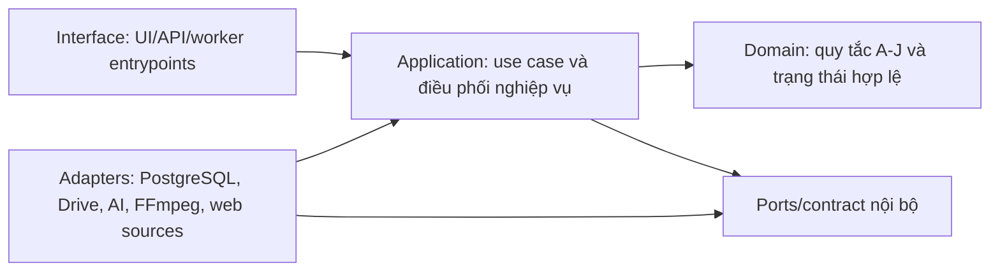
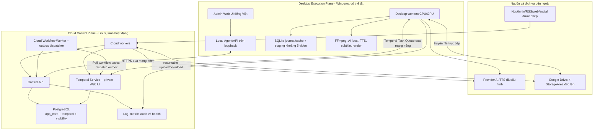

# AI Auto Video Creator - Kiến trúc hệ thống

**Giai đoạn:** 10 - Thiết kế kiến trúc  
**Trạng thái:** Baseline thiết kế đã kiểm toán theo ủy quyền quyết định kỹ thuật; các lựa chọn có điều kiện chưa được xác nhận khả thi bằng thực nghiệm  
**Căn cứ:** [Charter](./00-project-charter.md), [Đặc tả sản phẩm](./01-product-spec.md), [Bản đồ dữ liệu](./02-data-model.md), [Yêu cầu chất lượng](./03-quality-requirements.md), [Nghiên cứu công nghệ](./05-technology-research.md), [Bản đồ phân hệ](./06-system-map.md), [Luồng dữ liệu](./07-data-flow.md).

**Hồ sơ có hiệu lực:** [Danh mục ADR](./adr/README.md). [Báo cáo kiểm toán](./08-architecture-audit.md) ghi các lỗi của bản đầu, phần đã sửa và các cổng còn mở. Việc người dùng ủy quyền ghi ADR không được ghi thành người dùng đã xác nhận từng công nghệ hoặc kết quả benchmark.

## 1. Mục đích và ranh giới

Tài liệu này quyết định cấu trúc kỹ thuật cấp cao để hệ thống có thể được duy trì trong nhiều năm, chạy nền khi desktop tắt, tiếp tục sau gián đoạn và mở rộng mà không phải thay toàn bộ sản phẩm.

Tài liệu trả lời:

- Thành phần nào chạy trên cloud, thành phần nào chạy trên desktop.
- Nơi lưu dữ liệu chính, nơi lưu byte tệp và vai trò của Google Sheets.
- Cách điều phối công việc bền vững giữa hai môi trường.
- Ranh giới triển khai của 10 phân hệ A-J.
- Ngôn ngữ, runtime và các nền tảng lõi được chọn.
- Cách bảo vệ bí mật, truy vết, phục hồi và phát triển thành SaaS về sau.

Tài liệu **không** định nghĩa endpoint, payload, schema SQL vật lý, cấu trúc thư mục mã nguồn, phiên bản package, model AI cụ thể, prompt cụ thể hoặc thông số codec. Những phần đó thuộc các bước giao tiếp, kiểm thử và lộ trình triển khai.

Không có mã nguồn, framework hoặc thư viện nào được khởi tạo trong bước này.

### 1.1. Cách đọc trạng thái quyết định

- **QUYẾT ĐỊNH KIẾN TRÚC:** lựa chọn thiết kế trong phạm vi người dùng đã ủy quyền; trạng thái từng quyết định nằm trong ADR. `Accepted` nghĩa là baseline thiết kế; `Conditional` nghĩa là chưa chốt khả năng triển khai khi chưa qua gate.
- **CỔNG KIỂM CHỨNG:** điều phải thử bằng proof-of-capability hoặc benchmark trước khi triển khai rộng.
- **CHƯA QUYẾT ĐỊNH:** còn thiếu dữ liệu; có thể tiếp tục phần độc lập, nhưng phải giữ gate trước triển khai phần phụ thuộc.
- **GIẢ ĐỊNH:** thông tin chưa được người dùng xác nhận. Không giả định nào được phép tự động trở thành quyết định.

## 2. Các động lực kiến trúc

Kiến trúc phải ưu tiên theo thứ tự sau:

1. Không mất tiến độ khi desktop tắt, mất điện, worker dừng hoặc dịch vụ AI tạm lỗi.
2. Phần thu thập, làm giàu tin, media và chỉ mục tiếp tục chạy trên cloud.
3. Desktop chỉ nhận việc nặng hoặc cần tài nguyên cục bộ; khi online phải tiếp tục từ điểm phù hợp.
4. PostgreSQL, workflow engine và object storage không được lẫn vai trò với nhau.
5. Một video phải truy được nguồn, revision, cấu hình, model/provider, asset, lần chạy và file đầu ra.
6. Thử lại kỹ thuật không được tạo sản phẩm mới; tạo biến thể mới phải có danh tính riêng.
7. UI phải quan sát được từng bước và cho chạy/tạo lại để debug, nhưng không thêm bước duyệt hoặc sửa script trái R02.
8. Chi phí bổ sung phải có khả năng giữ dưới 50 USD/tháng theo R20.
9. Kiến trúc ban đầu dành cho một người dùng và một desktop, nhưng không khóa đường phát triển thành SaaS.
10. Không vận hành mười microservice chỉ vì có mười phân hệ logic.

## 3. So sánh các phương án

### 3.1. Tiêu chí và trọng số

Điểm từ 1 đến 10; điểm cao hơn là tốt hơn.

Đây là ước lượng chuyên môn để so sánh, không phải benchmark, xác suất thành công hoặc bằng chứng đáp ứng ngân sách. Chi phí và hiệu năng thực tế chưa được đo; điểm cao nhất không đóng các gate còn thiếu.

| Tiêu chí | Trọng số |
|---|---:|
| Đúng đắn và phục hồi bền vững | 20% |
| Phù hợp mô hình cloud/desktop offline | 15% |
| Độ đơn giản khi xây dựng | 10% |
| Độ đơn giản khi vận hành | 10% |
| Khả năng bảo trì và mở rộng | 15% |
| Chi phí tài nguyên | 10% |
| Quan sát và debug | 10% |
| Thời gian kiểm chứng | 10% |

### 3.2. Bốn phương án

| Phương án | Cơ chế | Điểm mạnh | Điểm yếu và rủi ro |
|---|---|---|---|
| P1 - Desktop làm trung tâm, cloud chỉ đồng bộ | Desktop giữ trạng thái chính; cloud thu thập rồi gửi snapshot xuống | Rẻ, ít thành phần, thử nhanh | Hai nguồn trạng thái dễ lệch; desktop tắt làm nghẽn điều phối; khó đạt resume, chống chạy trùng và SaaS |
| P2 - PostgreSQL và state machine tự xây | Cloud PostgreSQL giữ trạng thái; worker khóa job và tự quản retry/checkpoint | Ít dịch vụ, chi phí thấp, toàn quyền logic | Phải tự xây lease, heartbeat, timer, retry, cancellation, versioning, recovery và công cụ debug; rủi ro bảo trì dài hạn cao |
| P3 - Prefect self-hosted | PostgreSQL giữ nghiệp vụ; Prefect quản flow/task/deployment; cloud và desktop có worker riêng | Python-native, UI quan sát tốt, proof nhanh | Semantics cho workflow dài, desktop offline và side effect vẫn cần kiểm chứng; thêm Redis khi scale self-hosted; ranh giới state nghiệp vụ cần kỷ luật |
| P4 - Temporal self-hosted | PostgreSQL giữ nghiệp vụ; Temporal giữ lịch sử thực thi bền vững; worker poll task queue theo năng lực | Khớp nhất với workflow dài, worker offline, retry, timer, resume, child workflow và phân tuyến cloud/desktop | Học và vận hành khó hơn; workflow phải deterministic; activity phải idempotent; cần chứng minh vừa ngân sách và cấu hình an toàn |

### 3.3. Ma trận điểm

| Phương án | Đúng đắn | Hybrid offline | Xây dựng | Vận hành | Bảo trì | Chi phí | Debug | Proof | Tổng có trọng số |
|---|---:|---:|---:|---:|---:|---:|---:|---:|---:|
| P1 | 4 | 4 | 8 | 8 | 5 | 9 | 5 | 9 | **6,05/10** |
| P2 | 7 | 8 | 6 | 8 | 7 | 9 | 7 | 7 | **7,35/10** |
| P3 | 8 | 8 | 7 | 7 | 8 | 8 | 9 | 8 | **7,90/10** |
| P4 | 10 | 10 | 6 | 5 | 9 | 7 | 9 | 6 | **8,15/10** |

### 3.4. Kết luận lựa chọn

**QUYẾT ĐỊNH KIẾN TRÚC ARCH-001 - CONDITIONAL:** chọn **P4 - kiến trúc hybrid dùng Temporal self-hosted** làm phương án ưu tiên kiểm chứng, với PostgreSQL là nguồn sự thật nghiệp vụ và Google Drive là kho byte tệp lâu dài. Lựa chọn engine chưa được coi là đã chứng minh phù hợp production.

Độ nhạy: chuyển 10 điểm phần trăm trọng số từ đúng đắn sang đơn giản vận hành làm P3 đạt 7,80 và P4 đạt 7,65. Khoảng cách ban đầu chỉ 0,25 điểm nên không đủ để tuyên bố Temporal thắng tuyệt đối. Giữ P4 vì ưu tiên phục hồi đã được duyệt ở tài liệu 03; P3 là ứng viên đánh giá lại đầu tiên nếu gate P4 thất bại.

Temporal được chọn vì yêu cầu khó nhất của dự án không phải chỉ là xếp hàng job, mà là giữ một quy trình nhiều bước có thể dừng hàng giờ hoặc nhiều ngày rồi tiếp tục đúng chỗ trên một worker desktop không luôn online. Task Queue của Temporal giữ task khi chưa có worker và worker chủ động poll, phù hợp với kết nối outbound từ desktop. Tuy nhiên, retry của Temporal không tự làm side effect an toàn; kiến trúc vẫn bắt buộc idempotency và reconciliation.

**CỔNG KIỂM CHỨNG ARCH-GATE-001:** trước khi coi Temporal là nền tảng triển khai cuối cùng, phải chạy proof gồm mất điện giữa render, mất mạng giữa upload, desktop offline qua một lịch chạy, retry activity, tiếp tục batch và nâng phiên bản workflow. Nếu không đạt ngân sách hoặc độ ổn định, phải mở lại ADR này; không được âm thầm thay bằng queue tự xây.

Các proof cần mã chỉ được thực hiện sau bước 14 và sau khi giai đoạn code được cho phép. Hiện tại thiết kế có thể tiếp tục với contract trung lập và gate ghi rõ; không dựng prototype để lách quy tắc chưa code.

## 4. Phong cách kiến trúc được chọn

### 4.1. Modular monolith, không phải microservice sớm

**QUYẾT ĐỊNH KIẾN TRÚC ARCH-002:** mười phân hệ A-J là mười ranh giới module logic trong một hệ thống thống nhất. Giai đoạn đầu dùng **một monorepo**, nhưng tạo nhiều tiến trình triển khai theo nơi chạy và năng lực phần cứng.

Các module tuân theo hướng phụ thuộc:



Nguyên tắc:

- Domain không phụ thuộc FastAPI, Temporal, Google Drive hoặc provider AI.
- Temporal workflow chỉ điều phối; quy tắc nghiệp vụ và dữ liệu chính không nằm độc quyền trong lịch sử Temporal.
- Adapter bên ngoài có thể thay mà không đổi danh tính của bài, sự kiện, media, script, job hoặc video.
- Chỉ tách repo/service khi có nhu cầu triển khai, bảo mật, tải hoặc quyền sở hữu khác biệt đã được đo.

### 4.2. Hai mặt phẳng triển khai

**QUYẾT ĐỊNH KIẾN TRÚC ARCH-003:** hệ thống gồm một **Cloud Control Plane** luôn hoạt động và một **Desktop Execution Plane** có thể online/offline.



## 5. Thành phần triển khai

### 5.1. Cloud Control Plane

| Thành phần | Trách nhiệm | Không chịu trách nhiệm |
|---|---|---|
| Control API | Lệnh nghiệp vụ, truy vấn UI, metadata edit được phép, trạng thái, audit, cấp tham chiếu công việc | Proxy byte media lớn, render, giữ secret trong payload |
| Cloud workers | Thu thập, trích xuất, chuẩn hóa, phát hiện trùng, làm giàu media, lập chỉ mục, tác vụ AI được phép chạy cloud | Render desktop, dùng GPU desktop khi máy tắt |
| Cloud Workflow Worker | Chạy logic workflow deterministic, kể cả khi desktop tắt; outbox dispatcher là vòng lặp application độc lập, không chờ Temporal hoạt động để tồn tại | Không chạy FFmpeg, AI call hoặc I/O trong workflow code |
| Temporal Service | Schedule, workflow history, retry/timer, task queue, resume và điều phối worker | Nguồn sự thật cho bài/media/video; kho tệp; giữ secret |
| PostgreSQL | Nguồn sự thật nghiệp vụ, trạng thái quan sát, provenance, cấu hình phiên bản, vector/index | Lưu byte video/ảnh lớn; thay Google Drive |
| Observability pipeline | Log có cấu trúc, metric, trace, audit và health | Sửa trạng thái nghiệp vụ ngoài use case hợp lệ |

Cloud ban đầu triển khai trên **một Linux host** để giữ chi phí và độ phức tạp thấp. PostgreSQL dùng các database/role tách biệt cho dữ liệu ứng dụng và dữ liệu Temporal. Không dùng Elasticsearch/OpenSearch ở giai đoạn đầu; Temporal Visibility dùng PostgreSQL.

### 5.2. Desktop Execution Plane

| Thành phần | Trách nhiệm | Đặc tính |
|---|---|---|
| Admin Web UI | Bảng dữ liệu, trạng thái module/job/lô, log lỗi khi hover, lệnh bắt đầu/thử lại/tạo biến thể, quản lý metadata/source/hook/config | Chạy trong browser desktop; tiếng Việt; không chứa business rule quyết định |
| Local Agent | Phục vụ UI trên `localhost`, giữ device credential, proxy lệnh tới cloud, quản lý tiến trình worker và trạng thái máy | Không mở cổng vào từ Internet |
| Desktop workers | Poll task queue, xử lý CPU/GPU, script/plan/voice theo R18, subtitle, render và sync | Có capability và concurrency khai báo; dừng/khởi động lại được |
| Local SQLite journal | Manifest staging, operation receipt, secret reference của upload session, đường dẫn/checksum local, hàng báo cáo chờ gửi | Có receipt chưa gửi chỉ tồn tại local: phải giữ bền; không được coi toàn bộ journal là cache có thể xóa |
| Staging storage | Tài nguyên gần lượt cho tối đa 5 video và output chờ sync | Output chưa sync không bị xóa vì giới hạn 5 video |

Khi cloud không truy cập được, UI hiển thị trạng thái local có nhãn chưa cập nhật. Không bắt đầu batch mới từ dữ liệu local cũ. Công việc đã được cấp có thể hoàn tất local và giữ receipt, nhưng không tự commit hoặc xóa output. Khi nối lại, kết quả phải qua kiểm tra generation hiện hành; kết quả của worker đã hết quyền chỉ là artifact chờ đối chiếu.

### 5.3. Đóng gói và triển khai

**QUYẾT ĐỊNH KIẾN TRÚC ARCH-004:**

- Cloud dùng các container độc lập trên một host; manifest triển khai phải có thể chuyển sang nhiều host mà không đổi module nghiệp vụ.
- Desktop chạy native trên Windows để truy cập GPU, FFmpeg, filesystem và credential store trực tiếp; không bắt buộc Docker Desktop.
- UI là web application dùng chung component; bản đầu được Local Agent phục vụ trên loopback, không cần Electron/Tauri.
- Mọi phiên bản triển khai phải pin phiên bản runtime, image và dependency; không dùng tag trôi như `latest`.

## 6. Phân công 10 phân hệ vào kiến trúc

| Phân hệ | Module sở hữu logic | Nơi thực thi chính | Nơi lưu chính |
|---|---|---|---|
| A. Nguồn và thu thập nội dung | `source_ingestion` | Cloud worker | PostgreSQL + snapshot nguồn trên Drive |
| B. Kho nội dung | `content_catalog` | Cloud application | PostgreSQL/FTS/pgvector |
| C. Kho tài nguyên media | `media_catalog` | Cloud; desktop bổ sung derivative | PostgreSQL metadata + Drive byte |
| D. Bộ não nội dung AI | `creative_engine` | Desktop theo R18; cloud chỉ tác vụ nền đã cho phép | PostgreSQL, artifact lớn trên Drive |
| E. Xử lý media và audio | `media_processing` | Cloud cho bước nhẹ; desktop cho CPU/GPU nặng | Drive + manifest PostgreSQL |
| F. Preset, dựng video và kiểm tra đầu ra | `video_rendering` | Desktop; registry preset qua cloud application | Local staging, sau đó Drive + PostgreSQL receipt |
| G. Điều phối và quan sát | `orchestration` | Temporal + cloud application + workers | Temporal persistence + trạng thái nghiệp vụ PostgreSQL |
| H. Giao diện quản trị | `admin_console` | Browser desktop + Local Agent | Không giữ nguồn sự thật |
| I. Lưu trữ, đồng bộ và vòng đời | `storage_lifecycle` | Cloud và desktop adapters | Drive, PostgreSQL manifest, SQLite journal/cache local |
| J. Cấu hình, tài khoản và bí mật | `configuration_security` | Cloud và desktop theo phạm vi secret | PostgreSQL metadata không nhạy cảm + secret store từng nơi |

Tên module trên là tên ranh giới kiến trúc, chưa phải tên package hoặc thư mục mã nguồn chính thức.

## 7. Kiến trúc dữ liệu và lưu trữ

### 7.1. Nguồn sự thật

**QUYẾT ĐỊNH KIẾN TRÚC ARCH-005:**

| Loại dữ liệu | Nguồn sự thật | Lý do |
|---|---|---|
| Bài, revision, sự kiện, diễn biến, nhân vật, nguồn, chủ đề | PostgreSQL `app_core` | Cần giao dịch, quan hệ, chống trùng, truy vết và cập nhật đồng thời |
| Media metadata, provenance, index, biến thể, trạng thái an toàn | PostgreSQL `app_core` | Cần lọc kết hợp và liên kết tới nhiều nguồn/tin |
| Script, góc kể, production snapshot, kế hoạch dựng, dấu biến thể | PostgreSQL `app_core` | Cần bất biến theo phiên bản và chống trùng đồng thời |
| Job/batch/stage quan sát từ UI | PostgreSQL `app_core` | UI không phụ thuộc trực tiếp vào Temporal internals |
| Workflow history, timer, retry, task queue | Temporal persistence trên PostgreSQL riêng | Temporal sở hữu semantics thực thi |
| Byte bài gốc, ảnh, clip, audio, hook, derivative, output | Google Drive qua `StorageAdapter` | Tận dụng kho đã có; không làm phình database |
| Manifest và receipt chưa gửi trên desktop | SQLite local journal | Receipt chưa được cloud nhận là dữ liệu phục hồi duy nhất tại local, phải giữ; cloud mới có quyền chấp nhận kết quả nghiệp vụ |
| Secret | Secret store của nơi thực thi | Không ghi plaintext vào database, log, Drive hoặc workflow history |

### 7.2. Vai trò của Google Sheets

**QUYẾT ĐỊNH KIẾN TRÚC ARCH-006:** Google Sheets **không phải cơ sở dữ liệu chính** và **không nằm trên đường chạy bắt buộc của phiên bản đầu**.

Trải nghiệm giống Google Sheets được thực hiện bằng UI dạng bảng trên dữ liệu từ Control API. Bản đầu chọn **React + TypeScript + AG Grid Community** cho sorting, filtering, pagination, selection và chỉnh sửa có điều kiện ở các cột metadata được R14 cho phép. Không phụ thuộc tính năng Enterprise như server-side row grouping hoặc Excel export.

Google Sheets chỉ có thể được thêm sau dưới dạng adapter xuất/nhập hoặc đồng bộ một chiều có kiểm soát. Nếu thêm, PostgreSQL vẫn là nguồn sự thật và mọi write-back phải đi qua validation/audit của Control API.

### 7.3. PostgreSQL và tìm kiếm

**QUYẾT ĐỊNH KIẾN TRÚC ARCH-007:** dùng PostgreSQL cho dữ liệu giao dịch, `JSONB` cho phần metadata linh hoạt có schema kiểm soát, Full Text Search cho tìm từ khóa và `pgvector` cho embedding.

Lộ trình truy hồi:

1. Lọc theo ngữ cảnh sử dụng, loại media, độ dài, workspace và khả năng truy xuất. `Source.collection_enabled=false` chặn thu thập mới, không chặn dùng lịch sử theo R24; quyền tài nguyên `unknown` không tự thành bộ lọc loại bỏ theo charter. Tier là thứ tự ưu tiên và quy tắc chọn nguồn, không tự loại tất cả Tier thấp đã lưu.
2. Tìm từ khóa và fuzzy key bằng PostgreSQL.
3. Xếp hạng semantic bằng embedding trong `pgvector`.
4. Áp dụng rule đa dạng hóa và lịch sử sử dụng trước khi AI lựa chọn.

Không thêm Meilisearch/OpenSearch/vector database riêng cho đến khi benchmark chứng minh PostgreSQL không đạt tải hoặc trải nghiệm cần thiết. Model embedding và số chiều là cấu hình có phiên bản, không hard-code vào danh tính đối tượng.

Mỗi bộ embedding có model revision, dimension, normalization và distance metric. Không so sánh vector khác không gian dù cùng số chiều. Khi đổi model: dựng chỉ mục mới song song, kiểm tra retrieval, chuyển active revision nguyên tử, giữ khả năng rollback; bản cũ chỉ dọn sau khi hết tham chiếu. HNSW/IVFFlat và cấu hình bộ nhớ chưa chốt trước benchmark.

### 7.4. Google Drive là nhiều StorageArea độc lập

**QUYẾT ĐỊNH KIẾN TRÚC ARCH-008:** bốn tài khoản Drive không được coi là một ổ 20 TB nguyên tử. Mỗi tài khoản là một `StorageArea` có credential, quota quan sát, health, loại dữ liệu được phép và chính sách chọn riêng.

- Mỗi `MediaObject`/`Artifact` giữ `storage_area_id`, provider file ID, checksum, kích thước, MIME type và trạng thái sync.
- Phân loại theo loại dữ liệu là rule cấu hình, không viết cứng vào code.
- Không chuyển tệp sang tài khoản khác chỉ để né quota hoặc điều khoản.
- Upload binary dùng file ID do Drive cấp trước, lưu mapping vào PostgreSQL trước khi tải byte; upload lại giữ cùng ID. Resumable session hết hạn không làm mất danh tính file. `409` phải dẫn tới kiểm tra đối tượng hiện hữu, không được hiểu ngay là thành công.
- Mỗi file ID gắn với một artifact revision/checksum bất biến. Retry giữ ID chỉ khi giữ cùng byte; kết quả render mới có byte khác cần artifact revision/ID khác. Worker không được update nội dung file đã sync để ghi đè attempt khác.
- Session URI là dữ liệu nhạy cảm: mã hóa trong secret store, receipt chỉ giữ reference và offset. Offset local phải đối chiếu với server sau gián đoạn.
- Xác nhận đúng file ID, StorageArea, kích thước và checksum server cung cấp so với byte local. Nếu không có checksum phù hợp, tải kiểm tra hash trước khi xóa bản duy nhất. Chỉ trùng tên hoặc dung lượng chưa đủ bằng chứng.
- `SYNCED` là bằng chứng của I. G còn phải commit kết quả chất lượng, biến thể, completion ledger và cập nhật lô trong một transaction. I chỉ dọn khi nhận cleanup authorization từ commit này và không còn job khác giữ tệp.

Drive hỗ trợ retry với pre-generated ID cho binary; không áp dụng quy tắc đó cho chuyển đổi thành Google Docs/Sheets. Đây là lý do chọn lưu artifact dạng binary bất biến. [Tài liệu upload chính thức](https://developers.google.com/workspace/drive/api/guides/manage-uploads#use_a_pre-generated_id_to_upload_files).

Dung lượng 5 TB mỗi tài khoản và quyền API là **THÔNG TIN DO NGƯỜI DÙNG CUNG CẤP, CHƯA ĐƯỢC KIỂM CHỨNG**. Kiến trúc không phụ thuộc vào việc cộng gộp dung lượng này.

### 7.5. Snapshot bất biến khi bắt đầu script

Khi video bắt đầu bước tạo script, hệ thống tạo `ProductionSnapshot` bất biến gồm tối thiểu:

- Article/Event revision và nguồn được chọn.
- Prompt/preset/policy revision.
- Provider/model role policy đang có hiệu lực.
- Quy tắc độ dài, ngôn ngữ, hook, subtitle và output profile.
- Tham chiếu lịch sử và phiên bản chính sách chống lặp tại thời điểm giữ chỗ; không sao chép toàn bộ lịch sử vào mỗi snapshot.

Các thay đổi sau đó chỉ áp dụng cho job chưa bắt đầu script hoặc lần sản xuất sau, đúng R09 và R16.

Snapshot được commit một lần bằng transaction trước lời gọi tạo script đầu tiên; retry không chụp nguồn mới. Script/plan/media thực chọn có revision riêng, không ghi đè snapshot. Credential bị thu hồi không được giữ quyền sử dụng chỉ vì snapshot cũ; fallback chỉ trong policy đã giữ, ghi provider/model thực và vô hiệu hóa kết quả phụ thuộc khi cần.

Văn bản nguồn đã dùng và provenance phải còn đọc được sau khi nguồn ngoài sửa/xóa: giữ normalized text và revision trong PostgreSQL, cùng bản lưu nguồn được dùng trên Drive trước khi cho dọn bản duy nhất. Độ sâu lưu raw HTML của bài chưa dùng/bản trùng vẫn mở; việc này không làm mất bằng chứng của video đã sản xuất.

## 8. Điều phối bền vững

### 8.1. Workflow cấp cao

**QUYẾT ĐỊNH KIẾN TRÚC ARCH-009:** dùng các workflow có phạm vi rõ thay vì một workflow vô hạn duy nhất.

| Workflow | Nơi khởi tạo | Phạm vi |
|---|---|---|
| `DailyCollectionWorkflow` | Temporal Schedule trên cloud | Một ngày/chính sách thu thập; quét theo topic/Tier đến ngưỡng R23 |
| `ContentEnrichmentWorkflow` | Cloud | Chuẩn hóa, trùng, revision, liên kết, index và media bổ sung |
| `ProductionBatchWorkflow` | Lệnh người dùng | Giữ mục tiêu số video, cấp suất và dừng theo R10 |
| `VideoProductionWorkflow` | Child workflow của batch | Một sản phẩm dự kiến; script đến sync/cleanup |
| `DebugStageWorkflow` | Lệnh chạy từng công đoạn | Một stage trong ngữ cảnh job có phiên bản; ghi artifact và dừng ở ranh giới stage, không tự chạy bước sau |
| `MaintenanceWorkflow` | Schedule/lệnh | Reconcile Drive, dọn TTL, backup, health và khôi phục việc treo |

Batch dài phải dùng child workflow và cơ chế tiếp tục lịch sử phù hợp để không tăng workflow history vô hạn. Tên và payload chính xác sẽ chốt ở bước giao tiếp.

Cloud Workflow Worker luôn poll queue `control-workflows`, nơi chạy cả batch, video và maintenance workflow. Temporal Server không tự chạy mã workflow của ứng dụng. Child workflow không tự đổi sang desktop queue; chỉ activity cần desktop được route tới đó. Chờ desktop/provider là trạng thái nghiệp vụ, không phải giữ một activity chạy rồi heartbeat vô hạn. Chỉ cấp activity khi đủ điều kiện, dùng timeout thực thi riêng với thời gian chờ năng lực. Sau race mất kết nối, quay lại trạng thái chờ/đối chiếu có giới hạn, không làm hết retry chỉ vì desktop tắt.

Phân biệt mode `manual` và `auto`: debug dùng cùng stage handler, validation và receipt như batch, nhưng chỉ tiến khi nhận lệnh bước tiếp theo. Không dựng pipeline thứ hai thiếu cơ chế phục hồi. Child lỗi phải được batch ghi nhận và thay suất đủ điều kiện; không làm hỏng sibling. Chỉ continue-as-new batch sau khi đã bàn giao rõ child đang chạy, hoặc khi không còn child active; không để policy đóng parent hủy nhầm video con.

`ContentEnrichmentWorkflow` kiểm tra dữ liệu đủ và provenance theo R01, nhưng không có cổng bắt buộc kiểm chứng sự thật đa nguồn. Bài trùng không sinh thêm Article/script; media mới hợp lệ vẫn được gắn vào tin đại diện theo R22.

### 8.2. Task Queue theo năng lực

| Task Queue logic | Worker poll | Loại việc |
|---|---|---|
| `control-workflows` | Cloud Workflow Worker | Workflow Tasks; hoạt động độc lập cloud activity và desktop |
| `cloud-io` | Cloud worker | Crawl, API, metadata, Drive I/O, index nhẹ |
| `cloud-ai` | Cloud worker khi có provider hợp lệ | Phân tích nền được R18 cho phép |
| `desktop-cpu` | Desktop worker | Xử lý media CPU, subtitle, audio, kiểm tra |
| `desktop-gpu` | Desktop worker | Local AI/vision/transcode có GPU |
| `desktop-render` | Desktop render worker | Render cuối và kiểm tra output |

Đây là queue logic; triển khai có thể gộp worker process nhưng phải giữ handler tương thích. Các activity cùng chuỗi dùng tệp local phải route về cùng `device_id`; queue được scope theo workspace/device khi cần. Thêm desktop không đồng nghĩa hai máy nhìn thấy cùng filesystem. Khi desktop tắt, job desktop chờ; cloud queue tiếp tục. Scheduler nghiệp vụ giữ thứ tự lượt, không dựa vào FIFO tuyệt đối của task queue.

### 8.3. Ngữ nghĩa thực thi và idempotency

**QUYẾT ĐỊNH KIẾN TRÚC ARCH-010:** coi activity có side effect là **at-least-once**. Mọi side effect phải có operation ID ổn định và đường reconcile.

- Bắt đầu workflow dùng ID xác định từ đối tượng nghiệp vụ để lệnh lặp không tạo hai workflow.
- Ghi database và yêu cầu khởi động workflow dùng transactional outbox.
- Giữ suất biến thể và suất cuối của batch bằng unique constraint/transaction trong PostgreSQL.
- AI call ghi request fingerprint, provider account, model, attempt và response artifact; retry không được âm thầm tính là biến thể mới.
- Render dùng `video_job_id + render_attempt`; file tạm có thể thay, nhưng artifact thành phẩm có ID ổn định.
- Upload Drive dùng `artifact_id + checksum`; trạng thái không rõ phải truy vấn/reconcile trước khi upload lại.
- Activity dài heartbeat tiến độ; timeout và retry policy riêng theo loại việc, không dùng một giá trị chung.
- Hủy job là cooperative cancellation; không xóa artifact đang cần để reconcile.

**Ranh giới commit:** PostgreSQL do chủ sở hữu module quản lý quyết định kết quả stage nào được chấp nhận. Temporal quyết định bước nào đang được gọi/chờ/thử lại. API nhận result phải kiểm tra `operation_id`, `input_revision`, `device_id`, `execution_generation`, `recovery_epoch` hiện hành và trạng thái trước khi ghi stage result + outbox event trong cùng transaction. Activity chỉ báo hoàn tất cho Temporal sau commit; nếu mất phản hồi thì truy operation receipt đã commit, không thực thi lại side effect đã biết thành công.

**Chống worker cũ:** G cấp generation tăng đơn điệu khi quyền thực thi được thay thế. Worker hết generation không được ghi đè kết quả, chiếm lại suất, overwrite file chuẩn hoặc cho dọn tệp. Artifact mỗi attempt là bất biến; cần kiểm tra generation trước commit. Idempotency chống lặp request không thay thế được fencing chống kết quả đến muộn.

**Hoàn thành đúng một lần:** G điều phối một unit of work PostgreSQL; C ghi `MediaUsage` qua application port của C, còn G ghi artifact refs đã qua F/D, sync receipt I cùng checksum, content/variant refs, một completion ledger duy nhất, chuyển capacity reservation của job và tăng bộ đếm lô một lần. G không ghi trực tiếp bảng C. Crash sau commit nhưng trước ACK trả lại receipt cũ. Cleanup thất bại chỉ tạo lỗi cleanup; không giảm bộ đếm và không render lại.

**Giới hạn của AI retry:** nếu provider đã nhận request nhưng mất phản hồi, fingerprint không chứng minh rằng provider chưa tính tiền. Ghi `OUTCOME_UNKNOWN`, dùng cơ chế tra cứu của provider nếu có; retry giới hạn theo policy và tính khả năng phát sinh chi phí lặp. Không hứa exactly-once cho lời gọi AI bên ngoài.

Temporal history chỉ chứa ID, revision, checksum, trạng thái nhỏ và receipt cần thiết. Không đưa raw article, prompt bí mật, token, audio/video hoặc payload lớn vào workflow history.

### 8.4. Retry kỹ thuật và tạo biến thể

| Lệnh | Danh tính | Đầu vào | Tác động sản lượng |
|---|---|---|---|
| Thử lại kỹ thuật | Giữ `video_job_id`; tăng `attempt` | Giữ snapshot và mục tiêu đầu vào | Không tính video mới |
| Tạo biến thể mới | `video_job_id` mới, liên kết nguồn gốc | Tạo snapshot/lựa chọn mới và giữ dấu khác biệt | Có thể tính sản phẩm mới khi đạt và sync |

UI không được dùng cùng một nút hoặc cùng một API command cho hai ý nghĩa này.

**Quy tắc nội dung vẫn phải kiểm tra riêng:** trong lượt 1-3 video, góc kể thực phải khác nhau; giữa các lượt, ít nhất một yếu tố nội dung/nghe nhìn thực thay đổi, và không lặp script gần nhất theo charter. Đổi UUID, attempt, timestamp hoặc codec metadata không phải biến thể. D đối chiếu signature chuẩn hóa gồm text, asset content hash, thứ tự/timeline, giọng thực, audio và preset parameters; cùng G giữ reservation nguyên tử cho phương án đang chạy và đối chiếu lại output trước completion. Ngưỡng ngữ nghĩa còn thuộc bộ mẫu kiểm thử, không thể bảo đảm bằng một unique constraint.

CT-ORC-012 cụ thể hóa bằng VariantReservation do G sở hữu, độc lập BatchCapacityReservation. D đọc lịch sử/active reservations nhất quán và gắn registry revision vào validation; G compare-and-swap dưới khóa ngắn theo workspace khi giữ chỗ và completion. Không giữ transaction trong lúc gọi AI/render. Completion chuyển reservation và tăng registry revision cùng ledger/usage/count; job chờ không tự mất reservation. Validation stale chỉ được đối chiếu lại, không completion bằng bằng chứng cũ. Khóa workspace là baseline bảo thủ; không bổ sung service hay kho dữ liệu.

### 8.5. Thu thập, phân bổ lượt và chống chạy không giới hạn

- Mỗi nguồn có tối đa một `CollectionRun` định kỳ trong một ngày theo timezone cấu hình; retry là attempt của lượt đó. Tải bổ sung có purpose riêng theo R05 nhưng vẫn tôn trọng tombstone R24.
- Nguồn lỗi được ghi riêng và sang nguồn tiếp theo. Việc phân tích AI được fan-out, không giữ vòng crawl chờ AI phục hồi.
- Mỗi tin đại diện chỉ tăng một lần bộ đếm của mỗi topic mà nó thuộc; bộ đếm topic không được cộng thành số tin toàn hệ thống. Chưa phân loại thì chưa tính là đã đủ topic.
- Batch giữ quota suất đang chạy và con trỏ vòng qua nhiều AppSession. Job chờ tài nguyên không bị gọi là hết tin. Lượt sinh phương án không hợp lệ phải có giới hạn cấu hình, sau đó sang tin khác; không lặp vô hạn một tin để cố đạt mục tiêu.
- Khi cùng Tier mâu thuẫn, B giữ đại diện đã chọn nếu còn phù hợp; nếu chưa có đại diện thì dùng thứ tự Source ID ổn định để phá hòa, rồi revision hiện hành của nguồn đó. Lưu cả dấu vết mâu thuẫn; thứ tự này không là kết luận nguồn đúng hơn. Nguồn Tier cao hơn theo R08 vẫn ưu tiên cho job chưa snapshot.
- Ngày/lượt lịch đã bỏ lỡ phải được ghi là bỏ lỡ hoặc catch-up, không giả thành lượt chạy đúng hạn để đạt QR-AVL-003. Chính sách giờ quét và catch-up cụ thể vẫn mở.

## 9. Kiến trúc ứng dụng và giao tiếp cấp cao

### 9.1. Runtime và framework

**QUYẾT ĐỊNH KIẾN TRÚC ARCH-011:**

- Backend, workflow và worker chính dùng **Python** vì hệ sinh thái crawl, AI, media và SDK Temporal phù hợp nhất với dự án.
- Control API và Local Agent dùng **FastAPI**; trạng thái UI đẩy một chiều bằng **Server-Sent Events**, có polling dự phòng.
- UI dùng **TypeScript + React + AG Grid Community**.
- Xử lý/dựng media dùng **FFmpeg/ffprobe** qua adapter mỏng; không để command FFmpeg lan vào domain.
- Thư viện/model cụ thể cho TTS, subtitle alignment, vision và local AI vẫn đi qua ports có typed contract và được chọn sau benchmark.

Không dùng Node.js làm runtime worker thứ hai nếu chỉ để thực hiện tác vụ Python đã có. TypeScript giới hạn ở frontend trừ khi một nhu cầu đo được chứng minh khác.

### 9.2. Luồng lệnh và trạng thái

```mermaid
sequenceDiagram
    participant U as Người dùng
    participant UI as Admin UI
    participant LA as Local Agent
    participant API as Control API
    participant DB as PostgreSQL
    participant T as Temporal
    participant O as Outbox Dispatcher
    participant W as Cloud/Desktop Worker

    U->>UI: Bắt đầu lô / thử lại / tạo biến thể
    UI->>LA: Command có request ID
    LA->>API: HTTPS, device credential
    API->>DB: Ghi command + outbox trong một transaction
    API-->>LA: Đã nhận + trạng thái nghiệp vụ
    O->>DB: Đọc outbox chưa dispatch
    O->>T: Start/signal idempotent
    T->>W: Task theo capability queue
    W-->>T: Heartbeat trong lúc thực thi
    W->>API: Commit result kèm generation/revision
    API->>DB: Kiểm tra quyền; result + outbox nguyên tử
    API-->>W: Receipt đã commit hoặc từ chối kết quả cũ
    W-->>T: Kết quả nhỏ sau receipt hợp lệ
    API-->>LA: SSE event
    LA-->>UI: Cập nhật bảng/log
```

Chi tiết endpoint, event envelope, command/result schema, versioning và mã lỗi thuộc bước 11.

ACK cho UI chỉ là chấp nhận command đã lưu bền, không là stage hoàn thành. UI có phản hồi đang gửi ngay; nếu cloud không ACK trong ngưỡng 1 giây thì hiện chậm/chờ xác nhận, không báo thành công giả. SSE mang sequence và revision; sau reconnect đọc lại trạng thái chính thức hoặc resume event cursor, bỏ event cũ. Không lấy SSE làm hàng đợi lệnh.

### 9.3. Ranh giới truy cập dữ liệu

- Chỉ Cloud application và cloud-side domain adapters được kết nối trực tiếp PostgreSQL.
- Desktop và browser không có database credential; mọi dữ liệu nghiệp vụ đi qua Control API.
- Desktop có thể tải/upload byte trực tiếp với Google Drive để cloud không thành nút nghẽn media.
- Worker không đọc secret từ workflow payload; chỉ nhận `secret_ref` và resolve tại nơi thực thi được phép.
- UI chỉ sửa cột metadata trong allowlist; mọi thay đổi tạo audit record.

## 10. AI, media và render

### 10.1. AI Provider Gateway nội bộ

**QUYẾT ĐỊNH KIẾN TRÚC ARCH-012:** J cung cấp một port chung cho AI/TTS/embedding nhưng không dựng một service gateway riêng ở giai đoạn đầu. Adapter chạy trong worker phù hợp và trả typed result.

Gateway phải quản lý:

- Vai trò tác vụ, không gọi provider tùy ý từ domain.
- Account đã được xác minh quyền API, health, quota/rate limit quan sát và cooldown.
- Model/prompt/schema revision.
- Retry chỉ cho lỗi phù hợp; không tự thêm provider trả phí.
- Request fingerprint và usage/cost ledger.
- Local fallback theo capability của desktop, không gắn cứng một model.

Bốn tài khoản Gemini Pro không được mặc định là bốn API credential hợp lệ hoặc được phép pool. Chỉ account vượt kiểm tra quyền, quota và điều khoản mới được đưa vào router.

Rate limiter có scope theo provider/project/model và account khi thích hợp. Gemini giới hạn theo project, nên bốn key cùng project không tăng quota. Giới hạn dùng chung giữa cloud và desktop phải được giữ ở J trên cloud, không phải bốn bộ đếm local độc lập. [Gemini API rate limits](https://ai.google.dev/gemini-api/docs/rate-limits).

R18 là điều kiện desktop hoạt động: chọn script/plan/voice được desktop worker khởi chạy; worker vẫn có thể gọi provider cloud. Khi AI cloud lỗi, cloud orchestration giữ job chờ; khi desktop online, activity local được cấp lại bằng operation/generation mới và commit duy nhất. Không đổi fallback ngoài policy đã giữ hoặc tự mua thêm dịch vụ.

### 10.2. Dữ liệu web là đầu vào không tin cậy

Nội dung cào, metadata, caption và văn bản trong media được coi là **untrusted data**:

- Không được diễn giải câu lệnh nằm trong bài như chỉ thị hệ thống.
- Prompt đặt dữ liệu nguồn trong trường có cấu trúc và yêu cầu output có schema.
- Model không được tự gọi tool, tải URL hoặc sửa cấu hình chỉ vì nội dung nguồn yêu cầu.
- URL tải bổ sung phải qua chính sách nguồn, giới hạn kích thước/thời gian và kiểm tra redirect.
- Fetcher chỉ nhận HTTP(S) phù hợp; chặn địa chỉ loopback/private/link-local và endpoint metadata hạ tầng sau DNS resolution ở mỗi redirect. Mạng nội bộ dành cho API/Temporal không phải nguồn được crawler phép đọc. Đây là ranh giới chống SSRF cho dữ liệu web không tin cậy.
- Tệp media được probe/giải mã trong process có giới hạn tài nguyên; lỗi không được làm worker chính mất trạng thái.
- Plan/đường dẫn từ AI phải qua schema/allowlist và resolver artifact; không nối chuỗi thành shell command hoặc cho chỉ định đường dẫn ngoài staging.

### 10.3. Pipeline media và output

- Media dài hạn giữ bản gốc và derivative dùng lại được trên Drive theo R13.
- Bản `cloud-indexed` có metadata/chỉ mục nhưng chưa mặc định `render-ready`.
- Desktop prefetch đúng revision gần lượt, xác minh checksum rồi mới dựng.
- Image safety chỉ áp dụng ảnh; trạng thái uncertain/error theo R12/R25 không bị đổi thành safe.
- Kế hoạch dựng hợp lệ phải có visual hook, audio hook tương ứng và ảnh thumb của hook; hook do người dùng cung cấp không đi qua pipeline xử lý ảnh nhạy cảm.
- Hệ thống tự chọn/tải nhạc nền và SFX theo R11; provenance và quyền sử dụng vẫn phải được ghi theo trạng thái đã biết.
- Subtitle phải có word timing và được burn-in; timing là artifact có phiên bản.
- Render profile, codec, frame rate, độ phân giải và encoder là cấu hình versioned còn chờ benchmark.
- GPU có một bộ cấp phép tài nguyên chung để local AI, transcode và render không tranh VRAM ngoài kiểm soát.
- F giữ registry của đúng năm nhóm preset có phiên bản; J giữ cấu hình chọn, D chọn và điều chỉnh trong phạm vi F cho phép. Thumbnail câu chuyện là asset riêng, vẫn phải kiểm tra ảnh theo R25; miễn xử lý lại visual hook không miễn thumbnail.
- Video chỉ hoàn thành khi đạt đầy đủ gate tại tài liệu 03: phát được, 61-70 giây, tiếng Anh, hook đủ, subtitle karaoke trên output thực, âm thanh và biến thể hợp lệ, output sync và receipt hợp lệ. Marker suy luận phải đi vào lời dẫn/phụ đề phù hợp, không chỉ là metadata trong database.

## 11. Bảo mật và bí mật

### 11.1. Kết nối

**QUYẾT ĐỊNH KIẾN TRÚC ARCH-013:** cloud database, Temporal Web UI và service nội bộ không lộ ra Internet công khai.

- Desktop kết nối cloud qua mạng riêng WireGuard hoặc cơ chế private network tương đương được duyệt khi triển khai.
- Temporal frontend dùng mTLS giữa client/worker và server; không chỉ dựa vào việc biết địa chỉ cổng.
- Control API dùng HTTPS và device credential có thể thu hồi; mọi command có audit identity.
- Local Agent chỉ bind loopback mặc định.
- Không mở cổng inbound tới desktop; worker chủ động kết nối ra cloud.

Loopback vẫn phải dùng HTTPS cho kênh mang secret/dữ liệu theo QR-SEC-007; certificate cục bộ và lifecycle sẽ được kiểm chứng lúc đóng gói. Phiên UI được bootstrap tự động, không thêm màn đăng nhập. Agent kiểm tra Host/Origin, xác thực phiên nội bộ và bảo vệ command khỏi yêu cầu từ website khác; CORS/loopback đơn thuần chưa đủ. Media preview phục vụ từ đường dẫn manifest được phép, không nhận đường dẫn tùy ý từ browser.

mTLS xác thực kết nối, không tự cấp đúng quyền API. Temporal cần ClaimMapper/Authorizer hoặc cơ chế tương đương để desktop chỉ có quyền worker cần thiết; quyền start/admin thuộc cloud identity được chỉ định. Private network không thay thế kiểm tra này. [Temporal security](https://docs.temporal.io/self-hosted-guide/security).

### 11.2. Lưu bí mật

| Nơi cần dùng | Cách giữ |
|---|---|
| Desktop | Windows Credential Manager cho secret nhỏ; DPAPI theo tài khoản OS + ACL cho bundle lớn/private key; SQLite chỉ giữ `secret_ref` |
| Cloud | Secret bundle mã hóa có phiên bản, volume riêng và ACL tối thiểu; khóa gốc cấp ngoài PostgreSQL/image/container qua môi trường triển khai |
| Database | Chỉ metadata, scope, account status, version và `secret_ref` |
| Workflow/log/Drive | Cấm token, refresh token, password, private key và raw secret |

Secret nhập từ UI phải được gửi qua kênh bảo mật tới đúng secret store, không trả lại giá trị đầy đủ sau khi lưu. Việc luân chuyển, thu hồi và kiểm tra kết nối là use case của J.

J cloud là chủ sở hữu refresh token Drive và serialize refresh theo account/client. Desktop xin access token ngắn hạn qua kênh bảo mật để truyền file trực tiếp; chỉ giữ trong bộ nhớ, không qua Temporal. Giới hạn thực của token vẫn theo OAuth scope do Google cấp, không được gọi là file-scoped nếu không có cơ chế đó. Đăng ký OAuth phải kiểm tra refresh khi desktop tắt và trạng thái consent; ứng dụng External ở Testing có thể có refresh token hết hạn sau bảy ngày. [Google OAuth lifecycle](https://developers.google.com/identity/protocols/oauth2#expiration).

### 11.3. Chuẩn bị tối thiểu cho SaaS

**QUYẾT ĐỊNH KIẾN TRÚC ARCH-014:** ngay từ đầu, đối tượng sở hữu dữ liệu có `workspace_id`; phiên bản đầu chỉ có một workspace mặc định.

Chuẩn bị ngay:

- Scope dữ liệu, config, secret reference, provider account và storage area theo workspace.
- Không dùng global singleton cho prompt, preset hoặc credential.
- API có ranh giới xác thực và audit identity.

`workspace_id` phải tham gia query scope, cache key, unique constraint, storage mapping và secret lookup; ID này một mình không chứng minh cô lập tenant. Chưa mở nhiều tenant trước khi có kiểm thử cách ly và thiết kế danh tính riêng.

Chưa xây ở phiên bản đầu:

- Đăng ký người dùng, billing, subscription, RBAC phức tạp, public SaaS gateway, tenant provisioning và quota thương mại.

## 12. Quan sát, phục hồi và vòng đời

### 12.1. Quan sát

**QUYẾT ĐỊNH KIẾN TRÚC ARCH-015:** dùng structured log và OpenTelemetry correlation từ đầu; UI đọc trạng thái/log sản phẩm qua PostgreSQL, không truy vấn trực tiếp log file hoặc Temporal database.

Mọi log liên quan công việc có tối thiểu:

- `session_id`, `batch_id`, `workflow_id`, `video_job_id`, `stage`, `attempt` khi áp dụng.
- Mã lỗi ổn định, thông báo ngắn cho cột UI và chi tiết kỹ thuật khi hover/mở rộng.
- Nơi thực thi, provider/model/account reference không nhạy cảm, thời gian bắt đầu/kết thúc.
- Correlation ID xuyên API, workflow và worker.

Temporal Web UI chỉ là công cụ kỹ thuật riêng tư cho debug; Admin UI vẫn là giao diện vận hành chính.

Chỉ trạng thái/error summary/audit cần UI được lưu có cấu trúc trong PostgreSQL; không ghi mọi dòng FFmpeg/debug trace vào bảng nghiệp vụ. Log chi tiết có quota/rotation và reference để UI đọc phần cần thiết. Khi exporter/telemetry lỗi, business commit vẫn có durable error/status tối thiểu; không chặn render chỉ vì collector lỗi. TTL log chi tiết không được xóa completion ledger, source revision hoặc dấu biến thể còn cần cho chống lặp.

### 12.2. Health và reconciliation

Hệ thống phải có health riêng cho:

- Cloud API, Temporal, PostgreSQL và cloud worker.
- Desktop agent, worker capability, GPU/VRAM, dung lượng staging và FFmpeg.
- Từng provider account, từng StorageArea và quota quan sát.
- Job không heartbeat, upload chưa rõ kết quả, artifact thiếu hoặc checksum lệch.

`MaintenanceWorkflow` định kỳ reconcile trạng thái `UNKNOWN`, `UPLOADING`, `SYNC_PENDING` và job treo. Không tự đánh dấu thành công chỉ vì timeout đã hết. Host supervisor/healthcheck và lịch backup chạy độc lập Temporal để còn hoạt động khi chính Temporal hỏng; không đặt toàn bộ cơ chế cứu hộ bên trong engine cần cứu.

### 12.3. Backup và dọn dữ liệu

**QUYẾT ĐỊNH KIẾN TRÚC ARCH-016 - CONDITIONAL:** backup vật lý toàn PostgreSQL cluster kèm WAL cần để phục hồi thành một điểm nhất quán, có mã hóa và manifest version; không dùng các bản logical dump riêng lẻ để tuyên bố khôi phục đồng bộ app/Temporal/visibility. Baseline thử nghiệm một backup/ngày, giữ 7 bản ngày và 4 bản tuần khi dung lượng/chi phí cho phép. [PostgreSQL lưu ý snapshot nhiều database không đồng bộ](https://www.postgresql.org/docs/current/backup-dump.html), [pg_basebackup](https://www.postgresql.org/docs/current/app-pgbasebackup.html).

Restore vào môi trường cô lập, mặc định dừng dispatch, cleanup và mọi lời gọi side effect. Tạo recovery epoch opaque mới, commit nó trước khi mở writer/dispatcher, rồi đối chiếu Drive và journal desktop, thu hồi grant cũ và reconcile operation/completion ledger. Grant/result/event cũ dù có generation trùng vẫn không được mutation; dữ liệu an toàn cần áp dụng lại phải được cấp quyền hoặc phát hành lại dưới epoch mới. Dù database cùng điểm phục hồi, Drive/provider có thể đã tiến xa hơn snapshot. Secret bundle được backup mã hóa riêng; khóa phục hồi phải có bản giữ ngoài host và ngoài chính bundle, không chỉ nằm trong kho cần khôi phục. Không cam kết phục hồi sau mất toàn kho; không thay QR-AVL-005 bằng SLA mới. Nếu chưa đủ key/manifest hoặc restore chưa thử, hiển thị backup chưa kiểm chứng.

- Raw/reusable media và output giữ theo R13/R18; không nhân bản toàn bộ giữa bốn Drive trong giai đoạn đầu.
- Voice/subtitle riêng theo video, intermediate và tệp lỗi dọn bằng policy có cấu hình sau khi output đã sync và không còn cần retry.
- Local staging dọn theo manifest; không xóa bằng cách quét tên thư mục thiếu ngữ cảnh.
- Tệp dùng chung có reference đang hoạt động; không dọn chỉ vì một video đã xong. Giới hạn năm bộ tài nguyên không giới hạn được byte: cả desktop staging, output chờ sync và spool cloud đều có admission control theo dung lượng trống/dự báo. Đầy ổ thì giảm cấp việc phụ thuộc, không xóa output chưa sync hoặc kéo sập PostgreSQL.
- Restore database phải được thử định kỳ; có backup nhưng không thử restore không được coi là phục hồi hợp lệ.

## 13. Hiệu năng, mở rộng và chi phí

### 13.1. Đường tới 100 video trong 12 giờ

Kiến trúc không mặc định một con số concurrency. Công suất được điều khiển ở ba tầng:

1. Temporal Task Queue và worker concurrency theo capability.
2. Semaphore/tài nguyên desktop cho CPU, GPU, VRAM, RAM, disk I/O và network.
3. Rate limit/cost budget theo provider account và StorageArea.

Batch scheduler giữ số suất đang chạy để không cấp quá mục tiêu ở lượt cuối. Prefetch chuẩn bị tối đa 5 video gần lượt, song song render hiện tại với download/chuẩn bị video kế tiếp khi tài nguyên cho phép.

**CỔNG KIỂM CHỨNG ARCH-GATE-002:** benchmark pipeline thật trên Ryzen 9 7950X, RAM 32 GB, RTX 4070 Super 12 GB phải xác định bottleneck, concurrency và thời gian p95 theo stage. Chưa được tuyên bố đạt 100/12 giờ chỉ từ thiết kế.

### 13.2. Mở rộng

Thứ tự mở rộng ưu tiên:

1. Tăng số cloud worker I/O trong cùng host/process group.
2. Tách PostgreSQL hoặc Temporal sang host/managed service khi tải hoặc độ ổn định yêu cầu.
3. Thêm desktop worker khác bằng capability/task queue, không đổi workflow nghiệp vụ.
4. Chỉ tách module thành service khi có nhu cầu scale hoặc bảo mật độc lập.
5. Chỉ thêm search engine riêng khi benchmark PostgreSQL thất bại.

### 13.3. Ngân sách

Sổ chi phí ghi chi phí phát sinh theo R20: cloud host, API trả phí mới, lưu trữ bổ sung và dịch vụ quan sát bổ sung. Không tính gói Gemini/Drive đã có, điện, Internet và phần cứng.

Giữ QR-COST-003: cảnh báo khi dự báo đạt 80% ngân sách; không tự dừng runtime vì ngân sách nếu người dùng chưa cấu hình. Gate chi phí là điều kiện chọn phương án triển khai, không tự thêm hành vi dừng lô. Chi phí chưa quan sát được phải hiện chưa biết, không ghi bằng 0.

Hồ sơ đo bắt buộc có số nguồn/bài/media mới mỗi ngày, GB download/upload/egress, kích thước index/WAL/log/backup, số video mỗi tháng và usage AI/TTS kể cả retry không rõ kết quả. Mốc 100/12 giờ không xác định số giờ chạy mỗi tháng nên chưa thể suy ra hóa đơn tháng. Công suất phải đo đầu-cuối gồm sync; tốc độ trung bình cần tối thiểu 8,33 output hợp lệ/giờ.

**CỔNG KIỂM CHỨNG ARCH-GATE-003:** cấu hình cloud một host gồm PostgreSQL, Temporal, API và worker phải được đo tài nguyên và báo giá thực tế trước triển khai. Nếu tổng chi phí bổ sung dự kiến vượt 50 USD/tháng, phải giảm thành phần hoặc xin quyết định mới; không tự thay đổi phạm vi dữ liệu để che chi phí.

## 14. Các quyết định được đóng ở bước này

| Mục cũ | Kết luận kiến trúc |
|---|---|
| `DATA-OPEN-001` | PostgreSQL là nguồn sự thật có cấu trúc; Drive giữ byte; SQLite giữ journal phục hồi và cache local |
| `DATA-OPEN-002` | Google Sheets không là lõi và không nằm trong v1; UI bảng cung cấp trải nghiệm tương tự |
| `TECH-OPEN-001` | Python cho backend/workers; TypeScript + React cho UI |
| `TECH-OPEN-002` | Hybrid Cloud Control Plane + Desktop Execution Plane |
| `TECH-OPEN-003` | Temporal self-hosted, có cổng proof bắt buộc |
| `TECH-OPEN-006` | AG Grid Community; không dùng tính năng Enterprise trong baseline |
| `TECH-OPEN-007` | PostgreSQL self-host trên cloud host ban đầu; desktop chỉ truy cập qua API |
| `TECH-OPEN-008` | PostgreSQL FTS + pgvector trước; chưa có search service riêng |
| `MAP-OPEN-008` | Topology và hành vi offline được đóng; model/provider cụ thể vẫn mở |
| `MAP-OPEN-004` / `TECH-OPEN-014` | Đóng một phần: có workspace boundary, secret abstraction và audit; chưa xây full SaaS |

Trạng thái chính thức của từng lựa chọn thiết kế xem ADR. `TECH-OPEN-003/007` chỉ đóng phần hướng thiết kế, khả thi triển khai còn `Conditional`; không được đóng gate bằng việc đã viết tài liệu. Các tài liệu đầu vào giữ lịch sử, có ghi chú dẫn tới baseline hiện hành.

## 15. Giới hạn và đánh đổi đã biết

Việc duyệt kiến trúc đồng nghĩa chấp nhận các đánh đổi sau cho giai đoạn đầu, không đồng nghĩa chúng tồn tại vĩnh viễn:

1. **Cloud một host là một failure domain:** nếu host hoặc PostgreSQL dừng, thu thập và điều phối cloud tạm dừng. Hệ thống phục hồi từ persistence/backup nhưng chưa có high availability tự động.
2. **Temporal self-host tăng gánh vận hành:** phải theo dõi schema migration, version compatibility, persistence, certificate và workflow versioning. Đây là chi phí đổi lấy durable execution.
3. **PostgreSQL gánh cả giao dịch, tìm kiếm và vector ở quy mô đầu:** cách này giảm dịch vụ nhưng phải benchmark; search service chỉ được tách khi có bằng chứng.
4. **Google Drive là phụ thuộc bên ngoài:** quota, token, lỗi API và thay đổi điều khoản có thể làm chậm sync. Video chưa sync không được coi là hoàn thành và không được xóa local.
5. **Không có full SaaS/HA ở phiên bản đầu:** workspace boundary giúp mở rộng, nhưng chưa cung cấp cô lập hạ tầng, billing, RBAC hoặc SLA đa khách hàng.
6. **Local SQLite không cho phép vận hành độc lập:** nó giúp phục hồi thao tác local, nhưng không cho desktop tự tạo sự thật nghiệp vụ khi cloud mất kết nối.

## 16. Các vấn đề chưa quyết định

Các mục dưới đây không ngăn ghi ADR hoặc thiết kế contract độc lập. Quyền API, chi phí cloud, profile đầu ra, khả năng render/AI và phục hồi là điều kiện có thể buộc mở lại kiến trúc; chúng ngăn công nhận module liên quan sẵn sàng triển khai. Xem gate và bằng chứng cần có trong [ADR index](./adr/README.md).

| Mã | Vấn đề còn mở | Bước xử lý |
|---|---|---|
| ARCH-OPEN-001 | Nhà cung cấp cloud, cấu hình host và container runtime/manifest cuối cùng | Lộ trình triển khai + proof chi phí |
| ARCH-OPEN-002 | Giờ quét hằng ngày và timezone dùng cho lịch/tên thư mục | Giao tiếp/cấu hình |
| ARCH-OPEN-003 | Ngưỡng tin mới theo chủ đề, trending proxy và tiêu chí Tier | Nghiên cứu nghiệp vụ + kiểm thử |
| ARCH-OPEN-004 | Thuật toán/ngưỡng bài trùng, event linkage | Thiết kế kiểm thử dữ liệu |
| ARCH-OPEN-005 | TTS primary/fallback, local AI, embedding và model image safety | Benchmark theo vai trò |
| ARCH-OPEN-006 | Công cụ word alignment và sai số karaoke chấp nhận | Benchmark + thiết kế kiểm thử |
| ARCH-OPEN-007 | Output profile: kích thước, frame rate, codec, container, hardware encoder | Đặc tả output + benchmark render |
| ARCH-OPEN-008 | Timeout, retry, concurrency và quota cụ thể từng activity | Proof + vận hành |
| ARCH-OPEN-009 | Mapping loại dữ liệu vào bốn StorageArea và quyền/quota thật | Kiểm chứng tài khoản + cấu hình |
| ARCH-OPEN-010 | Quy tắc filename sanitize, độ dài và trường hợp file trùng tên | Giao tiếp/storage contract |
| ARCH-OPEN-011 | TTL chính xác cho log, intermediate, voice/subtitle và tệp lỗi | Chính sách lifecycle |
| ARCH-OPEN-012 | Danh sách cột metadata được sửa và kích thước bảng mục tiêu | Thiết kế UI + API |
| ARCH-OPEN-013 | Cơ chế secret encryption cụ thể trên cloud và quy trình rotation | Threat model + triển khai |
| ARCH-OPEN-014 - ĐÃ ĐÓNG THIẾT KẾ | Phá hòa cùng Tier bằng đại diện ổn định, rồi Source ID; không gán đây là kiểm chứng sự thật | Mục 8.5; ADR-0005 |

## 17. GIẢ ĐỊNH

**Không có GIẢ ĐỊNH nào được dùng để chốt kiến trúc trong tài liệu này.**

Các thông tin chưa kiểm chứng về dung lượng Google Drive, quyền dùng API của tài khoản Gemini/Drive, hiệu năng thực tế, giá cloud và chất lượng model được giữ dưới dạng cổng kiểm chứng hoặc vấn đề mở. Nếu kết quả kiểm chứng phủ định một quyết định lõi, ADR tương ứng phải được mở lại và trình người dùng duyệt.

## 18. Cổng chấp nhận kiến trúc trước khi code

Người dùng đã ủy quyền audit, điều chỉnh và ghi quyết định kỹ thuật. Các điểm sau là checklist baseline đã đưa vào ADR, không phải yêu cầu xin lại quyền:

1. Chấp nhận hybrid cloud/desktop và cloud là nơi giữ trạng thái chính.
2. Chấp nhận một monorepo modular monolith, không tạo mười repo/service.
3. Chấp nhận PostgreSQL + pgvector là dữ liệu chính, Drive là object storage và SQLite giữ journal phục hồi/cache desktop, không có quyền tự commit nghiệp vụ.
4. Chấp nhận Google Sheets không nằm trong đường chạy v1.
5. Chấp nhận Temporal self-hosted là lựa chọn chính, kèm proof bắt buộc và khả năng mở lại quyết định nếu proof thất bại.
6. Chấp nhận Python/FastAPI cho backend, React/TypeScript/AG Grid Community cho UI và FFmpeg cho render.
7. Chấp nhận desktop không truy cập database trực tiếp, không nhận kết nối inbound và chỉ công nhận hoàn thành sau sync/reconcile.
8. Chấp nhận chuẩn bị SaaS ở mức workspace boundary/secret abstraction/audit, chưa xây tính năng SaaS.
9. Chấp nhận các `ARCH-OPEN-*` tiếp tục được giữ mở đúng giai đoạn, không tự điền bằng giả định.

Việc duyệt kiến trúc **không cho phép viết code ngay**. Hợp đồng giao tiếp giữa các phân hệ được định nghĩa tại [docs/09-contracts/README.md](09-contracts/README.md). Sau bước này vẫn phải hoàn thành thiết kế kiểm thử, lộ trình triển khai và kiểm toán toàn bộ theo quy trình đã thống nhất.

## 19. Nguồn chính thức dùng để kiểm chứng

- PostgreSQL: [tài liệu hiện hành](https://www.postgresql.org/docs/current/), [Full Text Search](https://www.postgresql.org/docs/current/textsearch.html), [`SKIP LOCKED`](https://www.postgresql.org/docs/current/sql-select.html).
- pgvector: [repository và tài liệu chính thức](https://github.com/pgvector/pgvector).
- Temporal: [Task Queues](https://docs.temporal.io/task-queue), [Python SDK](https://docs.temporal.io/develop/python), [Schedules](https://docs.temporal.io/schedule), [self-hosted deployment](https://docs.temporal.io/self-hosted-guide/deployment), [PostgreSQL Visibility](https://docs.temporal.io/self-hosted-guide/visibility/postgresql), [mTLS configuration](https://docs.temporal.io/references/configuration#tls).
- Prefect, dùng trong so sánh: [self-hosted server](https://docs.prefect.io/v3/concepts/server), [workers](https://docs.prefect.io/v3/concepts/workers), [work pools](https://docs.prefect.io/v3/concepts/work-pools), [self-hosted scaling](https://docs.prefect.io/v3/advanced/self-hosted).
- FastAPI: [Server-Sent Events](https://fastapi.tiangolo.com/tutorial/server-sent-events/).
- AG Grid: [Community/Enterprise và license](https://www.ag-grid.com/license-pricing/), [cell editing](https://www.ag-grid.com/react-data-grid/cell-editing/).
- Google Drive API: [quota và giới hạn](https://developers.google.com/workspace/drive/api/guides/limits), [resumable uploads](https://developers.google.com/workspace/drive/api/guides/manage-uploads), [`files.create`](https://developers.google.com/workspace/drive/api/reference/rest/v3/files/create).
- Google Sheets API, dùng để đánh giá không chọn làm lõi: [usage limits](https://developers.google.com/workspace/sheets/api/limits).
- Docker Compose, tham chiếu cho đóng gói cloud một host: [tài liệu chính thức](https://docs.docker.com/compose/).

---

Kiến trúc hiện hành là modular monolith trong một monorepo, triển khai hybrid. PostgreSQL giữ sự thật nghiệp vụ; Temporal là engine ưu tiên có điều kiện; Drive giữ tệp; SQLite giữ cả cache và receipt chưa gửi cần bảo toàn. Báo cáo audit và ADR ghi rõ bằng chứng, giới hạn và điều kiện mở lại quyết định. Chưa có kết quả chạy hệ thống chứng minh đạt chất lượng, ngân sách hoặc an toàn phục hồi.
