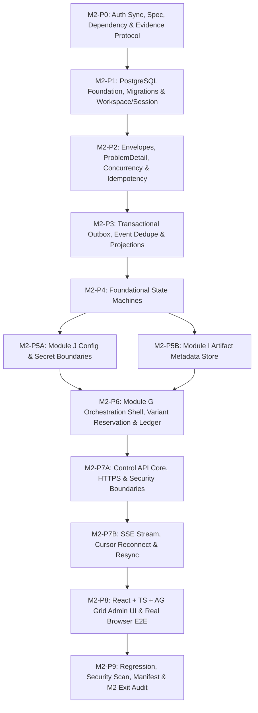

# M2 — Control Plane và Nền tảng Có thể Quan sát: Kế hoạch Thực thi (Implementation Plan)

**Tệp:** `docs/milestones/m2-control-plane/implementation-plan.md`  
**Trạng thái:** BẢN THẢO TRÌNH DUYỆT (AUTHORIZED FOR PLANNING — M2_PLAN_READY_FOR_USER_REVIEW)  
**Ngày lập:** 13-09-2026 (Cập nhật chuẩn hóa sau phản hồi User Checkpoint)  
**Căn cứ:**
- [Đặc tả Kỹ thuật M2](./spec.md)
- [Roadmap Mục 8 — M2 Control Plane](../../11-roadmap.md)
- Hợp đồng: [00-common-contract.md](../../09-contracts/00-common-contract.md), [01-control-api-and-stream.md](../../09-contracts/01-control-api-and-stream.md), [02-domain-events.md](../../09-contracts/02-domain-events.md), [09-orchestration-contracts.md](../../09-contracts/09-orchestration-contracts.md), [10-storage-contracts.md](../../09-contracts/10-storage-contracts.md), [11-configuration-security-contracts.md](../../09-contracts/11-configuration-security-contracts.md), [12-state-machines.md](../../09-contracts/12-state-machines.md)
- Chiến lược kiểm thử: [10-test-strategy.md](../../10-test-strategy.md)
- ADR liên quan: [ADR-0001](../../adr/0001-hybrid-modular-monolith.md), [ADR-0002](../../adr/0002-authoritative-data-and-search.md), [ADR-0004](../../adr/0004-commit-idempotency-and-fencing.md), [ADR-0007](../../adr/0007-runtime-and-admin-ui.md), [ADR-0009](../../adr/0009-trust-boundaries-and-secrets.md)

---

## 1. Nguyên tắc Thực thi Bắt buộc của M2

1. **Chu trình Kỷ luật Tuyệt đối**:
   `SPEC → PLAN → RED → IMPLEMENT → RUN → TEST → FIX → VERIFY → EVIDENCE → COMMIT`
2. **Kỷ luật Test-First & Chứng kiến RED Thật**:
   Mọi work package phải viết test trước code, chạy test và chứng kiến kết quả `FAILED` đúng oracle (do thiếu chức năng hoặc assertion thất bại, không phải do syntax/import missing), lưu stdout thô UTF-8 không BOM vào thư mục evidence của package đó trước khi viết dòng code implementation đầu tiên.
3. **Bảo vệ Kiến trúc Modular Monolith**:
   Mã nguồn M2 được đặt hoàn toàn trong `src/controlplane/`. Lớp Domain thuần túy tuyệt đối **không import** `fastapi`, `temporalio`, `psycopg`, `google` hay mã prototype `src/m1proof/`. Tuyệt đối không copy/rename mã prototype `src/m1proof` thành production code.
4. **Bảo toàn Hồi quy M1**:
   Toàn bộ **93 bài test của M1** phải tiếp tục đạt `PASS` (100% green, 0 skipped, 0 failed) trong suốt quá trình phát triển M2.
5. **Khóa Phiên bản Sau Nghiên cứu**:
   Không tự tiện gán phiên bản cũ. Các dependency backend và frontend toolchain được kiểm chứng tương thích trong M2-P0 trước khi khóa chính xác (pinned) vào lockfile.
6. **Không Mock trong E2E**:
   Kiểm thử E2E của M2 là dòng chảy thực: `Browser (Playwright) → FastAPI Control API → Application/UoW → PostgreSQL → Outbox → Projection → SSE → Browser DOM (React + AG Grid)`. Tuyệt đối không dùng JavaScript mock/fixture hard-code trong frontend.
7. **Ranh giới Bảo mật Fail-Closed**:
   0 byte plaintext secret được lưu trong PostgreSQL nghiệp vụ hay trả về qua API/UI/Event/Log. Mọi vi phạm secret boundary lập tức kích hoạt STOP condition.
8. **Khóa chặt Phạm vi Ngoài M2**:
   Milestone M3 và Phân hệ A tiếp tục duy trì trạng thái **`NOT AUTHORIZED`**. Cấm triển khai bất kỳ mã nguồn nào của Module A..F trong M2.

---

## 2. Sơ đồ Chuỗi Work Packages M2

---

## 3. Chi tiết Từng Work Package (Definition of Ready & Done)

---

### M2-P0: Authorization Sync, Spec/Traceability, Dependency Selection, Toolchain Lock & Evidence Protocol

- **Requirement / CT / INV IDs**: `ARCH-001`, `ADR-0007`, `PCC-027`, `PCC-028`, `INV-001..012`.
- **Dependencies**: Không có (Khởi đầu M2).
- **Mục tiêu**:
  1. Hoàn tất đồng bộ quyền trên toàn bộ repository (M1 ACCEPTED/CLOSED, M2 AUTHORIZED, M3 NOT AUTHORIZED).
  2. Thiết lập quy chuẩn kiểm tra chéo kiến trúc (Architecture/Import boundary test cấm domain import framework ngoài).
  3. Lựa chọn và khóa chính xác phiên bản backend candidates (`fastapi`, `uvicorn`, `httpx`) tương thích CPython 3.13.15, Pydantic 2.13.5, native SSE, RFC 9457 và TestClient.
  4. Lựa chọn và khóa chính xác frontend toolchain theo ADR-0007: Node.js LTS, React 18, TypeScript, AG Grid Community, Vite, Vitest, Playwright.
  5. Thiết kế chi tiết cơ chế Custom Raw SQL Migration Runner đáp ứng đủ 8 tiêu chuẩn (version table, checksum, ordering, advisory lock, dirty handling, forward, rollback, interrupted recovery).
  6. Thiết lập Evidence Protocol cho toàn bộ Milestone M2 (schema chuẩn, lệnh, trạng thái, băm SHA-256).
- **Allowed File Scope**:
  - `pyproject.toml`, `uv.lock`
  - `docs/milestones/m2-control-plane/evidence/m2-p0/`
  - `docs/milestones/m2-control-plane/toolchain-lock.md`
  - `tests/m2/test_p0_architecture_and_toolchain.py`
  - `src/controlplane/__init__.py`
- **Forbidden File Scope**:
  - `src/m1proof/**` (cấm sửa)
  - `src/controlplane/domain/**`, `application/**`, `api/**` (chưa code ở P0)
  - `tests/m1/**` (cấm sửa)
- **RED Oracle**:
  - `test_tst_m2_p0_001_domain_purity_import_rules`: Thử nghiệm import trái phép `fastapi` hoặc `psycopg` vào module domain giả lập -> Phải bị chặn bởi AST boundary checker.
  - `test_tst_m2_p0_002_backend_candidates_compatibility`: Kiểm tra FastAPI candidate hỗ trợ RFC 9457 Problem Details và SSE generator trên Python 3.13.15 -> Thất bại khi chưa cài đặt/khóa.
  - `test_tst_m2_p0_003_frontend_toolchain_locked`: Kiểm tra tệp cấu hình toolchain frontend tồn tại và không chứa `latest` -> Thất bại khi chưa cấu hình.
- **Positive Tests**: Toàn bộ dependency backend và frontend toolchain được resolve thành công, phiên bản khớp chính xác 100%, AST checker xác nhận domain purity.
- **Negative Tests**: Cố tình chèn dependency `latest` hoặc import `psycopg` trong domain -> Thất bại ngay lập tức.
- **Concurrency / Fault / Security Tests**: N/A cho package P0.
- **Migration / Rollback**: N/A cho package P0.
- **Evidence**:
  - `docs/milestones/m2-control-plane/evidence/m2-p0/commands.jsonl`
  - `docs/milestones/m2-control-plane/evidence/m2-p0/status.md`
  - `docs/milestones/m2-control-plane/evidence/m2-p0/red-observations.md`
  - `docs/milestones/m2-control-plane/evidence/m2-p0/red-p0-stdout.txt`
  - `docs/milestones/m2-control-plane/evidence/m2-p0/hashes.sha256`
  - `docs/milestones/m2-control-plane/toolchain-lock.md`
- **PASS Criteria**: M1 regression 93 tests tiếp tục PASS; backend và frontend toolchain được khóa exact; AST rule chặn vi phạm domain import; evidence P0 đầy đủ hợp lệ.
- **STOP Condition**: Không tìm được phiên bản FastAPI hỗ trợ ổn định native SSE và RFC 9457 trên Python 3.13.15, hoặc conflict dependency với pydantic/psycopg.
- **Claim Allowed**: "M2-P0 hoàn tất: toolchain và dependency đã được kiểm chứng và khóa chính xác; quy tắc kiến trúc domain purity đã sẵn sàng."
- **Claim Forbidden**: "Control plane đã sẵn sàng chạy" hoặc "Database đã migration".

---

### M2-P1: PostgreSQL Foundation, Raw SQL Migration Engine & Workspace/Session Foundation

- **Requirement / CT / INV IDs**: `ARCH-002`, `ADR-0002`, `CT-CMN-001`, `CT-API-001`, `CT-API-010`, `QR-MNT-002`.
- **Dependencies**: M2-P0.
- **Mục tiêu**:
  1. Hiện thực hóa Custom Raw SQL Migration Runner với đầy đủ 8 tiêu chuẩn: bảng `cp_schema_migrations`, băm SHA-256 đối soát checksum, thứ tự nghiêm ngặt, `pg_advisory_xact_lock` chống chạy đồng thời, đánh dấu `DIRTY`/`FAILED` khi lỗi, transaction riêng cho từng file, và script rollback tương ứng.
  2. Tạo migration `0001_initial_controlplane.sql` (và `0001_initial_controlplane.rollback.sql`) khởi tạo schema `controlplane`, bảng `cp_workspaces`, `cp_actors`, `cp_sessions`.
  3. Xây dựng `UnitOfWork` và `TransactionManager` quản lý kết nối PostgreSQL qua `psycopg 3` connection pool, cam kết rollback sạch sẽ khi có exception.
  4. Hiện thực hóa ranh giới cô lập theo `workspace_id` và xác thực phiên `session_id`.
- **Allowed File Scope**:
  - `src/controlplane/infrastructure/db/**`
  - `src/controlplane/domain/identity/**`
  - `src/controlplane/application/identity/**`
  - `tests/m2/test_p1_db_and_workspace.py`
  - `docs/milestones/m2-control-plane/evidence/m2-p1/**`
- **Forbidden File Scope**:
  - `src/controlplane/api/**`, `src/controlplane/ui/**`, `src/m1proof/**`.
- **RED Oracle**:
  - `test_tst_m2_p1_001_migration_forward_and_rollback`: Chạy migration tiến rồi lùi -> FAILED vì runner chưa tồn tại.
  - `test_tst_m2_p1_002_migration_checksum_tamper_rejected`: Sửa 1 byte file SQL đã migrate -> FAILED vì chưa có logic verify checksum.
  - `test_tst_m2_p1_003_concurrent_migration_advisory_lock`: Hai thread đồng thời gọi migrate -> FAILED vì chưa có advisory lock.
  - `test_tst_m2_p1_004_workspace_isolation_and_session_binding`: Truy vấn workspace khác mà không có quyền -> FAILED vì chưa có filter enforcement.
- **Positive Tests**: Migration áp dụng thành công trên PostgreSQL 18.6 container port 55432; rollback gỡ sạch bảng; workspace và session được tạo và lưu trữ chuẩn.
- **Negative Tests**: File migration thiếu rollback script -> Bị từ chối; script bị sửa checksum -> Báo lỗi `CHECKSUM_MISMATCH`; câu lệnh SQL lỗi -> Đánh dấu `FAILED`/`DIRTY` và rollback transaction.
- **Concurrency / Fault / Security Tests**: Test advisory lock khi 2 connection cố gắng migrate đồng thời; test crash giữa transaction đảm bảo connection pool không bị leak.
- **Migration / Rollback**: File `0001_initial_controlplane.sql` và `0001_initial_controlplane.rollback.sql` được kiểm tra tự động chạy up/down/up.
- **Evidence**: `docs/milestones/m2-control-plane/evidence/m2-p1/` (commands.jsonl, status.md, red-observations.md, red-p1-stdout.txt, hashes.sha256).
- **PASS Criteria**: Migration up/down/up thành công 100% trên PostgreSQL 18.6; advisory lock hoạt động; workspace boundary được cô lập; 93 tests M1 tiếp tục PASS.
- **STOP Condition**: Không thể lấy được advisory lock hoặc rollback migration để lại bảng/schema mồ côi.
- **Claim Allowed**: "M2-P1 hoàn tất: PostgreSQL migration engine đạt 8 tiêu chuẩn và workspace foundation đã hoạt động."
- **Claim Forbidden**: "Control API đã sẵn sàng."

---

### M2-P2: Envelopes, RFC 9457 ProblemDetail, Optimistic Concurrency & Idempotency Store

- **Requirement / CT / INV IDs**: `CT-CMN-001..006`, `ADR-0004`, `ADR-0005`, `ADR-0010`.
- **Dependencies**: M2-P1.
- **Mục tiêu**:
  1. Hiện thực hóa các lớp Envelope chuẩn trong domain: `MessageEnvelope`, `CommandEnvelope`, `CommandReceipt`, định dạng timestamp RFC 3339 UTC và correlation/causation tracking.
  2. Hiện thực hóa mô hình lỗi RFC 9457 `ProblemDetail` chuẩn hóa cho toàn hệ thống (`type`, `title`, `status`, `detail`, `instance`, `code`, `correlation_id`).
  3. Migration tạo bảng `controlplane.cp_idempotency_records` (`idempotency_key`, `workspace_id`, `command_name`, `request_hash`, `receipt_id`, `response_payload`, `created_at`, `expires_at`).
  4. Xây dựng `IdempotencyManager`: Cùng idempotency_key và cùng request_hash -> Trả về cached response; cùng idempotency_key nhưng khác payload -> Từ chối với lỗi `IDEMPOTENCY_KEY_REUSED_WITH_DIFFERENT_PAYLOAD`.
  5. Kiểm soát đồng thời lạc quan: Kiểm tra `expected_revision` khớp với aggregate revision hiện tại; trả về lỗi 409 `REVISION_CONFLICT` khi có xung đột mà không tự ý merge.
- **Allowed File Scope**:
  - `src/controlplane/domain/common/**`
  - `src/controlplane/infrastructure/db/migrations/0002_idempotency_records.*`
  - `src/controlplane/application/idempotency/**`
  - `tests/m2/test_p2_envelopes_and_idempotency.py`
  - `docs/milestones/m2-control-plane/evidence/m2-p2/**`
- **Forbidden File Scope**:
  - `src/controlplane/api/**`, `src/controlplane/ui/**`, `src/m1proof/**`.
- **RED Oracle**:
  - `test_tst_m2_p2_001_envelope_invariants_and_rfc3339`: Envelope thiếu correlation_id hoặc sai timestamp format -> FAILED vì chưa có validator.
  - `test_tst_m2_p2_002_idempotency_same_payload_returns_cached_receipt`: Gửi lại cùng payload -> FAILED vì chưa có idempotency store.
  - `test_tst_m2_p2_003_idempotency_key_reused_different_payload_rejected`: Gửi cùng key khác payload -> FAILED vì chưa có logic reject hash mismatch.
  - `test_tst_m2_p2_004_optimistic_concurrency_revision_conflict`: expected_revision không khớp -> FAILED vì chưa có revision check.
- **Positive Tests**: Envelope serialization/deserialization chuẩn; idempotent replay trả về nguyên vẹn receipt; revision tăng đơn điệu sau commit.
- **Negative Tests**: Tái sử dụng idempotency key với payload khác -> Trả về `IDEMPOTENCY_KEY_REUSED_WITH_DIFFERENT_PAYLOAD` kèm status 409; expected_revision sai -> Trả về `REVISION_CONFLICT` (RFC 9457).
- **Concurrency / Fault / Security Tests**: Concurrent requests cùng một idempotency key trong transaction song song; kiểm tra request hash sử dụng SHA-256.
- **Migration / Rollback**: Migration `0002_idempotency_records.sql` và rollback tương ứng.
- **Evidence**: `docs/milestones/m2-control-plane/evidence/m2-p2/` (commands.jsonl, status.md, red-observations.md, red-p2-stdout.txt, hashes.sha256).
- **PASS Criteria**: 100% tests P2 đạt; idempotency reject đúng chuẩn; problem details đúng RFC 9457; 93 tests M1 tiếp tục PASS.
- **STOP Condition**: Idempotency cho phép ghi đè response với payload khác hoặc revision conflict không chặn được race condition.
- **Claim Allowed**: "M2-P2 hoàn tất: Envelope, RFC 9457 ProblemDetail, Concurrency và Idempotency store đã hoạt động."
- **Claim Forbidden**: "Outbox đã sẵn sàng."

---

### M2-P3: Transactional Outbox, Event Checkpoint/Dedupe & Operation Projections

- **Requirement / CT / INV IDs**: `CT-CMN-001`, `CT-API-007`, `09-contracts/02-domain-events.md`, `ADR-0004`.
- **Dependencies**: M2-P2.
- **Mục tiêu**:
  1. Migration tạo bảng `controlplane.cp_outbox_events` (`event_id`, `workspace_id`, `contract_name`, `contract_version`, `correlation_id`, `causation_id`, `event_kind`, `aggregate_type`, `aggregate_id`, `payload`, `occurred_at`, `published`, `published_at`).
  2. Hiện thực hóa Transactional Outbox Pattern: Event nghiệp vụ và mutation bảng nghiệp vụ bắt buộc phải được commit trong cùng 1 transaction PostgreSQL (nếu transaction rollback, outbox event không bao giờ được sinh ra).
  3. Xây dựng `OutboxPublisher` phát event at-least-once và `ConsumerDeduplicator` lưu trữ event checkpoint bền vững trên PostgreSQL (`cp_event_checkpoints`).
  4. Hiện thực hóa `OperationProjection`: Cập nhật read model bảng `cp_operations` từ các events phát ra để phục vụ query và stream.
- **Allowed File Scope**:
  - `src/controlplane/infrastructure/db/migrations/0003_outbox_and_operations.*`
  - `src/controlplane/application/outbox/**`
  - `src/controlplane/application/projections/**`
  - `tests/m2/test_p3_outbox_and_projections.py`
  - `docs/milestones/m2-control-plane/evidence/m2-p3/**`
- **Forbidden File Scope**:
  - `src/controlplane/api/**`, `src/controlplane/ui/**`, `src/m1proof/**`.
- **RED Oracle**:
  - `test_tst_m2_p3_001_outbox_atomic_commit_with_business_mutation`: Rollback mutation nghiệp vụ nhưng outbox event vẫn ghi -> FAILED vì chưa đảm bảo tính nguyên tử.
  - `test_tst_m2_p3_002_outbox_publisher_at_least_once_and_consumer_dedupe`: Event phát lại lần 2 -> FAILED vì consumer xử lý lặp side effect.
  - `test_tst_m2_p3_003_operation_projection_updated_from_events`: Phát event OperationStarted -> FAILED vì bảng cp_operations chưa cập nhật trạng thái.
- **Positive Tests**: Outbox commit nguyên tử cùng dữ liệu; publisher đánh dấu published sau khi dispatch; deduplicator chặn event trùng lặp; projection phản ánh đúng trạng thái.
- **Negative Tests**: Lỗi giữa chừng trong transaction nghiệp vụ -> Không có event nào trong outbox; event bị thiếu correlation_id -> Bị từ chối tại domain.
- **Concurrency / Fault / Security Tests**: Mô phỏng crash sau khi ghi outbox nhưng trước khi dispatch; test concurrent consumer xử lý cùng một event_id.
- **Migration / Rollback**: Migration `0003_outbox_and_operations.sql` và rollback tương ứng.
- **Evidence**: `docs/milestones/m2-control-plane/evidence/m2-p3/` (commands.jsonl, status.md, red-observations.md, red-p3-stdout.txt, hashes.sha256).
- **PASS Criteria**: Atomicity outbox được chứng minh 100%; deduplication ngăn chặn hoàn toàn duplicate side effect; 93 tests M1 tiếp tục PASS.
- **STOP Condition**: Outbox event tồn tại độc lập mà không có bản ghi nghiệp vụ tương ứng (vi phạm tính nguyên tử).
- **Claim Allowed**: "M2-P3 hoàn tất: Transactional Outbox, Event Engine và Operation Projection đã hoạt động."
- **Claim Forbidden**: "State machine đã hoàn tất."

---

### M2-P4: Foundational State Machines (Operation, Batch, Job, Stage, Artifact)

- **Requirement / CT / INV IDs**: `CT-STATE-008..012`, `12-state-machines.md`.
- **Dependencies**: M2-P3.
- **Mục tiêu**:
  1. Hiện thực hóa các máy trạng thái cốt lõi bằng code domain thuần túy:
     - **Operation State Machine** (`CT-STATE-011`): `PREPARED → STARTED → SUCCEEDED | FAILED | OUTCOME_UNKNOWN`.
     - **Batch State Machine** (`CT-STATE-010`): `CREATED → RUNNING ↔ WAITING_CAPABILITY → COMPLETED_TARGET | COMPLETED_EXHAUSTED | FAILED_SYSTEM`.
     - **Job State Machine** (`CT-STATE-009`): `CREATED → SNAPSHOTTED → ACTIVE ↔ WAITING → READY_FOR_COMPLETION → COMPLETED | FAILED_FINAL`.
     - **Stage Run State Machine** (`CT-STATE-008`): `PENDING → WAITING_DEPENDENCY | WAITING_CAPABILITY | RUNNING → SUCCEEDED | FAILED_RETRYABLE | FAILED_FINAL | OUTCOME_UNKNOWN | STALE`.
     - **Artifact Location State Machine** (`CT-STATE-012`): `DECLARED → MATERIALIZING → AVAILABLE_UNVERIFIED → VERIFYING → VERIFIED | CORRUPT | MISSING → CLEANUP_ELIGIBLE → CLEANUP_AUTHORIZED → DELETED`.
  2. Nghiêm cấm mọi transition không hợp lệ bằng ngoại lệ `ForbiddenTransitionError` (trả mã `FORBIDDEN_TRANSITION`).
  3. Phân biệt rõ ràng: `WAITING` khác `FAILED`, `OUTCOME_UNKNOWN` khác cả hai; không tự ý retry từ `OUTCOME_UNKNOWN` mà phải qua reconcile.
- **Allowed File Scope**:
  - `src/controlplane/domain/statemachine/**`
  - `tests/m2/test_p4_statemachines.py`
  - `docs/milestones/m2-control-plane/evidence/m2-p4/**`
- **Forbidden File Scope**:
  - `src/controlplane/api/**`, `src/controlplane/ui/**`, `src/m1proof/**`.
- **RED Oracle**:
  - `test_tst_m2_p4_001_valid_lifecycle_transitions`: Thử chuyển trạng thái hợp lệ của Operation và Job -> FAILED vì state machine chưa cài đặt.
  - `test_tst_m2_p4_002_forbidden_transition_completed_to_running_rejected`: Cố tình chuyển từ COMPLETED về RUNNING -> FAILED vì chưa có logic chặn transition cấm.
  - `test_tst_m2_p4_003_outcome_unknown_requires_reconciliation`: Thử retry trực tiếp từ OUTCOME_UNKNOWN -> FAILED vì chưa có rule chặn retry mù.
- **Positive Tests**: Toàn bộ chuyển trạng thái hợp lệ theo sơ đồ hợp đồng `12-state-machines.md` được chấp thuận, tăng revision và phát event tương ứng.
- **Negative Tests**: Mọi chuyển trạng thái cấm (completed -> running, succeeded -> failed, deleted -> available) đều trả về `FORBIDDEN_TRANSITION` và không có side effect.
- **Concurrency / Fault / Security Tests**: Hai transition đồng thời trên cùng một aggregate aggregate -> 1 thành công, 1 bị chặn bởi expected_revision conflict.
- **Migration / Rollback**: N/A (State machine logic thuần domain).
- **Evidence**: `docs/milestones/m2-control-plane/evidence/m2-p4/` (commands.jsonl, status.md, red-observations.md, red-p4-stdout.txt, hashes.sha256).
- **PASS Criteria**: 100% các nhánh chuyển trạng thái hợp lệ và cấm được bao phủ bởi tests; phân biệt đúng taxonomy lỗi; 93 tests M1 tiếp tục PASS.
- **STOP Condition**: Tồn tại kịch bản cho phép aggregate đã `COMPLETED` hoặc `DELETED` quay trở lại trạng thái hoạt động.
- **Claim Allowed**: "M2-P4 hoàn tất: 5 máy trạng thái cốt lõi đã được kiểm chứng không có kẽ hở chuyển trạng thái."
- **Claim Forbidden**: "Phân hệ J hoặc G đã hoàn tất."

---

### M2-P5A: Module J — Config Revision, Policy & Secret Boundary Foundation

- **Requirement / CT / INV IDs**: `09-contracts/11-configuration-security-contracts.md`, `CT-STATE-013`, `ADR-0009`.
- **Dependencies**: M2-P4.
- **Mục tiêu**:
  1. Migration tạo bảng `controlplane.cp_config_revisions` (`config_id`, `scope`, `revision`, `content_hash`, `payload`, `status`, `created_at`) và `controlplane.cp_secret_handles` (`handle_id`, `provider`, `account_label`, `status`, `updated_at`).
  2. Hiện thực hóa `ConfigRevisionManager`: Quản lý bản sửa đổi cấu hình bất biến, revision tăng đơn điệu, đối soát `content_hash` SHA-256; không cho phép sửa đè bản ghi cũ; hỗ trợ chuyển trạng thái `DRAFT → PUBLISHED → SUPERSEDED | INVALIDATED`.
  3. Hiện thực hóa `SecretHandleResolver`: Lưu trữ metadata của secret và trả về `SecretHandle` an toàn; **cam kết 0 byte plaintext secret** được lưu trong PostgreSQL hay trả về API response; tương thích cơ chế vault process cô lập của ADR-0009.
- **Allowed File Scope**:
  - `src/controlplane/infrastructure/db/migrations/0004_config_and_secrets.*`
  - `src/controlplane/domain/config_security/**`
  - `src/controlplane/application/config_security/**`
  - `tests/m2/test_p5a_config_and_secrets.py`
  - `docs/milestones/m2-control-plane/evidence/m2-p5a/**`
- **Forbidden File Scope**:
  - `src/controlplane/api/**`, `src/controlplane/ui/**`, `src/m1proof/**`.
- **RED Oracle**:
  - `test_tst_m2_p5a_001_config_revision_immutability_and_hash`: Cố tình update trực tiếp nội dung config revision đã PUBLISHED -> FAILED vì chưa có immutability enforcement.
  - `test_tst_m2_p5a_002_secret_handle_storage_blocks_plaintext`: Thử lưu trữ secret value vào cp_secret_handles -> FAILED vì chưa có schema cấm trường secret.
  - `test_tst_m2_p5a_003_secret_redaction_in_domain_events`: Phát event config updated -> FAILED vì payload chứa secret thay vì handle.
- **Positive Tests**: Tạo và publish config revision thành công; băm SHA-256 nội dung khớp 100%; secret handle ánh xạ an toàn mà không lộ token.
- **Negative Tests**: Cố tình cập nhật revision đã published -> Báo lỗi `CONFIG_REVISION_IMMUTABLE`; quét toàn bộ bảng DB cam kết 0 byte token/key.
- **Concurrency / Fault / Security Tests**: Security scanner quét toàn bộ schema và data của Module J; concurrent publishing với cùng revision number.
- **Migration / Rollback**: Migration `0004_config_and_secrets.sql` và rollback tương ứng.
- **Evidence**: `docs/milestones/m2-control-plane/evidence/m2-p5a/` (commands.jsonl, status.md, red-observations.md, red-p5a-stdout.txt, hashes.sha256).
- **PASS Criteria**: Immutability được bảo vệ tuyệt đối; 0 secret leak; 93 tests M1 tiếp tục PASS.
- **STOP Condition**: Phát hiện plaintext secret trong PostgreSQL hoặc trong event payload của Module J.
- **Claim Allowed**: "M2-P5A hoàn tất: Phân hệ J đã bảo vệ bản sửa đổi cấu hình bất biến và ranh giới bí mật."
- **Claim Forbidden**: "Toàn bộ M2-P5 đã xong (còn P5B)."

---

### M2-P5B: Module I — Artifact Version & Location Metadata Store

- **Requirement / CT / INV IDs**: `09-contracts/10-storage-contracts.md`, `CT-STATE-012`, `ADR-0006`, `ADR-0010`.
- **Dependencies**: M2-P4.
- **Mục tiêu**:
  1. Migration tạo bảng `controlplane.cp_artifact_versions` (`artifact_id`, `version_id`, `sha256_hash`, `size_bytes`, `mime_type`, `created_at`) và `controlplane.cp_artifact_locations` (`location_id`, `version_id`, `storage_type`, `uri`, `status`, `last_verified_at`).
  2. Hiện thực hóa `ArtifactMetadataStore`: Quản lý vòng đời metadata tệp theo CT-STATE-012; lưu trữ và xác thực mã băm SHA-256; chuyển trạng thái vị trí (`DECLARED → MATERIALIZING → AVAILABLE_UNVERIFIED → VERIFYING → VERIFIED | CORRUPT | MISSING`).
  3. Quản lý ủy quyền dọn dẹp (`CleanupAuthorization`): Chỉ cho phép dọn dẹp khi vị trí đã `VERIFIED` và có xác nhận từ coordinator; không tự ý xóa khi đang xử lý.
- **Allowed File Scope**:
  - `src/controlplane/infrastructure/db/migrations/0005_artifact_metadata.*`
  - `src/controlplane/domain/storage_meta/**`
  - `src/controlplane/application/storage_meta/**`
  - `tests/m2/test_p5b_artifact_metadata.py`
  - `docs/milestones/m2-control-plane/evidence/m2-p5b/**`
- **Forbidden File Scope**:
  - `src/controlplane/api/**`, `src/controlplane/ui/**`, `src/m1proof/**`.
- **RED Oracle**:
  - `test_tst_m2_p5b_001_artifact_version_registration_and_hash_integrity`: Đăng ký version tệp -> FAILED vì chưa có metadata store.
  - `test_tst_m2_p5b_002_location_state_lifecycle_and_verification`: Chuyển trạng thái location sang VERIFIED -> FAILED vì chưa có validator.
  - `test_tst_m2_p5b_003_cleanup_authorization_requires_verified_location`: Thử ủy quyền xóa location chưa VERIFIED -> FAILED vì chưa có rule chặn cleanup trái phép.
- **Positive Tests**: Đăng ký artifact version với hash SHA-256; cập nhật location status đúng luồng; cấp phép cleanup đúng quy tắc.
- **Negative Tests**: Đăng ký với hash không hợp lệ -> Báo lỗi `INVALID_ARTIFACT_HASH`; yêu cầu cleanup location đang `VERIFYING` hoặc `CORRUPT` -> Bị từ chối `CLEANUP_NOT_ELIGIBLE`.
- **Concurrency / Fault / Security Tests**: Concurrent location verification updates; test chống đường dẫn local độc hại (path traversal trong URI).
- **Migration / Rollback**: Migration `0005_artifact_metadata.sql` và rollback tương ứng.
- **Evidence**: `docs/milestones/m2-control-plane/evidence/m2-p5b/` (commands.jsonl, status.md, red-observations.md, red-p5b-stdout.txt, hashes.sha256).
- **PASS Criteria**: Quản lý metadata artifact đúng CT-STATE-012; hash integrity được kiểm soát chặt chẽ; 93 tests M1 tiếp tục PASS.
- **STOP Condition**: Artifact location bị xóa khi chưa được cấp `CleanupAuthorization`.
- **Claim Allowed**: "M2-P5B hoàn tất: Phân hệ I metadata store đã quản lý chính xác vòng đời artifact."
- **Claim Forbidden**: "Orchestration shell đã xong."

---

### M2-P6: Module G — Orchestration Shell, Variant Reservation & Completion Ledger Skeleton

- **Requirement / CT / INV IDs**: `09-contracts/09-orchestration-contracts.md`, `CT-ORC-012`, `AUD2-B01`, `ADR-0004`.
- **Dependencies**: M2-P5A, M2-P5B.
- **Mục tiêu**:
  1. Migration tạo bảng `controlplane.cp_execution_grants` (`grant_id`, `job_id`, `stage_id`, `recovery_epoch`, `status`, `granted_at`, `expires_at`), `controlplane.cp_batch_capacity` (`batch_id`, `target_count`, `reserved_count`, `completed_count`, `exhausted`), `controlplane.cp_variant_reservations` (`reservation_id`, `fingerprint`, `job_id`, `status`, `created_at`), và `controlplane.cp_completion_ledger` (`ledger_id`, `job_id`, `output_ref`, `committed_at`).
  2. Hiện thực hóa `ExecutionGrant` fencing: Mỗi grant gắn liền với `recovery_epoch` của workspace; worker hoặc activity trả kết quả mang epoch cũ bị cách ly (`STALE_GENERATION_FENCED`).
  3. Hiện thực hóa `VariantReservation` (AUD2-B01 / CT-ORC-012 / TST-WF-VAR-001..004): Quản lý đặt chỗ biến thể góc kể kịch bản độc lập với batch capacity; đảm bảo không bao giờ có 2 job trùng lặp variant fingerprint được cấp phép hoàn thành.
  4. Hiện thực hóa `CompletionLedger`: Ghi nhận hoàn thành công việc nguyên tử, kết hợp kiểm tra capacity reservation và variant reservation trước khi chốt job `COMPLETED`.
- **Allowed File Scope**:
  - `src/controlplane/infrastructure/db/migrations/0006_orchestration_shell.*`
  - `src/controlplane/domain/orchestration/**`
  - `src/controlplane/application/orchestration/**`
  - `tests/m2/test_p6_orchestration_shell.py`
  - `docs/milestones/m2-control-plane/evidence/m2-p6/**`
- **Forbidden File Scope**:
  - `src/controlplane/api/**`, `src/controlplane/ui/**`, `src/m1proof/**`.
- **RED Oracle**:
  - `test_tst_m2_p6_001_execution_grant_stale_epoch_fencing`: Worker mang recovery_epoch cũ nộp kết quả -> FAILED vì chưa có fencing logic.
  - `test_tst_m2_p6_002_variant_reservation_prevents_duplicate_angles`: Hai job cùng claim 1 variant fingerprint -> FAILED vì chưa có reservation manager.
  - `test_tst_m2_p6_003_batch_capacity_exhaustion_handling`: Đặt chỗ vượt target batch count -> FAILED vì chưa có capacity reservation.
  - `test_tst_m2_p6_004_completion_ledger_atomic_record`: Commit completion ledger nhưng transaction rollback -> FAILED vì chưa đảm bảo tính nguyên tử.
- **Positive Tests**: Grant được cấp và giải phóng đúng hạn; variant reservation chống trùng lặp; completion ledger commit nguyên tử.
- **Negative Tests**: Stale epoch bị từ chối với `STALE_RECOVERY_EPOCH`; variant conflict trả về `VARIANT_RESERVATION_CONFLICT` và kết thúc job `FAILED_FINAL`.
- **Concurrency / Fault / Security Tests**: Hai transaction song song cố gắng tạo cùng một VariantReservation -> Đúng 1 transaction thành công, transaction kia fail sạch.
- **Migration / Rollback**: Migration `0006_orchestration_shell.sql` và rollback tương ứng.
- **Evidence**: `docs/milestones/m2-control-plane/evidence/m2-p6/` (commands.jsonl, status.md, red-observations.md, red-p6-stdout.txt, hashes.sha256).
- **PASS Criteria**: 100% tests orchestration shell đạt; AUD2-B01 được giải quyết triệt để; 93 tests M1 tiếp tục PASS.
- **STOP Condition**: Cho phép hai video job trùng variant fingerprint cùng commit hoàn thành.
- **Claim Allowed**: "M2-P6 hoàn tất: Phân hệ G orchestration shell, variant reservation và completion ledger đã hoạt động."
- **Claim Forbidden**: "Control API đã sẵn sàng."

---

### M2-P7A: Module H — Control API Core, Local HTTPS & Security Boundaries

- **Requirement / CT / INV IDs**: `CT-API-001..007`, `CT-API-010`, `ADR-0007`, `ADR-0009`, `ADR-0010`.
- **Dependencies**: M2-P6.
- **Mục tiêu**:
  1. Xây dựng ứng dụng FastAPI HTTP server với prefix `/v1` quản lý các endpoints:
     - `GET /v1/operations`, `GET /v1/operations/{id}`
     - `POST /v1/batches` (kèm `Idempotency-Key`)
     - `GET /v1/jobs`, `GET /v1/jobs/{id}`
     - `GET /v1/configs`, `PUT /v1/configs/{scope}` (kèm `If-Match`)
     - `GET /v1/errors/{technical_detail_ref}`
  2. Hỗ trợ Local HTTPS / TLS (chạy với chứng chỉ SSL loopback tự sinh).
  3. Middleware bảo mật nghiêm ngặt:
     - Host validation (chặn DNS rebinding, chỉ cho phép localhost/127.0.0.1).
     - Origin validation (chỉ chấp nhận localhost trusted ports).
     - CSRF protection cho các phương thức mutation.
     - Secret Redaction middleware (lọc mọi chuỗi nhạy cảm trước khi gửi response).
     - RFC 9457 Problem Details exception handler (chuyển mọi domain/application errors thành JSON chuẩn).
  4. Cơ chế truy cập lỗi an toàn: Không trả stack trace thô; cấp `technical_detail_ref` và chỉ cho phép tra cứu có xác thực.
- **Allowed File Scope**:
  - `src/controlplane/infrastructure/security/**`
  - `src/controlplane/api/main.py`, `routes/**`, `middleware/**`
  - `tests/m2/test_p7a_control_api_security.py`
  - `docs/milestones/m2-control-plane/evidence/m2-p7a/**`
- **Forbidden File Scope**:
  - `src/controlplane/ui/**`, `src/m1proof/**`.
- **RED Oracle**:
  - `test_tst_m2_p7a_001_host_header_spoofing_rejected`: Gửi header Host lạ `evil.com` -> FAILED vì chưa có Host validation.
  - `test_tst_m2_p7a_002_csrf_mutation_without_token_rejected`: Gửi POST không có CSRF token/header -> FAILED vì chưa có CSRF middleware.
  - `test_tst_m2_p7a_003_secret_redaction_filters_leaks`: Server trả lỗi chứa token -> FAILED vì token chưa bị redact.
  - `test_tst_m2_p7a_004_rfc9457_error_formatting`: Gây lỗi 409 conflict -> FAILED vì response chưa đúng format RFC 9457.
- **Positive Tests**: Gọi API hợp lệ trả về HTTP 200/202; idempotent command xử lý chuẩn; lỗi định dạng đúng RFC 9457; HTTPS kết nối an toàn.
- **Negative Tests**: Host spoofing trả 403 Forbidden; Origin lạ trả 403; CSRF thiếu trả 403; Revision conflict trả 409; Input sai quy tắc trả 422.
- **Concurrency / Fault / Security Tests**: Security scan kiểm tra header security (HSTS, X-Content-Type-Options, X-Frame-Options); kiểm tra zero leak token trong logs và responses.
- **Migration / Rollback**: N/A (API layer).
- **Evidence**: `docs/milestones/m2-control-plane/evidence/m2-p7a/` (commands.jsonl, status.md, red-observations.md, red-p7a-stdout.txt, hashes.sha256).
- **PASS Criteria**: Toàn bộ ranh giới bảo mật CT-API-010 đạt; chuẩn lỗi RFC 9457 tuân thủ 100%; 93 tests M1 tiếp tục PASS.
- **STOP Condition**: Bất kỳ response nào làm lộ chuỗi token/credential hoặc stack trace thô của hệ thống.
- **Claim Allowed**: "M2-P7A hoàn tất: Control API core, local HTTPS và các ranh giới bảo mật đã hoạt động."
- **Claim Forbidden**: "SSE stream đã xong (thuộc P7B)."

---

### M2-P7B: Module H — Server-Sent Events (SSE) Stream, Cursor Reconnect & Resync

- **Requirement / CT / INV IDs**: `CT-API-008`, `09-contracts/01-control-api-and-stream.md`, `ADR-0007`.
- **Dependencies**: M2-P7A.
- **Mục tiêu**:
  1. Hiện thực hóa endpoint SSE `GET /v1/operations/stream?cursor=...` truyền tải luồng sự kiện cập nhật trạng thái thời gian thực một chiều từ server tới browser.
  2. Định dạng sự kiện SSE chuẩn: `id` (stream_event_id), `event` (event_kind), `data` (JSON chứa `cursor`, `resource_type`, `resource_id`, `status`, `summary`, `correlation_id`).
  3. Cơ chế phục hồi kết nối (Reconnect): Client gửi cursor cuối cùng đã nhận (`Last-Event-ID` hoặc query param `cursor`); server gửi bù các sự kiện bị lỡ từ outbox/operation projections.
  4. Xử lý trôi cursor (Resync Required): Khi client gửi cursor quá cũ đã vượt quá khoảng retention lưu trữ, server phản hồi sự kiện đặc biệt `resync_required: true` yêu cầu client query lại toàn bộ snapshot.
  5. Projection nhật ký session an toàn phục vụ theo dõi trên giao diện quản trị.
- **Allowed File Scope**:
  - `src/controlplane/api/sse/**`
  - `src/controlplane/application/projections/**`
  - `tests/m2/test_p7b_sse_stream.py`
  - `docs/milestones/m2-control-plane/evidence/m2-p7b/**`
- **Forbidden File Scope**:
  - `src/controlplane/ui/**`, `src/m1proof/**`.
- **RED Oracle**:
  - `test_tst_m2_p7b_001_sse_stream_format_and_headers`: Kết nối tới /v1/operations/stream -> FAILED vì endpoint chưa có text/event-stream format.
  - `test_tst_m2_p7b_002_sse_reconnect_with_cursor_delivers_missed_events`: Client ngắt kết nối, tạo 3 events, client reconnect bằng cursor cũ -> FAILED vì chưa có replay logic.
  - `test_tst_m2_p7b_003_sse_cursor_expired_triggers_resync_required`: Gửi cursor = 1 khi server đã dọn dẹp tới cursor = 100 -> FAILED vì chưa có resync flag.
- **Positive Tests**: Luồng SSE phát sự kiện mượt mà; client nhận đúng chuỗi sự kiện; cursor tăng đơn điệu; reconnect nhận đủ sự kiện bị lỡ.
- **Negative Tests**: Gửi cursor không hợp lệ -> Báo lỗi 400; cursor hết hạn -> Nhận `resync_required: true`; không cho phép gửi command qua SSE (chỉ read-only).
- **Concurrency / Fault / Security Tests**: Nhiều client cùng kết nối SSE; client ngắt kết nối đột ngột (abrupt disconnect) không gây leak thread/memory trên server.
- **Migration / Rollback**: N/A.
- **Evidence**: `docs/milestones/m2-control-plane/evidence/m2-p7b/` (commands.jsonl, status.md, red-observations.md, red-p7b-stdout.txt, hashes.sha256).
- **PASS Criteria**: SSE stream tuân thủ 100% CT-API-008; reconnect không mất dữ liệu; 93 tests M1 tiếp tục PASS.
- **STOP Condition**: SSE stream bị treo hoặc đứt kết nối làm rò rỉ unhandled exceptions trên server.
- **Claim Allowed**: "M2-P7B hoàn tất: Luồng SSE thời gian thực và cơ chế reconnect/resync đã hoạt động."
- **Claim Forbidden**: "Admin UI đã xong."

---

### M2-P8: Module H — React + TypeScript + AG Grid Community Admin UI & Real Browser E2E

- **Requirement / CT / INV IDs**: `ADR-0007`, `QR-UX-001`, `QR-UX-002`, `09-contracts/01-control-api-and-stream.md`.
- **Dependencies**: M2-P7B.
- **Mục tiêu**:
  1. Xây dựng giao diện web quản trị sản phẩm bằng **React 18, TypeScript và AG Grid Community** theo đúng [ADR-0007](../../adr/0007-runtime-and-admin-ui.md):
     - Giao diện tiếng Việt có dấu 100%, Dark Mode hiện đại, tối ưu cho desktop 1080p+ (1920x1080).
     - Bảng dữ liệu AG Grid hiển thị danh sách Operations, Batches, Jobs từ API thật.
     - Form gửi command mẫu (`StartProductionBatch`) có `Idempotency-Key` và xử lý biên nhận `CommandReceipt`.
     - Tích hợp `EventSource` lắng nghe stream SSE `/v1/operations/stream`, tự động cập nhật trạng thái trên bảng AG Grid mà không cần reload trang.
     - Modal kiểm tra lỗi an toàn hiển thị thông tin thân thiện và `technical_detail_ref` (tuyệt đối không hiển thị stack trace thô hay secret).
  2. Kiểm thử Browser E2E thực tế bằng **Playwright**:
     - Kích hoạt dòng chảy thực: `Playwright Browser → Control API → PostgreSQL → Outbox → Projection → SSE → AG Grid DOM`.
     - Xác nhận AG Grid cập nhật trạng thái trực tiếp trên màn hình từ `ACCEPTED` sang `RUNNING` và `SUCCEEDED`.
     - **Tuyệt đối không dùng JavaScript mock/fixture hard-coded trong frontend.**
- **Allowed File Scope**:
  - `src/controlplane/ui/**` (package.json, vite.config.ts, tsconfig.json, src/**)
  - `tests/m2/test_p8_browser_e2e.py` (Playwright tests)
  - `docs/milestones/m2-control-plane/evidence/m2-p8/**`
- **Forbidden File Scope**:
  - `src/m1proof/**`, `tests/m1/**`.
- **RED Oracle**:
  - `test_tst_m2_p8_001_react_ag_grid_rendering_vietnamese_utf8`: Mở trang UI -> FAILED vì frontend chưa được dựng hoặc thiếu font tiếng Việt UTF-8.
  - `test_tst_m2_p8_002_browser_e2e_real_command_sse_dom_flow`: Playwright nhấn nút gửi command mẫu trên UI, chờ AG Grid cập nhật qua SSE -> FAILED vì dòng chảy chưa tích hợp.
  - `test_tst_m2_p8_003_safe_error_inspection_without_secret_leak`: Kích hoạt lỗi và mở modal chẩn đoán -> FAILED vì modal để lộ stack trace hoặc secret.
- **Positive Tests**: Giao diện load dưới 1 giây; tiếng Việt hiển thị sắc nét; AG Grid sort/filter mượt mà; SSE cập nhật dòng dữ liệu theo thời gian thực; Playwright E2E pass 100%.
- **Negative Tests**: Dữ liệu có chuỗi `<script>` -> Được escape an toàn (chống XSS); ngắt kết nối mạng tạm thời -> UI hiển thị badge "Mất kết nối - đang kết nối lại..." và tự phục hồi khi có mạng.
- **Concurrency / Fault / Security Tests**: XSS sanitization check; responsive layout test tại 1920x1080; kiểm tra không có secret trong DOM inspector.
- **Migration / Rollback**: N/A.
- **Evidence**: `docs/milestones/m2-control-plane/evidence/m2-p8/` (commands.jsonl, status.md, red-observations.md, red-p8-stdout.txt, hashes.sha256, screenshot/recording E2E).
- **PASS Criteria**: Giao diện React + AG Grid hoạt động hoàn hảo; E2E Playwright test pass trên luồng thật; 93 tests M1 tiếp tục PASS.
- **STOP Condition**: Giao diện vỡ layout tại 1080p, lỗi font tiếng Việt, hoặc E2E chỉ pass nhờ mock frontend.
- **Claim Allowed**: "M2-P8 hoàn tất: Admin UI React + AG Grid đã tích hợp thật với Control API và SSE stream."
- **Claim Forbidden**: "Milestone M2 đã hoàn thành toàn bộ (còn P9)."

---

### M2-P9: Regression Suite, Security Audit, Manifest Synthesis & M2 Exit Gate Verification

- **Requirement / CT / INV IDs**: `10-test-strategy.md`, `M2 Exit Gate`.
- **Dependencies**: M2-P0..M2-P8.
- **Mục tiêu**:
  1. Chạy toàn bộ test suite hồi quy M1 (93 tests) và toàn bộ test suite M2 -> Cam kết 0 regressions.
  2. Thực hiện quét bảo mật fail-closed trên toàn bộ repository: Quét credential canary, secret pattern, token leaks trong code, logs, DB views, và docs.
  3. Kiểm chứng khả năng rollback của toàn bộ các migration M2 (chạy down về trạng thái ban đầu và chạy up trở lại) đảm bảo tính toàn vẹn dữ liệu.
  4. Tổng hợp toàn bộ bằng chứng M2 từ P0 đến P8 vào tệp `manifest.json` của M2, tính toán và đối soát mã băm SHA-256 toàn vẹn 100%.
  5. Lập Báo cáo Kiểm toán Exit Gate M2 `docs/milestones/m2-control-plane/audit-m2.md` và xác nhận trạng thái sẵn sàng cho User Checkpoint M2 (`M2_READY_FOR_USER_CHECKPOINT`).
- **Allowed File Scope**:
  - `docs/milestones/m2-control-plane/audit-m2.md`
  - `docs/milestones/m2-control-plane/evidence/manifest.json`
  - `docs/milestones/m2-control-plane/evidence/m2-p9/**`
  - `tests/m2/test_p9_m2_exit_gate.py`
- **Forbidden File Scope**:
  - `src/**` (chỉ chạy kiểm thử, không sửa code sản phẩm).
- **RED Oracle**:
  - `test_tst_m2_p9_001_m2_manifest_and_gate_evaluation`: Chạy gate evaluation khi thiếu 1 artifact evidence -> FAILED vì gate engine phát hiện thiếu bằng chứng.
  - `test_tst_m2_p9_002_artifact_tamper_detection`: Sửa 1 byte trong tệp evidence cũ -> FAILED vì manifest phát hiện sai lệch SHA-256.
- **Positive Tests**: 100% tests M1 và M2 PASSED; manifest xác nhận toàn vẹn 100% artifacts; secret scanner xác nhận 0 findings; audit report M2 kết luận đạt chuẩn.
- **Negative Tests**: Thử nghiệm can thiệp băm artifact -> Gate engine fail-closed; thử chèn canary secret -> Scanner báo lỗi và chặn exit gate.
- **Concurrency / Fault / Security Tests**: Quét toàn bộ repository chống rò rỉ bí mật; kiểm tra toàn bộ transaction rollback.
- **Migration / Rollback**: Kiểm tra chu trình rollback toàn bộ các migration M2.
- **Evidence**: `docs/milestones/m2-control-plane/evidence/m2-p9/` (commands.jsonl, status.md, red-observations.md, red-p9-stdout.txt, hashes.sha256, manifest.json).
- **PASS Criteria**: Toàn bộ exit criteria của M2 đạt; Báo cáo kiểm toán M2 hoàn tất; M1 93 tests tiếp tục PASS; sẵn sàng cho User Checkpoint M2.
- **STOP Condition**: Bất kỳ bài test nào của M1 bị fail hoặc phát hiện bất kỳ token nào bị rò rỉ.
- **Claim Allowed**: "Milestone M2 hoàn tất 100% và đạt toàn bộ tiêu chí Exit Gate; sẵn sàng trình Người dùng User Checkpoint M2."
- **Claim Forbidden**: "Milestone M3 đã được mở (M3 tiếp tục NOT AUTHORIZED)."

---

## 4. Tiêu chí Đạt Exit Gate Milestone M2

1. **100% Hợp đồng Nền tảng Đã Được Kiểm chứng**: Envelopes, RFC 9457 Problem Details, Idempotency, Transactional Outbox, 5 State Machines, Config revisions, Artifact metadata, Execution grant fencing, Variant reservation, Completion ledger.
2. **Không có Duplicate Aggregate hoặc Duplicate Side Effect**: Command lặp không sinh aggregate trùng; event lặp không tạo side effect kép.
3. **Bảo vệ Ranh giới Bí mật Tuyệt đối**: 0 byte secret xuất hiện trong database view, log, API response, UI DOM hay event payload.
4. **Lát cắt Người dùng Hoạt động Đích thực**: Giao diện React + TypeScript + AG Grid Community hiển thị tiếng Việt, kết nối Control API thật qua HTTPS, nhận stream SSE thời gian thực và vượt qua kiểm thử Playwright E2E thật.
5. **Bảo toàn Hồi quy M1**: 93 bài test của M1 tiếp tục đạt GREEN 100%.
6. **Báo cáo Kiểm toán M2 Hoàn tất**: Lập tệp `docs/milestones/m2-control-plane/audit-m2.md` sẵn sàng cho quyết định phê duyệt User Checkpoint từ Người dùng.
