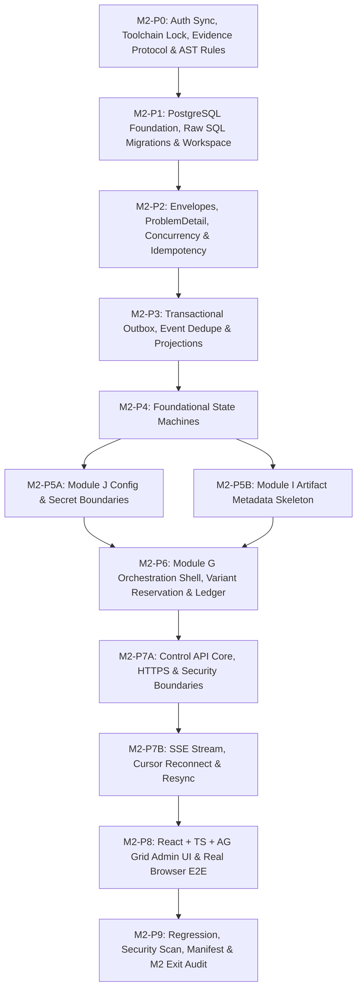

# M2 — Control Plane và Nền tảng Có thể Quan sát: Kế hoạch Thực thi (Implementation Plan)

**Tệp:** `docs/milestones/m2-control-plane/implementation-plan.md`  
**Trạng thái:** BẢN THẢO TRÌNH DUYỆT (AUTHORIZED FOR PLANNING — M2_PLAN_READY_FOR_FINAL_APPROVAL)  
**Ngày lập:** 13-09-2026 (Cập nhật chuẩn hóa sau Independent Plan Review)  
**Căn cứ:**
- [Đặc tả Kỹ thuật M2](./spec.md)
- [Roadmap Mục 8 — M2 Control Plane](../../11-roadmap.md)
- Hợp đồng: [00-common-contract.md](../../09-contracts/00-common-contract.md), [01-control-api-and-stream.md](../../09-contracts/01-control-api-and-stream.md), [02-domain-events.md](../../09-contracts/02-domain-events.md), [09-orchestration-contracts.md](../../09-contracts/09-orchestration-contracts.md), [10-storage-contracts.md](../../09-contracts/10-storage-contracts.md), [11-configuration-security-contracts.md](../../09-contracts/11-configuration-security-contracts.md), [12-state-machines.md](../../09-contracts/12-state-machines.md)
- Chiến lược kiểm thử: [10-test-strategy.md](../../10-test-strategy.md)
- ADR liên quan: [ADR-0001](../../adr/0001-hybrid-modular-monolith.md), [ADR-0002](../../adr/0002-authoritative-data-and-search.md), [ADR-0004](../../adr/0004-commit-idempotency-and-fencing.md), [ADR-0007](../../adr/0007-runtime-and-admin-ui.md), [ADR-0009](../../adr/0009-trust-boundaries-and-secrets.md)

---

## 1. Nguyên tắc Thực thi Bắt buộc của M2

1. **Chu trình Kỷ luật Tuyệt đối**:
   `SPEC → PLAN → RED → IMPLEMENT → RUN → TEST → FIX → VERIFY → EVIDENCE → COMMIT`
2. **Kỷ luật Test-First Phân loại**:
   - **M2-P0** là package capability/preflight: Sử dụng compatibility PASS/FAIL evidence và architecture-validator AST tests. P0 tạo skeleton interfaces để P1+ fail vì oracle/NotImplemented chứ không fail vì missing module/import setup.
   - **Từ M2-P1 trở đi**: Bắt buộc chứng kiến RED thật đúng oracle nghiệp vụ, lưu stdout thô UTF-8 không BOM vào thư mục evidence của package trước khi viết code implementation.
3. **Bảo vệ Kiến trúc Modular Monolith & Domain Purity**:
   Mã nguồn M2 đặt trong `src/controlplane/`. Lớp Domain thuần túy tuyệt đối **không import** `fastapi`, `temporalio`, `psycopg`, `psycopg_pool`, `google` hay mã prototype `src/m1proof`. Bổ sung AST checker tự động thực thi luật import một chiều.
4. **Bảo toàn Hồi quy M1**:
   Toàn bộ **93 bài test của M1** phải tiếp tục đạt `PASS` (100% green, 0 skipped, 0 failed) trong suốt quá trình phát triển M2.
5. **Tooling & Scanner Độc lập**:
   M2 xây dựng tooling và secret scanner riêng (`src/controlplane/infrastructure/security/`), tuyệt đối không import hoặc phụ thuộc vào script `m1proof.oauth_broker`.
6. **Khóa Phiên bản Sau Nghiên cứu**:
   Lựa chọn exact pinned dependency trong P0 sau compatibility proof: FastAPI (>=0.135.0 cho native SSE), `psycopg_pool`, Node.js 22 LTS, npm exact, React, TypeScript, AG Grid Community maintained patch, Vite, Playwright TypeScript. Tuyệt đối không dùng `latest`.
7. **Không Mock trong E2E**:
   Kiểm thử E2E của M2 là dòng chảy thực bằng Playwright TypeScript: `Browser → FastAPI Control API → Application/UoW → PostgreSQL → Outbox → Projection → SSE → Browser DOM (AG Grid)`. Không dùng mock/fixture hard-coded trong frontend.
8. **Ranh giới Bảo mật Fail-Closed**:
   0 byte plaintext secret được lưu trong PostgreSQL nghiệp vụ hay trả về qua API/UI/Event/Log. Mọi vi phạm secret boundary lập tức kích hoạt STOP condition.
9. **Khóa chặt Phạm vi Ngoài M2**:
   Milestone M3 và Phân hệ A tiếp tục duy trì trạng thái **`NOT AUTHORIZED`**. Cấm triển khai bất kỳ mã nguồn nào của Module A..F trong M2.

---

## 2. Sơ đồ Chuỗi Work Packages M2

---

## 3. Chi tiết 12 Work Packages (Definition of Ready & Done)

---

### M2-P0: Authorization Sync, Toolchain Lock, Evidence Protocol & Architecture Rules

- **Requirement / CT / INV IDs**: `ARCH-001`, `ADR-0007`, `PCC-027`, `PCC-028`, `INV-001..012`.
- **Dependencies**: Không có (Khởi đầu M2).
- **Mục tiêu**:
  1. Xác nhận đồng bộ trạng thái authorization (M1 ACCEPTED, M2 AUTHORIZED, M3 NOT AUTHORIZED).
  2. Quyết định production packaging strategy cho `src/controlplane` trong `pyproject.toml` đảm bảo import/entrypoint hoạt động từ fresh documented environment mà không phụ thuộc test-only `sys.path` hacks và không làm hỏng M1 regression.
  3. Đánh giá compatibility và khóa chính xác backend candidates: `fastapi >= 0.135.0` (hỗ trợ native SSE), `uvicorn`, `psycopg_pool` (bắt buộc cho connection pooling), `httpx==0.28.1`.
  4. Lựa chọn và khóa chính xác frontend toolchain: Node.js 22 LTS, `npm` exact version, React, TypeScript, AG Grid Community maintained patch, Vite, Playwright TypeScript; khởi tạo `src/controlplane/ui/package.json` và lockfile exact.
  5. Thiết kế và kiểm thử công cụ Evidence Validator thực thi ngay từ P0: Định nghĩa schema `status.json` (nguồn sự thật duy nhất cho máy), cơ chế kiểm tra `hashes.sha256` DAG không tự tham chiếu (exclude itself), và quy tắc kiểm tra gate fail-closed.
  6. Xây dựng bộ kiểm thử Architecture/Import boundary bằng AST (`tests/m2/test_p0_architecture_rules.py`) cấm domain layer import bất kỳ framework/driver ngoài nào hoặc import mã M1 proof.
  7. Khởi tạo skeleton interfaces tối thiểu để các bài test của P1+ thất bại vì oracle nghiệp vụ / `NotImplementedError` thay vì `ModuleNotFoundError`.
- **Allowed File Scope**:
  - `pyproject.toml`, `uv.lock`
  - `src/controlplane/ui/package.json`, `package-lock.json`
  - `src/controlplane/ui/vite.config.ts`, `playwright.config.ts`
  - `docs/milestones/m2-control-plane/toolchain-lock.md`
  - `src/controlplane/infrastructure/evidence/**` (evidence validator script)
  - `src/controlplane/domain/interfaces/**` (skeleton interfaces)
  - `tests/m2/test_p0_architecture_rules.py`, `tests/m2/test_p0_evidence_validator.py`
  - `docs/milestones/m2-control-plane/evidence/m2-p0/**`
- **Forbidden File Scope**:
  - `src/m1proof/**` (cấm sửa)
  - `tests/m1/**` (cấm sửa)
  - `src/controlplane/domain/` (chỉ skeleton interfaces, chưa code domain models)
  - `src/controlplane/api/**`, `application/**` (chưa code ở P0)
- **RED Oracle / Preflight Protocol**:
  - P0 là preflight package: Không tạo RED giả do thiếu cài đặt thư viện.
  - `test_tst_m2_p0_001_ast_boundary_rules`: Cố tình quét module vi phạm import `fastapi` trong domain -> Thất bại đúng oracle của AST checker.
  - `test_tst_m2_p0_002_evidence_validator_rejects_tampered_hash`: Validator kiểm tra hash DAG không tự tham chiếu -> Thất bại đúng oracle khi tệp hash bị sửa.
- **Positive Tests**: AST boundary test xác nhận 100% domain code tuân thủ luật phụ thuộc một chiều; evidence validator kiểm tra hợp lệ thư mục P0; toàn bộ backend và frontend toolchain resolve thành công.
- **Negative Tests**: Chèn thử import `psycopg` vào domain interface -> Bị chặn ngay lập tức; tạo `status.json` sai schema -> Validator báo lỗi fail-closed.
- **Concurrency / Fault / Security Tests**: N/A cho P0.
- **Migration / Rollback**: N/A.
- **Evidence**:
  - `docs/milestones/m2-control-plane/evidence/m2-p0/commands.jsonl`
  - `docs/milestones/m2-control-plane/evidence/m2-p0/status.json` (machine-readable authority)
  - `docs/milestones/m2-control-plane/evidence/m2-p0/status.md` (human-readable derivative)
  - `docs/milestones/m2-control-plane/evidence/m2-p0/hashes.sha256` (loại trừ chính nó)
  - `docs/milestones/m2-control-plane/evidence/m2-p0/capability_toolchain.json`
  - `docs/milestones/m2-control-plane/toolchain-lock.md`
- **PASS Criteria**:
  - M1 regression: 93 passed, 0 skipped, 0 failed.
  - Backend và frontend toolchain được exact-pin và verify tương thích trên Python 3.13 và Node 22 LTS.
  - Evidence validator và AST checker hoạt động chuẩn xác, chứng minh domain purity.
- **STOP Condition**: Xảy ra xung đột dependency giữa `psycopg_pool`, `pydantic 2.13.5` và FastAPI trên Python 3.13, hoặc packaging strategy phá vỡ test suite M1.
- **Claim Allowed**: "M2-P0 hoàn tất: Toolchain đã khóa chính xác; evidence protocol và quy tắc kiến trúc domain purity đã sẵn sàng."
- **Claim Forbidden**: "Control plane đã sẵn sàng chạy" hoặc "Database đã migration".

---

### M2-P1: PostgreSQL Foundation, Raw SQL Migrations & Workspace/Session Foundation

- **Requirement / CT / INV IDs**: `ARCH-002`, `ADR-0002`, `CT-CMN-001`, `CT-API-001`, `CT-API-010`, `QR-MNT-002`.
- **Dependencies**: M2-P0.
- **Mục tiêu**:
  1. Hiện thực hóa Raw SQL Migration Runner native:
     - Dùng connection chuyên biệt và **session-level advisory lock** (`pg_advisory_lock` / `pg_advisory_unlock`) bao bọc toàn bộ migration run.
     - Bảng `controlplane.cp_schema_migrations` lưu version, name, checksum_sha256, applied_at, execution_ms.
     - Checksum verification chống sửa đổi file đã áp dụng.
     - Thứ tự nghiêm ngặt (strict ordering).
     - Transactional SQL only: Migration fail -> Transaction rollback, không ghi applied, startup fail-closed (không cần dirty state).
     - Forward migration từng file trong transaction riêng.
     - Rollback migration tương ứng (`.rollback.sql`).
     - **Isolated Test DB Guard**: Kiểm thử destructive down/up chỉ được chạy trên disposable isolated test database/schema được guard rõ ràng.
  2. Tạo migration `0001_initial_controlplane.sql` khởi tạo schema `controlplane`, bảng `cp_workspaces`, `cp_actors`, `cp_sessions`.
  3. Xây dựng `UnitOfWork` và `TransactionManager` quản lý kết nối qua `psycopg_pool.ConnectionPool`.
  4. Hiện thực hóa ranh giới cô lập `workspace_id` và session `session_id`.
- **Allowed File Scope**:
  - `src/controlplane/infrastructure/db/**`
  - `src/controlplane/domain/identity/**`
  - `src/controlplane/application/identity/**`
  - `tests/m2/test_p1_db_and_workspace.py`
  - `docs/milestones/m2-control-plane/evidence/m2-p1/**`
- **Forbidden File Scope**:
  - `src/controlplane/api/**`, `src/controlplane/ui/**`, `src/m1proof/**`.
- **RED Oracle**:
  - `test_tst_m2_p1_001_migration_forward_and_rollback_on_isolated_db`: Chạy up/down/up trên isolated test schema -> FAILED vì migration runner chưa hoàn thiện.
  - `test_tst_m2_p1_002_migration_checksum_tamper_rejected`: Thay đổi 1 ký tự file migration cũ -> FAILED vì chưa có logic verify checksum SHA-256.
  - `test_tst_m2_p1_003_session_level_advisory_lock`: Kiểm tra advisory lock không bị nhả giữa các migration -> FAILED vì session lock chưa được giữ.
  - `test_tst_m2_p1_004_workspace_isolation_and_session_binding`: Truy vấn dữ liệu workspace khác -> FAILED vì chưa áp dụng workspace boundary.
- **Positive Tests**: Migration chạy tiến thành công trên PostgreSQL 18.6 container port 55432; connection pool cấp phát kết nối ổn định; workspace và session được tạo và lưu trữ chuẩn.
- **Negative Tests**: Sửa đổi checksum file đã migrate -> Fail-closed `CHECKSUM_MISMATCH`; lỗi SQL -> Rollback sạch sẽ không ghi nhận bản ghi; cố tình chạy destructive rollback trên non-test DB -> Bị guard chặn ngay lập tức.
- **Concurrency / Fault / Security Tests**: Concurrent migration runner bị chặn bởi session advisory lock; crash giữa chừng tự động giải phóng lock và rollback an toàn.
- **Migration / Rollback**: `0001_initial_controlplane.sql` và `0001_initial_controlplane.rollback.sql` kiểm thử up/down/up trên isolated disposable schema.
- **Evidence**: `docs/milestones/m2-control-plane/evidence/m2-p1/` (`commands.jsonl`, `status.json`, `status.md`, `red-observations.md`, `red-p1-stdout.txt`, `hashes.sha256`).
- **PASS Criteria**: Chạy evidence validator của P0 đạt PASS; 93 tests M1 tiếp tục PASS; 100% tests P1 đạt GREEN.
- **STOP Condition**: Advisory lock bị giải phóng giữa các migration hoặc rollback migration để lại schema mồ côi.
- **Claim Allowed**: "M2-P1 hoàn tất: PostgreSQL migration engine đạt 8 tiêu chuẩn và workspace foundation đã hoạt động."
- **Claim Forbidden**: "Control API đã sẵn sàng."

---

### M2-P2: Envelopes, RFC 9457 ProblemDetail, Optimistic Concurrency & Durable Idempotency

- **Requirement / CT / INV IDs**: `CT-CMN-001..006`, `ADR-0004`, `ADR-0005`, `ADR-0010`.
- **Dependencies**: M2-P1.
- **Mục tiêu**:
  1. Hiện thực hóa các domain model Envelope: `MessageEnvelope`, `CommandEnvelope`, timestamp RFC 3339 UTC, correlation_id và causation_id.
  2. Bền vững hóa `CommandReceipt` trong bảng `controlplane.cp_command_receipts` (`receipt_id`, `command_id`, `disposition`, `operation_id`, `resource_ref`, `accepted_at`, `current_revision`).
  3. Migration tạo bảng `controlplane.cp_idempotency_records` (`idempotency_key`, `workspace_id`, `command_name`, `request_hash`, `receipt_id`, `created_at`, `expires_at` [nullable, no auto-purge in M2]).
  4. Hiện thực hóa `IdempotencyManager`:
     - Cùng key + cùng request_hash -> Trả về `CommandReceipt` bền vững đã lưu.
     - Cùng key + khác payload -> Báo lỗi `IDEMPOTENCY_KEY_REUSED_WITH_DIFFERENT_PAYLOAD`.
  5. Business uniqueness: Ràng buộc unique constraints trên aggregate nghiệp vụ là lớp bảo vệ thứ hai sau idempotency.
  6. Kiểm soát đồng thời lạc quan: Kiểm tra `expected_revision` khớp với aggregate revision; trả về domain error transport-neutral `RevisionConflictError` (không phụ thuộc HTTP). Lớp API sau này chịu trách nhiệm map sang RFC 9457 409 `REVISION_CONFLICT`.
- **Allowed File Scope**:
  - `src/controlplane/domain/common/**`
  - `src/controlplane/infrastructure/db/migrations/0002_idempotency_and_receipts.*`
  - `src/controlplane/application/idempotency/**`
  - `tests/m2/test_p2_envelopes_and_idempotency.py`
  - `docs/milestones/m2-control-plane/evidence/m2-p2/**`
- **Forbidden File Scope**:
  - `src/controlplane/api/**`, `src/controlplane/ui/**`, `src/m1proof/**`.
- **RED Oracle**:
  - `test_tst_m2_p2_001_envelope_invariants_and_rfc3339`: Envelope thiếu correlation_id hoặc sai format RFC 3339 -> FAILED vì thiếu validator.
  - `test_tst_m2_p2_002_durable_command_receipt_persistence`: Gửi command -> FAILED vì bảng cp_command_receipts chưa ghi nhận.
  - `test_tst_m2_p2_003_idempotency_key_reused_different_payload_rejected`: Tái sử dụng key với payload khác -> FAILED vì chưa có hash mismatch detection.
  - `test_tst_m2_p2_004_optimistic_concurrency_revision_conflict`: expected_revision không khớp -> FAILED vì chưa có revision conflict check.
- **Positive Tests**: Envelope serialization chuẩn; replay cùng payload trả về đúng receipt bền vững đã commit; revision tăng đơn điệu sau commit.
- **Negative Tests**: Tái sử dụng key khác payload trả `IDEMPOTENCY_KEY_REUSED_WITH_DIFFERENT_PAYLOAD`; revision cũ trả `RevisionConflictError`.
- **Concurrency / Fault / Security Tests**: Concurrent requests cùng key trong transaction song song; kiểm tra request hash sử dụng SHA-256; không purge tự động idempotency records.
- **Migration / Rollback**: `0002_idempotency_and_receipts.sql` và rollback tương ứng trên isolated test DB.
- **Evidence**: `docs/milestones/m2-control-plane/evidence/m2-p2/` (`commands.jsonl`, `status.json`, `status.md`, `red-observations.md`, `red-p2-stdout.txt`, `hashes.sha256`).
- **PASS Criteria**: Evidence validator P0 đạt PASS; 93 tests M1 tiếp tục PASS; 100% tests P2 đạt GREEN.
- **STOP Condition**: Idempotency cho phép ghi đè response với payload khác hoặc receipt không được persist bền vững.
- **Claim Allowed**: "M2-P2 hoàn tất: Envelopes, CommandReceipt bền vững, Idempotency store và Concurrency control đã hoạt động."
- **Claim Forbidden**: "Transactional outbox đã sẵn sàng."

---

### M2-P3: Transactional Outbox, Event Deduplication & Durable Operation-Stream Projections

- **Requirement / CT / INV IDs**: `CT-CMN-001`, `CT-EVT-001..005`, `CT-API-007`, `09-contracts/02-domain-events.md`, `ADR-0004`.
- **Dependencies**: M2-P2.
- **Mục tiêu**:
  1. Migration tạo bảng `controlplane.cp_outbox_events` bao phủ đầy đủ schema CT-EVT-001..005: `event_id`, `event_name`, `aggregate_type`, `aggregate_id`, `aggregate_revision`, `producer`, `workspace_id`, `correlation_id`, `causation_id`, `contract_version`, `recovery_epoch`, `sensitivity`, `occurred_at`, `recorded_at`, `payload` (JSONB), `published`, `published_at`.
  2. Transactional Outbox: Đảm bảo mutation nghiệp vụ và outbox event commit trong cùng 1 transaction PostgreSQL.
  3. Consumer Deduplication & Atomic Side Effect: Bảng `controlplane.cp_event_checkpoints`; khi consumer cập nhật projection/read model, checkpoint và projection phải commit trong cùng một transaction.
  4. Fault Handling:
     - Dispatch thành công → crash trước published ACK → dispatch lại → consumer dedupe → logical side effect chỉ một lần.
     - Phát hiện aggregate revision gap và out-of-order events.
     - Cách ly event có schema không hỗ trợ (`QUARANTINED_UNSUPPORTED_SCHEMA`).
     - Từ chối event mang epoch cũ (`STALE_RECOVERY_EPOCH`).
  5. Durable Operation-Stream Projection: Bảng `controlplane.cp_operation_stream` với monotonic `BIGINT cursor` (`stream_event_id`), `operation_id`, `event_kind`, `summary`, `correlation_id`, `created_at` và retention watermark làm nguồn sự thật duy nhất cho endpoint SSE.
- **Allowed File Scope**:
  - `src/controlplane/infrastructure/db/migrations/0003_outbox_and_projections.*`
  - `src/controlplane/domain/events/**`
  - `src/controlplane/application/outbox/**`
  - `src/controlplane/application/projections/**`
  - `tests/m2/test_p3_outbox_and_projections.py`
  - `docs/milestones/m2-control-plane/evidence/m2-p3/**`
- **Forbidden File Scope**:
  - `src/controlplane/api/**`, `src/controlplane/ui/**`, `src/m1proof/**`.
- **RED Oracle**:
  - `test_tst_m2_p3_001_outbox_atomic_commit_with_business_mutation`: Rollback transaction nghiệp vụ nhưng outbox event vẫn ghi -> FAILED vì chưa đảm bảo atomicity.
  - `test_tst_m2_p3_002_consumer_dedupe_and_fault_recovery`: Giả lập crash sau dispatch trước published ACK, dispatch lại -> FAILED vì projection bị nhân đôi.
  - `test_tst_m2_p3_003_unsupported_schema_quarantined`: Gửi event sai schema version -> FAILED vì chưa có logic quarantine.
  - `test_tst_m2_p3_004_operation_stream_monotonic_cursor`: Kiểm tra cursor trong cp_operation_stream -> FAILED vì cursor chưa tăng đơn điệu.
- **Positive Tests**: Outbox commit nguyên tử; consumer dedupe ngăn chặn duplicate side effect; cursor tăng đơn điệu; stream projection phản ánh chính xác event.
- **Negative Tests**: Event mang stale recovery epoch bị từ chối; event sai schema version bị chuyển vào quarantine.
- **Concurrency / Fault / Security Tests**: Fault injection crash trước khi update published; concurrent consumers xử lý cùng một event_id.
- **Migration / Rollback**: `0003_outbox_and_projections.sql` và rollback tương ứng trên isolated test DB.
- **Evidence**: `docs/milestones/m2-control-plane/evidence/m2-p3/` (`commands.jsonl`, `status.json`, `status.md`, `red-observations.md`, `red-p3-stdout.txt`, `hashes.sha256`).
- **PASS Criteria**: Evidence validator P0 đạt PASS; 93 tests M1 tiếp tục PASS; 100% tests P3 đạt GREEN.
- **STOP Condition**: Outbox event tồn tại khi transaction nghiệp vụ bị rollback hoặc consumer dedupe để lặp side effect.
- **Claim Allowed**: "M2-P3 hoàn tất: Transactional Outbox, Event Deduplication và Durable Operation Stream Projection đã hoạt động."
- **Claim Forbidden**: "State machines đã hoàn tất."

---

### M2-P4: Foundational State Machines & Operation Semantics Mapping

- **Requirement / CT / INV IDs**: `CT-STATE-008..012`, `CT-API-007`, `12-state-machines.md`.
- **Dependencies**: M2-P3.
- **Mục tiêu**:
  1. Hiện thực hóa các máy trạng thái cốt lõi bằng code domain thuần túy:
     - **Operation State Machine** (`CT-STATE-011`): `PREPARED → STARTED → SUCCEEDED | FAILED | OUTCOME_UNKNOWN`.
     - **Batch State Machine** (`CT-STATE-010`): `CREATED → RUNNING ↔ WAITING_CAPABILITY → COMPLETED_TARGET | COMPLETED_EXHAUSTED | FAILED_SYSTEM`.
     - **Job State Machine** (`CT-STATE-009`): `CREATED → SNAPSHOTTED → ACTIVE ↔ WAITING → READY_FOR_COMPLETION → COMPLETED | FAILED_FINAL`.
     - **Stage Run State Machine** (`CT-STATE-008`): `PENDING → WAITING_DEPENDENCY | WAITING_CAPABILITY | RUNNING → SUCCEEDED | FAILED_RETRYABLE | FAILED_FINAL | OUTCOME_UNKNOWN | STALE`.
     - **Artifact Location State Machine** (`CT-STATE-012`): `DECLARED → MATERIALIZING → AVAILABLE_UNVERIFIED → VERIFYING → VERIFIED | CORRUPT | MISSING`. Cleanup transition chỉ được phép: `VERIFIED → CLEANUP_ELIGIBLE → CLEANUP_AUTHORIZED → DELETED`.
  2. Định nghĩa và kiểm thử tường minh mapping giữa execution state và API projection:
     - `PREPARED` → `accepted`
     - `STARTED` → `running`
     - `STARTED` (chờ capability/grant) → `waiting`
     - `SUCCEEDED` → `succeeded`
     - `FAILED` → `failed`
     - `OUTCOME_UNKNOWN` → `outcome_unknown`
  3. Cấm mọi transition không hợp lệ với `ForbiddenTransitionError` (`FORBIDDEN_TRANSITION`).
- **Allowed File Scope**:
  - `src/controlplane/domain/statemachine/**`
  - `src/controlplane/application/projections/operation_view_mapper.py`
  - `tests/m2/test_p4_statemachines.py`
  - `docs/milestones/m2-control-plane/evidence/m2-p4/**`
- **Forbidden File Scope**:
  - `src/controlplane/api/**`, `src/controlplane/ui/**`, `src/m1proof/**`.
- **RED Oracle**:
  - `test_tst_m2_p4_001_valid_lifecycle_transitions`: Thử chuyển trạng thái hợp lệ của Operation và Job -> FAILED vì state machine chưa cài đặt.
  - `test_tst_m2_p4_002_forbidden_transition_completed_to_running_rejected`: Chuyển từ COMPLETED về RUNNING -> FAILED vì chưa có rule chặn transition cấm.
  - `test_tst_m2_p4_003_operation_execution_to_projection_mapping`: Kiểm tra mapping giữa PREPARED/STARTED và accepted/running -> FAILED vì mapper chưa cài đặt.
  - `test_tst_m2_p4_004_artifact_cleanup_strict_transition_order`: Cố tình chuyển từ AVAILABLE_UNVERIFIED sang CLEANUP_ELIGIBLE -> FAILED vì chưa tuân thủ VERIFIED requirement.
- **Positive Tests**: Toàn bộ chuyển trạng thái hợp lệ theo sơ đồ hợp đồng được chấp thuận; mapping sang `OperationView` đúng 100%.
- **Negative Tests**: Mọi transition cấm đều trả về `FORBIDDEN_TRANSITION` và không có side effect.
- **Concurrency / Fault / Security Tests**: Hai transition đồng thời trên cùng một aggregate aggregate -> Chặn bởi revision conflict.
- **Migration / Rollback**: N/A (Domain logic thuần túy).
- **Evidence**: `docs/milestones/m2-control-plane/evidence/m2-p4/` (`commands.jsonl`, `status.json`, `status.md`, `red-observations.md`, `red-p4-stdout.txt`, `hashes.sha256`).
- **PASS Criteria**: Evidence validator P0 đạt PASS; 93 tests M1 tiếp tục PASS; 100% tests P4 đạt GREEN.
- **STOP Condition**: Tồn tại kịch bản cho phép aggregate đã `COMPLETED` hoặc `DELETED` quay trở lại trạng thái hoạt động.
- **Claim Allowed**: "M2-P4 hoàn tất: 5 máy trạng thái cốt lõi và mapping OperationView đã được kiểm chứng."
- **Claim Forbidden**: "Phân hệ J hoặc G đã hoàn tất."

---

### M2-P5A: Module J — Config Revision, Policy & Secret Boundary Foundation

- **Requirement / CT / INV IDs**: `09-contracts/11-configuration-security-contracts.md`, `CT-STATE-013`, `ADR-0009`.
- **Dependencies**: M2-P4.
- **Mục tiêu**:
  1. Migration tạo bảng `controlplane.cp_config_revisions` (`config_id`, `scope`, `revision`, `content_hash`, `payload`, `status`, `created_at`) và `controlplane.cp_secret_handles` (`handle_id`, `provider`, `account_label`, `status`, `updated_at`).
  2. `ConfigRevisionManager`: Quản lý bản sửa đổi cấu hình bất biến, revision tăng đơn điệu, đối soát `content_hash` SHA-256; chuyển trạng thái `DRAFT → PUBLISHED → SUPERSEDED | INVALIDATED`.
  3. `SecretHandleResolver`: Lưu trữ metadata của secret và trả về `SecretHandle` an toàn; **cam kết 0 byte plaintext secret** được lưu trong PostgreSQL nghiệp vụ; tương thích cơ chế vault process cô lập của ADR-0009.
- **Allowed File Scope**:
  - `src/controlplane/infrastructure/db/migrations/0004_config_and_secrets.*`
  - `src/controlplane/domain/config_security/**`
  - `src/controlplane/application/config_security/**`
  - `tests/m2/test_p5a_config_and_secrets.py`
  - `docs/milestones/m2-control-plane/evidence/m2-p5a/**`
- **Forbidden File Scope**:
  - `src/controlplane/api/**`, `src/controlplane/ui/**`, `src/m1proof/**`.
- **RED Oracle**:
  - `test_tst_m2_p5a_001_config_revision_immutability_and_hash`: Cố tình update nội dung config revision đã PUBLISHED -> FAILED vì chưa có immutability enforcement.
  - `test_tst_m2_p5a_002_secret_handle_storage_blocks_plaintext`: Thử lưu trữ secret plaintext vào cp_secret_handles -> FAILED vì chưa có schema cấm trường secret.
  - `test_tst_m2_p5a_003_secret_redaction_in_domain_events`: Phát event config updated -> FAILED vì payload chứa secret thay vì handle.
- **Positive Tests**: Tạo và publish config revision thành công; hash SHA-256 khớp 100%; secret handle ánh xạ an toàn mà không lộ token.
- **Negative Tests**: Cố tình sửa revision đã published trả lỗi `CONFIG_REVISION_IMMUTABLE`; quét bảng DB xác nhận 0 byte token/key.
- **Concurrency / Fault / Security Tests**: Standalone secret scanner quét toàn bộ schema và data của Module J; concurrent publishing với cùng revision number.
- **Migration / Rollback**: `0004_config_and_secrets.sql` và rollback tương ứng trên isolated test DB.
- **Evidence**: `docs/milestones/m2-control-plane/evidence/m2-p5a/` (`commands.jsonl`, `status.json`, `status.md`, `red-observations.md`, `red-p5a-stdout.txt`, `hashes.sha256`).
- **PASS Criteria**: Evidence validator P0 đạt PASS; 0 secret leak; 93 tests M1 tiếp tục PASS; 100% tests P5A đạt GREEN.
- **STOP Condition**: Phát hiện plaintext secret trong PostgreSQL hoặc trong event payload của Module J.
- **Claim Allowed**: "M2-P5A hoàn tất: Phân hệ J đã bảo vệ bản sửa đổi cấu hình bất biến và ranh giới bí mật."
- **Claim Forbidden**: "Toàn bộ M2-P5 đã xong (còn P5B)."

---

### M2-P5B: Module I — Artifact Version & Location Metadata Skeleton

- **Requirement / CT / INV IDs**: `09-contracts/10-storage-contracts.md`, `CT-STATE-012`, `ADR-0006`, `ADR-0010`.
- **Dependencies**: M2-P4.
- **Mục tiêu**:
  1. Migration tạo bảng `controlplane.cp_artifact_versions` (`artifact_id`, `version_id`, `sha256_hash`, `size_bytes`, `mime_type`, `created_at`) và `controlplane.cp_artifact_locations` (`location_id`, `version_id`, `storage_type`, `uri`, `status`, `last_verified_at`).
  2. `ArtifactMetadataStore`: Quản lý vòng đời metadata tệp theo CT-STATE-012; lưu trữ và xác thực mã băm SHA-256; chuyển trạng thái vị trí (`DECLARED → MATERIALIZING → AVAILABLE_UNVERIFIED → VERIFYING → VERIFIED | CORRUPT | MISSING`).
  3. `CleanupAuthorization` Skeleton: Quản lý tính đủ điều kiện dọn dẹp metadata (`CLEANUP_ELIGIBLE → CLEANUP_AUTHORIZED → DELETED`).
  4. **Phạm vi Giới hạn**: Không claim external byte integrity / Drive lifecycle trong M2. Không thực hiện real destructive cleanup và không claim production-safe cleanup khi lease/cloud verification đầy đủ chưa tồn tại.
- **Allowed File Scope**:
  - `src/controlplane/infrastructure/db/migrations/0005_artifact_metadata.*`
  - `src/controlplane/domain/storage_meta/**`
  - `src/controlplane/application/storage_meta/**`
  - `tests/m2/test_p5b_artifact_metadata.py`
  - `docs/milestones/m2-control-plane/evidence/m2-p5b/**`
- **Forbidden File Scope**:
  - `src/controlplane/api/**`, `src/controlplane/ui/**`, `src/m1proof/**`.
- **RED Oracle**:
  - `test_tst_m2_p5b_001_artifact_version_registration_and_hash_integrity`: Đăng ký version tệp -> FAILED vì chưa có metadata store.
  - `test_tst_m2_p5b_002_location_state_lifecycle_and_verification`: Chuyển trạng thái location sang VERIFIED -> FAILED vì chưa có validator.
  - `test_tst_m2_p5b_003_cleanup_authorization_requires_verified_location`: Yêu cầu cleanup location chưa VERIFIED -> FAILED vì chưa có rule chặn cleanup trái phép.
- **Positive Tests**: Đăng ký artifact version với hash SHA-256; cập nhật location status đúng luồng; cấp phép cleanup skeleton đúng quy tắc.
- **Negative Tests**: Đăng ký với hash không hợp lệ trả `INVALID_ARTIFACT_HASH`; yêu cầu cleanup location đang `VERIFYING` bị từ chối `CLEANUP_NOT_ELIGIBLE`.
- **Concurrency / Fault / Security Tests**: Concurrent location verification updates; test path traversal trong URI.
- **Migration / Rollback**: `0005_artifact_metadata.sql` và rollback tương ứng trên isolated test DB.
- **Evidence**: `docs/milestones/m2-control-plane/evidence/m2-p5b/` (`commands.jsonl`, `status.json`, `status.md`, `red-observations.md`, `red-p5b-stdout.txt`, `hashes.sha256`).
- **PASS Criteria**: Evidence validator P0 đạt PASS; metadata skeleton tuân thủ CT-STATE-012; 93 tests M1 tiếp tục PASS.
- **STOP Condition**: Artifact location bị đánh dấu deleted khi chưa qua trạng thái `CLEANUP_AUTHORIZED`.
- **Claim Allowed**: "M2-P5B hoàn tất: Phân hệ I metadata skeleton đã được thiết lập."
- **Claim Forbidden**: "Drive storage lifecycle hay destructive cleanup đã hoàn tất."

---

### M2-P6: Module G — Orchestration Shell, Variant Reservation & Completion Ledger Skeleton

- **Requirement / CT / INV IDs**: `09-contracts/09-orchestration-contracts.md`, `CT-ORC-002`, `CT-ORC-012`, `AUD2-B01`, `ADR-0004`.
- **Dependencies**: M2-P5A, M2-P5B.
- **Mục tiêu**:
  1. Migration tạo persistence thực cho:
     - `cp_production_batches`: `batch_id`, `workspace_id`, `status`, `target_count`, `created_at`.
     - `cp_video_jobs`: `job_id`, `batch_id`, `workspace_id`, `status`, `snapshot_ref`, `revision`.
     - `cp_stage_runs`: `stage_run_id`, `job_id`, `stage_name`, `attempt`, `status`, `recovery_epoch`.
  2. `BatchCapacityReservation` Riêng biệt: Bảng `cp_batch_capacity_reservations` (`reservation_id`, `workspace_id`, `batch_id`, `job_id`, `state`: `ACTIVE`/`CONVERTED`/`RELEASED`, `created_at`). Cấp phát capacity nguyên tử, invariant 1 reservation đúng 1 job.
  3. `VariantReservation` & VariantRegistryRevision CAS (AUD2-B01 / CT-ORC-012):
     - Bảng `cp_variant_reservations`: `reservation_id`, `workspace_id`, `job_id`, `fingerprint`, `snapshot_scope`, `validation_ref`, `variation_policy_revision`, `expected_registry_revision`, `committed_registry_revision`, `state` (`ACTIVE`/`CONVERTED`/`RELEASED`), `created_at`.
     - Bảng `cp_variant_registry`: `workspace_id`, `current_registry_revision`.
     - Quản lý CAS trên `current_registry_revision`.
     - Sử dụng contract errors chuẩn: `VARIANT_CONFLICT` (trùng fingerprint) và `VARIANT_VALIDATION_STALE` (registry revision đã bị thay đổi). Tuyệt đối không tự tạo lỗi mới.
  4. `ExecutionGrant` Fencing: Gắn liền với `recovery_epoch`; worker nộp kết quả mang epoch cũ bị từ chối với `STALE_RECOVERY_EPOCH`.
  5. `CompletionLedger` Skeleton: Bảng `cp_completion_ledger` với unique invariant trên `job_id`, lưu trữ refs tới batch, capacity reservation, variant reservation, output artifact/hash, actor/time.
  6. **Phạm vi Giới hạn**: M2 chỉ claim: *"G-side completion skeleton/invariants proven using typed test ports/fixtures."* Không claim full CommitVideoCompletion end-to-end vì C/D/F và render media thực tế chưa thuộc M2.
- **Allowed File Scope**:
  - `src/controlplane/infrastructure/db/migrations/0006_orchestration_shell.*`
  - `src/controlplane/domain/orchestration/**`
  - `src/controlplane/application/orchestration/**`
  - `tests/m2/test_p6_orchestration_shell.py`
  - `docs/milestones/m2-control-plane/evidence/m2-p6/**`
- **Forbidden File Scope**:
  - `src/controlplane/api/**`, `src/controlplane/ui/**`, `src/m1proof/**`.
- **RED Oracle**:
  - `test_tst_m2_p6_001_execution_grant_stale_epoch_fencing`: Worker mang recovery_epoch cũ nộp kết quả -> FAILED vì chưa có fencing logic.
  - `test_tst_m2_p6_002_variant_reservation_cas_and_conflict`: Hai job cùng claim 1 variant fingerprint -> FAILED vì chưa có variant reservation CAS.
  - `test_tst_m2_p6_003_batch_capacity_reservation_lifecycle`: Đặt chỗ vượt target count -> FAILED vì chưa có capacity reservation manager.
  - `test_tst_m2_p6_004_completion_ledger_unique_job_invariant`: Thử commit completion 2 lần cho cùng 1 job -> FAILED vì chưa có unique ledger invariant.
- **Positive Tests**: Grant được cấp và giải phóng đúng hạn; variant reservation chống trùng lặp qua CAS; completion ledger commit nguyên tử duy nhất 1 lần trên mỗi job.
- **Negative Tests**: Stale epoch bị từ chối với `STALE_RECOVERY_EPOCH`; variant conflict trả về đúng `VARIANT_CONFLICT`; validation stale trả về `VARIANT_VALIDATION_STALE`.
- **Concurrency / Fault / Security Tests**: Hai transaction song song cố gắng tạo cùng một VariantReservation -> 1 thành công, 1 fail sạch với `VARIANT_CONFLICT`.
- **Migration / Rollback**: `0006_orchestration_shell.sql` và rollback tương ứng trên isolated test DB.
- **Evidence**: `docs/milestones/m2-control-plane/evidence/m2-p6/` (`commands.jsonl`, `status.json`, `status.md`, `red-observations.md`, `red-p6-stdout.txt`, `hashes.sha256`).
- **PASS Criteria**: Evidence validator P0 đạt PASS; 93 tests M1 tiếp tục PASS; AUD2-B01 được kiểm chứng; 100% tests P6 đạt GREEN.
- **STOP Condition**: Hai video job trùng variant fingerprint cùng commit hoàn thành.
- **Claim Allowed**: "M2-P6 hoàn tất: G-side completion skeleton/invariants proven using typed test ports/fixtures."
- **Claim Forbidden**: "Full CommitVideoCompletion end-to-end đã hoàn tất."

---

### M2-P7A: Module H — Control API Core, Local HTTPS & Security Boundaries

- **Requirement / CT / INV IDs**: `CT-API-001..007`, `CT-API-010`, `ADR-0007`, `ADR-0009`, `ADR-0010`.
- **Dependencies**: M2-P6.
- **Mục tiêu**:
  1. Xây dựng ứng dụng FastAPI HTTP server với prefix `/v1`:
     - `GET /v1/operations`, `GET /v1/operations/{id}`
     - `POST /v1/batches` (bắt buộc header `Idempotency-Key`)
     - `GET /v1/jobs`, `GET /v1/jobs/{id}`
     - `GET /v1/configs`, `PUT /v1/configs/{scope}` (bắt buộc `Idempotency-Key` và `If-Match`)
     - `GET /v1/errors/{technical_detail_ref}`
  2. Bootstrap-Session Protocol phù hợp ADR-0009:
     - Không thêm login screen.
     - Server khởi động sinh bootstrap session token gắn chặt với `workspace_id` và actor.
     - Session truyền qua cookie an toàn: `HttpOnly; Secure; SameSite=Strict; Path=/`.
     - Browser không tự khai workspace đáng tin; server tự resolve workspace từ session.
  3. CSRF Protocol: Áp dụng cơ chế **Double Submit Cookie** (cookie `csrf_token` + header `X-CSRF-Token`).
  4. Local HTTPS Protocol: Hỗ trợ TLS qua chứng chỉ tự sinh loopback; phân biệt rõ TLS handshake works vs browser cert provisioning (không dùng `ignoreHTTPSErrors` rồi tuyên bố cert provisioning PASS).
  5. Host & Origin Validation: Host header bắt buộc là `localhost`/`127.0.0.1` (chặn DNS rebinding); Origin header kiểm tra strict.
  6. Durable Technical-Detail Storage: Bảng `cp_technical_details` lưu trữ stack trace và context an toàn; response lỗi API chỉ trả về `technical_detail_ref`.
  7. Secret Redaction: Middleware quét response và log lọc bỏ chuỗi nhạy cảm.
- **Allowed File Scope**:
  - `src/controlplane/infrastructure/db/migrations/0007_technical_details.*`
  - `src/controlplane/infrastructure/security/**`
  - `src/controlplane/api/main.py`, `routes/**`, `middleware/**`
  - `tests/m2/test_p7a_control_api_security.py`
  - `docs/milestones/m2-control-plane/evidence/m2-p7a/**`
- **Forbidden File Scope**:
  - `src/controlplane/ui/**`, `src/m1proof/**`.
- **RED Oracle**:
  - `test_tst_m2_p7a_001_host_header_spoofing_rejected`: Gửi header Host lạ `evil.com` -> FAILED vì chưa có Host validation.
  - `test_tst_m2_p7a_002_csrf_mutation_without_token_rejected`: Gửi POST mutation không có header `X-CSRF-Token` khớp cookie -> FAILED vì chưa có CSRF validator.
  - `test_tst_m2_p7a_003_safe_technical_detail_ref_retrieval`: Gây lỗi 500, kiểm tra response -> FAILED vì response chứa stack trace thay vì technical_detail_ref.
  - `test_tst_m2_p7a_004_tls_handshake_verification`: Kết nối TLS tới local server -> FAILED vì chưa khởi tạo HTTPS listener.
- **Positive Tests**: Gọi API hợp lệ trả về HTTP 200/202; idempotent command xử lý chuẩn; lỗi định dạng đúng RFC 9457; TLS handshake hoạt động an toàn.
- **Negative Tests**: Host spoofing trả 403; CSRF thiếu trả 403; Revision conflict trả 409; Input sai quy tắc trả 422; PUT config thiếu `Idempotency-Key` bị từ chối.
- **Concurrency / Fault / Security Tests**: Security scan kiểm tra zero leak token; test tra cứu lỗi xuyên workspace bị từ chối 404/403.
- **Migration / Rollback**: `0007_technical_details.sql` và rollback tương ứng trên isolated test DB.
- **Evidence**: `docs/milestones/m2-control-plane/evidence/m2-p7a/` (`commands.jsonl`, `status.json`, `status.md`, `red-observations.md`, `red-p7a-stdout.txt`, `hashes.sha256`, `tls_handshake_evidence.json`).
- **PASS Criteria**: Evidence validator P0 đạt PASS; ranh giới bảo mật CT-API-010 đạt 100%; 93 tests M1 tiếp tục PASS.
- **STOP Condition**: Response làm lộ chuỗi token/credential hoặc stack trace thô của hệ thống.
- **Claim Allowed**: "M2-P7A hoàn tất: Control API core, local HTTPS và các ranh giới bảo mật đã hoạt động."
- **Claim Forbidden**: "SSE stream đã xong (thuộc P7B)."

---

### M2-P7B: Module H — Server-Sent Events (SSE) Stream, Cursor Reconnect & Resync

- **Requirement / CT / INV IDs**: `CT-API-008`, `09-contracts/01-control-api-and-stream.md`, `ADR-0007`.
- **Dependencies**: M2-P7A.
- **Mục tiêu**:
  1. Hiện thực hóa endpoint SSE `GET /v1/operations/stream?cursor=...` đọc dữ liệu trực tiếp từ bảng durable operation-stream projection (`cp_operation_stream`).
  2. Định dạng sự kiện SSE chuẩn: `id` (stream_event_id), `event` (event_kind), `data` (JSON chứa `cursor`, `resource_type`, `resource_id`, `status`, `summary`, `correlation_id`).
  3. Reconnect Protocol: Client ngắt kết nối và kết nối lại kèm cursor cuối đã nhận (`Last-Event-ID` hoặc query param `cursor`); server gửi bù đầy đủ các events bị lỡ từ operation stream projection.
  4. Resync Protocol: Khi client gửi cursor quá cũ vượt quá retention watermark của bảng `cp_operation_stream`, server phát sự kiện đặc biệt `resync_required: true` yêu cầu client query lại toàn bộ snapshot.
  5. Projection nhật ký session an toàn phục vụ theo dõi trên giao diện quản trị.
- **Allowed File Scope**:
  - `src/controlplane/api/sse/**`
  - `src/controlplane/application/projections/**`
  - `tests/m2/test_p7b_sse_stream.py`
  - `docs/milestones/m2-control-plane/evidence/m2-p7b/**`
- **Forbidden File Scope**:
  - `src/controlplane/ui/**`, `src/m1proof/**`.
- **RED Oracle**:
  - `test_tst_m2_p7b_001_sse_stream_format_and_headers`: Kết nối tới /v1/operations/stream -> FAILED vì endpoint chưa có text/event-stream format.
  - `test_tst_m2_p7b_002_sse_reconnect_with_cursor_delivers_missed_events`: Ngắt kết nối, phát 3 events, reconnect bằng cursor cũ -> FAILED vì chưa có replay logic từ durable stream projection.
  - `test_tst_m2_p7b_003_sse_cursor_expired_triggers_resync_required`: Gửi cursor cũ hơn retention watermark -> FAILED vì chưa có resync handling.
- **Positive Tests**: SSE phát sự kiện liên tục; client nhận đúng chuỗi sự kiện; cursor tăng đơn điệu; reconnect nhận đủ sự kiện bị lỡ.
- **Negative Tests**: Cursor không hợp lệ trả 400; cursor hết hạn nhận `resync_required: true`; không cho phép gửi mutation qua SSE.
- **Concurrency / Fault / Security Tests**: Nhiều client cùng kết nối SSE đồng thời; client ngắt kết nối đột ngột không gây rò rỉ thread hay memory.
- **Migration / Rollback**: N/A.
- **Evidence**: `docs/milestones/m2-control-plane/evidence/m2-p7b/` (`commands.jsonl`, `status.json`, `status.md`, `red-observations.md`, `red-p7b-stdout.txt`, `hashes.sha256`).
- **PASS Criteria**: Evidence validator P0 đạt PASS; SSE stream tuân thủ 100% CT-API-008; 93 tests M1 tiếp tục PASS.
- **STOP Condition**: SSE stream bị treo hoặc đứt kết nối làm sập server.
- **Claim Allowed**: "M2-P7B hoàn tất: Luồng SSE thời gian thực và cơ chế reconnect/resync đã hoạt động."
- **Claim Forbidden**: "Admin UI đã xong."

---

### M2-P8: Module H — React + TypeScript + AG Grid Community Admin UI & Real Browser E2E

- **Requirement / CT / INV IDs**: `ADR-0007`, `QR-UX-001`, `QR-UX-002`, `QR-PERF-005`, `QR-PERF-006`.
- **Dependencies**: M2-P7B.
- **Mục tiêu**:
  1. Xây dựng giao diện web quản trị sản phẩm bằng **React + TypeScript + AG Grid Community** trên nền build Vite theo đúng [ADR-0007](../../adr/0007-runtime-and-admin-ui.md):
     - Giao diện tiếng Việt có dấu 100%, Dark Mode hiện đại, tối ưu cho desktop 1080p+ (1920x1080).
     - Bảng dữ liệu AG Grid hiển thị danh sách Operations, Batches, Jobs từ API thật.
     - Form gửi command mẫu (`StartProductionBatch`) có `Idempotency-Key` và hiển thị biên nhận `CommandReceipt`.
     - Tích hợp `EventSource` lắng nghe stream SSE `/v1/operations/stream`, tự động cập nhật bảng AG Grid thời gian thực.
     - Modal kiểm tra lỗi an toàn hiển thị thông tin thân thiện và `technical_detail_ref` (không để lộ stack trace thô).
  2. Kiểm thử Browser E2E thực tế bằng **`@playwright/test` TypeScript** (`tests/m2/e2e/*.spec.ts`, chạy qua Node Playwright runner, không tạo Python Playwright trùng lặp):
     - Kích hoạt dòng chảy thực tế: `Playwright Browser → Control API → Application/UoW → PostgreSQL → Outbox → Projection → SSE → AG Grid DOM`.
     - Xác nhận AG Grid cập nhật trạng thái trực tiếp trên màn hình từ `ACCEPTED` sang `RUNNING` và `SUCCEEDED`.
     - **Test-Only Application Driver**: Định nghĩa test driver nội bộ để advance các state của Batch/Job/Operation qua application ports; driver không phải frontend mock, không direct-write DB, không public production endpoint.
     - **Tiêu chuẩn Hiệu năng Đã Phê duyệt**:
       * `QR-PERF-005`: 95% thao tác UI thông thường phản hồi hữu ích <= 2 giây.
       * `QR-PERF-006`: Command acknowledgment <= 1 giây.
       * (Bỏ yêu cầu chưa phê duyệt "page load < 1s"; dataset scale giữ trạng thái OPEN theo charter).
- **Allowed File Scope**:
  - `src/controlplane/ui/**` (src/**, public/**, package.json, vite.config.ts, tsconfig.json)
  - `tests/m2/e2e/**` (`*.spec.ts`, playwright.config.ts)
  - `src/controlplane/application/test_driver.py` (test-only application driver)
  - `docs/milestones/m2-control-plane/evidence/m2-p8/**`
- **Forbidden File Scope**:
  - `src/m1proof/**`, `tests/m1/**`.
- **RED Oracle**:
  - `test_tst_m2_p8_001_react_ag_grid_rendering_vietnamese_utf8`: Mở trang UI -> FAILED vì frontend chưa build hoặc thiếu font tiếng Việt UTF-8.
  - `test_tst_m2_p8_002_browser_e2e_real_command_sse_dom_flow`: Playwright nhấn nút gửi command, chờ AG Grid cập nhật qua SSE -> FAILED vì dòng chảy chưa tích hợp.
  - `test_tst_m2_p8_003_safe_error_inspection_modal`: Kích hoạt lỗi và mở modal chẩn đoán -> FAILED vì modal để lộ stack trace hoặc secret.
- **Positive Tests**: UI phản hồi hữu ích <= 2s (`QR-PERF-005`); command ACK <= 1s (`QR-PERF-006`); tiếng Việt hiển thị sắc nét; AG Grid cập nhật trực tiếp từ SSE; Playwright E2E pass 100%.
- **Negative Tests**: Chèn chuỗi `<script>` -> Được escape an toàn (chống XSS); ngắt kết nối mạng tạm thời -> UI hiển thị badge kết nối lại và tự phục hồi khi có mạng.
- **Concurrency / Fault / Security Tests**: XSS sanitization check; responsive layout test tại 1920x1080; kiểm tra không có secret trong DOM inspector.
- **Migration / Rollback**: N/A.
- **Evidence**: `docs/milestones/m2-control-plane/evidence/m2-p8/` (`commands.jsonl`, `status.json`, `status.md`, `red-observations.md`, `red-p8-stdout.txt`, `hashes.sha256`, playwright test report, screenshot/video E2E).
- **PASS Criteria**: Evidence validator P0 đạt PASS; E2E Playwright test pass trên luồng thật; QR-PERF-005/006 đạt chuẩn; 93 tests M1 tiếp tục PASS.
- **STOP Condition**: Giao diện vỡ layout tại 1080p, lỗi font tiếng Việt, hoặc E2E chỉ pass nhờ mock frontend.
- **Claim Allowed**: "M2-P8 hoàn tất: Admin UI React + AG Grid đã tích hợp thật với Control API và SSE stream."
- **Claim Forbidden**: "Milestone M2 đã hoàn thành toàn bộ (còn P9)."

---

### M2-P9: Regression Suite, Security Audit, Manifest Synthesis & M2 Exit Gate Verification

- **Requirement / CT / INV IDs**: `10-test-strategy.md`, `M2 Exit Gate`.
- **Dependencies**: M2-P0..M2-P8.
- **Mục tiêu**:
  1. Chạy toàn bộ test suite hồi quy M1 (93 tests) và toàn bộ test suite M2 (Python tests + Playwright E2E) -> Cam kết 0 regressions.
  2. Thực hiện quét bảo mật fail-closed bằng **standalone scanner của M2** (`src/controlplane/infrastructure/security/secret_scanner.py`): Quét credential canary, secret pattern, token leaks trong code, logs, DB views, và docs (tuyệt đối không dùng `m1proof.oauth_broker`).
  3. Kiểm chứng khả năng rollback của toàn bộ các migration M2 trên disposable isolated test database/schema.
  4. Tái chạy Evidence Validator của P0, xác thực băm SHA-256 DAG không tự tham chiếu cho toàn bộ package P0..P8, và tổng hợp vào `docs/milestones/m2-control-plane/evidence/manifest.json`.
  5. Lập Báo cáo Kiểm toán Exit Gate M2 `docs/milestones/m2-control-plane/audit-m2.md` và chuyển trạng thái M2 sang sẵn sàng cho User Checkpoint (`M2_READY_FOR_USER_CHECKPOINT`).
- **Allowed File Scope**:
  - `docs/milestones/m2-control-plane/audit-m2.md`
  - `docs/milestones/m2-control-plane/evidence/manifest.json`
  - `docs/milestones/m2-control-plane/evidence/m2-p9/**`
  - `tests/m2/test_p9_m2_exit_gate.py`
- **Forbidden File Scope**:
  - `src/**` (chỉ chạy kiểm thử, không sửa code sản phẩm).
- **RED Oracle**:
  - `test_tst_m2_p9_001_m2_manifest_and_gate_evaluation`: Chạy gate evaluation khi thiếu 1 artifact evidence -> FAILED vì gate engine phát hiện thiếu bằng chứng.
  - `test_tst_m2_p9_002_artifact_tamper_detection`: Sửa 1 byte trong tệp evidence cũ -> FAILED vì manifest phát hiện sai lệch SHA-256.
- **Positive Tests**: 100% tests M1 và M2 PASSED; manifest xác nhận toàn vẹn 100% artifacts; secret scanner xác nhận 0 findings; audit report M2 kết luận đạt chuẩn.
- **Negative Tests**: Thử nghiệm can thiệp băm artifact -> Gate engine fail-closed; chèn canary secret -> Scanner báo lỗi và chặn exit gate.
- **Concurrency / Fault / Security Tests**: Quét toàn bộ repository chống rò rỉ bí mật; kiểm tra toàn bộ transaction rollback.
- **Migration / Rollback**: Kiểm tra chu trình rollback toàn bộ các migration M2 trên isolated test DB.
- **Evidence**: `docs/milestones/m2-control-plane/evidence/m2-p9/` (`commands.jsonl`, `status.json`, `status.md`, `red-observations.md`, `red-p9-stdout.txt`, `hashes.sha256`, `manifest.json`).
- **PASS Criteria**: Toàn bộ exit criteria của M2 đạt; Báo cáo kiểm toán M2 hoàn tất; M1 93 tests tiếp tục PASS; sẵn sàng cho User Checkpoint M2.
- **STOP Condition**: Bất kỳ bài test nào của M1 bị fail hoặc phát hiện bất kỳ token nào bị rò rỉ.
- **Claim Allowed**: "Milestone M2 hoàn tất 100% và đạt toàn bộ tiêu chí Exit Gate; sẵn sàng trình Người dùng User Checkpoint M2."
- **Claim Forbidden**: "Milestone M3 đã được mở (M3 tiếp tục NOT AUTHORIZED)."

---

## 4. Tiêu chí Đạt Exit Gate Milestone M2

1. **100% Hợp đồng Nền tảng Đã Được Kiểm chứng**: Envelopes, RFC 9457 Problem Details, Idempotency, Transactional Outbox, 5 State Machines, Config revisions, Artifact metadata skeleton, Execution grant fencing, Variant reservation, Completion ledger skeleton.
2. **Không có Duplicate Aggregate hoặc Duplicate Side Effect**: Command lặp không sinh aggregate trùng; event lặp không tạo side effect kép.
3. **Bảo vệ Ranh giới Bí mật Tuyệt đối**: 0 byte secret xuất hiện trong database view, log, API response, UI DOM hay event payload.
4. **Lát cắt Người dùng Hoạt động Đích thực**: Giao diện React + TypeScript + AG Grid Community hiển thị tiếng Việt, kết nối Control API thật qua HTTPS, nhận stream SSE thời gian thực và vượt qua kiểm thử Playwright E2E thật.
5. **Bảo toàn Hồi quy M1**: 93 bài test của M1 tiếp tục đạt GREEN 100%.
6. **Báo cáo Kiểm toán M2 Hoàn tất**: Lập tệp `docs/milestones/m2-control-plane/audit-m2.md` sẵn sàng cho quyết định phê duyệt User Checkpoint từ Người dùng.
