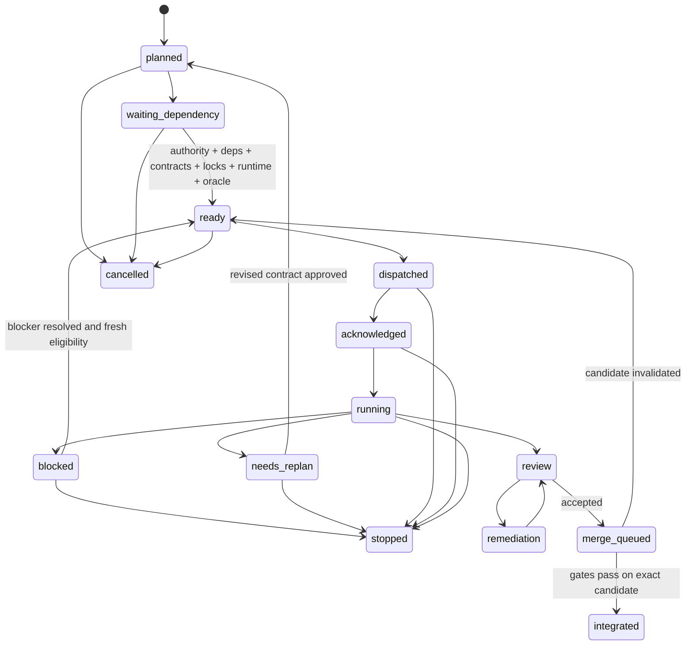

# Protocol task và worker

> **Trạng thái:** `PROPOSED ARCHITECTURE EXPERIMENT — NO NEW IMPLEMENTATION AUTHORITY`

## 1. Nguồn trạng thái

Orca là execution plane và communication plane bắt buộc. Trạng thái task đến từ record Orca + Git candidate + evidence machine-readable, không suy từ dòng cuối terminal. Dely chạy bên trong task được cấp quyền và không tạo worker con ngoài dispatch do Control quản lý.

### Tách biệt Delivery Ledger và Orca Execution Plane

- **Delivery Ledger Task ID** (ví dụ: `PD-PILOT-CONTROL`, `M3-A-TEMPLATE`): Định danh work package trong DAG và delivery ledger (`task-dag.yaml`). Thuộc quyền quản lý của Control.
- **Orca Execution Plane**:
  - `run_id`: Định danh run thực thi tổng thể trong Orca.
  - `task_id`: Định danh execution container / process trong Orca (ví dụ `task_576e006b5784`).
  - `dispatch_id`: Định danh phiên / attempt thực thi cụ thể của worker (ví dụ `ctx_ea3797c96ced`).
  - `worker_terminal_id`: Handle terminal của worker (ví dụ `term_299d71b8-d78c-41f9-ad72-2b25401fb60d`).
  - `dispatch_capability`: Token thẩm quyền dispatch do Orca cấp.
- **OrcaDeliveryAdapter** (do Control sở hữu): Thành phần chuyển ngữ giữa các sự kiện Orca CLI (`heartbeat`, `ask`, `escalation`, `worker_done`) và máy trạng thái delivery ledger. `worker_done` chỉ giải quyết attempt của dispatch, không trực tiếp đánh dấu `integrated`.

Mọi message qua protocol phải mang:

```yaml
protocol_version: "1.0.0"
run_id: string
delivery_task_id: string
orca_task_id: string
dispatch_id: string
worker_terminal_id: string
sequence: integer
sent_at: RFC3339
lease_id: string|null
fencing_tokens: {resource_id: integer}
type: heartbeat|status|ask|escalation|worker_done
body: object
```

Message thiếu ID, sequence lùi, dispatch không khớp hoặc fencing token cũ bị từ chối fail closed.

## 2. Máy trạng thái task



### Ý nghĩa bắt buộc

| Trạng thái | Điều kiện |
|---|---|
| `planned` | Có proposal nhưng chưa đủ eligibility |
| `waiting_dependency` | Chờ predecessor/authority/contract/runtime có tên |
| `ready` | Predicate eligibility đã được scheduler chứng minh |
| `dispatched` | Orca đã ghi dispatch và lease, chưa có ACK |
| `acknowledged` | Worker xác nhận exact task/scope/baseline/lease |
| `running` | Worker đang làm trong owned scope |
| `blocked` | Phụ thuộc tạm thời, không cần đổi contract/scope |
| `needs_replan` | Cần đổi scope, architecture, acceptance hoặc ownership |
| `review` | Candidate task đã commit; không có worker sửa cùng tree |
| `remediation` | Original implementer sửa finding trong contract, một pass/finding |
| `merge_queued` | Review accepted; chờ tích hợp tuần tự |
| `integrated` | Merge và gate đạt trên exact integrated HEAD |
| `stopped` | Authority/safety/failure dừng có chủ ý |
| `cancelled` | Chưa tạo candidate hoặc candidate được bảo toàn riêng, không tiếp tục |

Không có cạnh `waiting_dependency → dispatched`, `blocked → running` hoặc `review → integrated` trực tiếp.

## 3. Dispatch và ACK

Trước dispatch, Control ghi execution envelope:

- authority ref và exact baseline commit;
- branch/worktree và protected dirty paths;
- owned/forbidden paths;
- requirement/contract/invariant refs;
- exact locks, lease expiry và fencing token;
- acceptance rows cùng counterexample;
- runtime prerequisites;
- evidence paths;
- implement/review model route;
- commit/push/publication authority riêng biệt.

Worker ACK đúng một lần, nêu exact `task_id`, `dispatch_id`, baseline và owned path digest. ACK không khớp làm dispatch `NO_ACK`; không cho worker sửa file.

### Kiểm tra khói tương thích Harness (Tool-Execution Smoke Test)

Trước khi tiến hành sửa đổi hoặc mutation dưới lease được cấp, worker hoặc harness thực thi bắt buộc phải vượt qua bài kiểm tra khói thực thi công cụ:
- Xác nhận harness gọi đúng tên công cụ đầy đủ, không làm sụp tên công cụ có namespace (`functions.exec` -> `functions`). Hiện tượng này đã được quan sát thực tế trên Codex CLI kết hợp `ag/gemini-3.8-flash-high` trong khi Antigravity native với effective model `ag/gemini-3.8-flash-high` thực thi thành công.
- Nếu smoke test thất bại: kích hoạt điều kiện `STOP` / `blocked_harness`, giải phóng lease, và fallback an toàn sang harness tương thích đã kiểm chứng (Antigravity native); không giả định route thành công là harness có thể thực thi.
- Không xem lỗi này là vĩnh viễn đối với Codex CLI; đây là một cổng kiểm tra động tại runtime (dynamic compatibility gate).

## 4. Heartbeat, check và status

### Heartbeat

Worker gửi heartbeat khi có active lease và còn chạy. Heartbeat gồm:

- phase hiện tại;
- last progress sequence;
- path đang sở hữu;
- acceptance instrument gần nhất;
- blocker nếu có;
- requested renewal duration.

Heartbeat không phải completion, không tự gia hạn lease và không thay status report. Scheduler chỉ renew sau khi kiểm authority/visibility.

### Check

Control dùng Orca inbox `check` để nhận message. Không đọc terminal rồi đoán worker hoàn tất. Check có cursor/sequence; message đã xử lý được acknowledge để không áp dụng hai lần.

### Status

Worker gửi `status` khi đổi phase quan trọng, phát hiện STOP condition hoặc đạt checkpoint lâu. `status` phải phân biệt:

- tiến độ bình thường;
- `blocked_external`;
- `blocked_dependency`;
- `needs_replan`;
- `candidate_ready_for_review`.

`blocked` không đồng nghĩa process worker lỗi. Authentication/quota/harness crash không được giả thành blocked business state.

## 5. Ask và escalation

Khi worker cần coordinator trả lời câu hỏi quyết định tiếp tục hay dừng, worker bắt buộc dùng lệnh `ask` qua Orca CLI:

```sh
orca orchestration ask --from <worker_terminal> --dispatch-capability <dcap> --question "<nội dung>" --options "<opt1,opt2>" --timeout-ms <ms>
```

Lệnh `ask` chặn worker đồng bộ cho tới khi coordinator phản hồi. Nếu timeout hoặc mất kết nối, worker không lặp lại câu hỏi trùng lặp mà resume theo message ID đã nhận.

Khi worker gặp blocker cần coordinator xử lý trước khi tiếp tục, worker gửi `escalation`:

```sh
orca orchestration send --from <worker_terminal> --dispatch-capability <dcap> --type escalation --subject "Blocked: <lý do>" --body "<chi tiết>" --task-id <orca_task_id> --dispatch-id <orca_dispatch_id>
```

Sau `ask` hoặc escalation, nếu lease hết hạn mà không có giải pháp, task chuyển `blocked`, mọi output muộn bị fence.

Escalation tự động khi:

1. heartbeat quá hạn;
2. cùng blocker lặp hai lần;
3. lock wait vượt bound;
4. worker mất visibility;
5. remediation re-review vẫn không accept;
6. security/data-loss condition xuất hiện.

Control không tự trả lời câu hỏi thuộc user authority.

## 6. Wait và worker loss

- Chờ dependency: không giữ write lock/path lease; có thể giữ queue position.
- Chờ external provider trong một operation đã gửi: giữ operation identity, chuyển outcome unknown và reconcile trước retry.
- Chờ review: implementer không sửa candidate; lease mutation được đóng.
- Chờ merge: candidate pin bằng commit SHA; thay đổi làm review invalid.
- Terminal không phản hồi: kiểm Orca worker record, process và last message; không suy completion từ output.
- Worker replacement luôn nhận dispatch/lease/fencing token mới; không tiếp tục bằng token cũ.

## 7. Exactly-once `worker_done` và Orca CLI Mapping

Lệnh Orca CLI `worker_done` chỉ hỗ trợ đúng hai giá trị outcome:
`--outcome succeeded` hoặc `--outcome failed`.

```sh
orca orchestration send --from <worker_terminal> --dispatch-capability <dcap> --type worker_done --subject "<short status>" --body "<3-sentence summary>" --task-id <orca_task_id> --dispatch-id <orca_dispatch_id> --outcome succeeded|failed
```

### Ý nghĩa và cơ chế chuyển đổi của `OrcaDeliveryAdapter`

1. **`worker_done` chỉ settle execution attempt (dispatch)**: Nó ghi nhận phiên làm việc của worker kết thúc. Nó KHÔNG tự động chuyển trạng thái delivery task sang `integrated`.
2. **Chuyển đổi thành công (`--outcome succeeded`)**:
   - `OrcaDeliveryAdapter` kiểm tra execution envelope, candidate commit SHA, committed diff + dirty overlay scope, và evidence.
   - Nếu hợp lệ, `OrcaDeliveryAdapter` lập tức giải phóng toàn bộ active mutation lease của dispatch đó (đảm bảo nguyên tắc Section 6: khi chờ review, implementer không giữ mutation lease), sau đó chuyển delivery task sang `review` (chưa phải `integrated`).
   - Sau khi reviewer độc lập xác nhận `ACCEPT`, task chuyển sang `merge_queued`.
   - Sau khi các integration gate tuần tự PASS trên exact candidate HEAD, task mới trở thành `integrated`.
3. **Chuyển đổi thất bại hoặc blocker (`--outcome failed`)**:
   - Khi worker gặp lỗi không thể phục hồi hoặc blocker cần re-plan, worker gửi `worker_done --outcome failed` (hoặc escalation).
   - `OrcaDeliveryAdapter` chuyển trạng thái delivery task sang `blocked` hoặc `needs_replan`.
   - Toàn bộ live lease của dispatch đó bị hủy / giải phóng.
4. **Tiếp tục sau blocker / re-plan cần Fresh Dispatch**:
   - Khi nguyên nhân chặn được giải quyết, delivery task được chuyển về `ready` (nếu đủ eligibility).
   - Khi dispatch lại, hệ thống cấp một **fresh dispatch** với `dispatch_id` hoàn toàn mới, active lease mới và monotonic fencing token mới. Tuyệt đối không tái sử dụng dispatch ID hoặc fencing token cũ!
5. **Từ chối kết quả trùng lặp hoặc quá hạn (Duplicate / Stale Result Rejection)**:
   - Một dispatch đã settled chỉ nhận đúng một lần `worker_done`.
   - Kết quả gửi lại từ dispatch cũ, hoặc mang fencing token cũ hơn token hiện hành, bị từ chối fail-closed.
   - Dedupe key là `(run_id, delivery_task_id, dispatch_id, type=worker_done)`.
6. **Không tái sử dụng Orca task ID và dispatch ID trên toàn hệ thống (Global Non-Reuse)**:
   - Orca task ID và dispatch ID là duy nhất trên toàn bộ vòng đời hệ thống, bao gồm cả các attempt đã hoàn tất (`settled`).
   - Nghiêm cấm ghi đè dispatch binding (`Duplicate dispatch binding overwrite`) hoặc tái sử dụng ID giữa các lần dispatch.
7. **Ràng buộc Candidate Commit với actual HEAD Git**:
   - Khởi tạo dispatch bắt buộc đối chiếu `candidate_commit` và `approved_candidate_commit` với commit `HEAD` thực tế trong Git DAG (`git rev-parse HEAD`). Sai lệch commit bị từ chối fail-closed.
8. **Ràng buộc Intended Dispatch vô điều kiện**:
   - Khi dispatch chỉ định `intended_dispatch_id`, lease liên kết bắt buộc phải khớp chính xác với `intended_dispatch_id` đó. Mọi nỗ lực bypass (như `ctx_init`) bị cấm triệt để.
9. **Fencing theo từng Live Allocation Slot cho Capacity Lock**:
   - Lock dạng `capacity` phân bổ vị trí theo từng slot riêng biệt (`LOCK_ID:slot_N`).
   - Mỗi slot có bộ đếm monotonic fencing token độc lập. Các holder song song giữ token hợp lệ đồng thời mà không xung đột; khi slot được thu hồi và tái cấp phát, bộ đếm slot tăng lên ngăn chặn worker cũ gửi kết quả quá hạn.
10. **Chống nới rộng thời hạn và từ chối lock không khai báo**:
    - Không được vượt quá thời hạn `lease_seconds` đã công bố trong cấu hình lock tại thời điểm chiếm giữ hoặc gia hạn.
    - Mọi lock chưa khai báo trong registry đều bị từ chối tại `acquire_lease`, `create_dispatch` và toàn bộ DAG.
11. **Máy trạng thái thực thi Harness quan sát được**:
    - Harness tuân thủ chu trình: `IDLE -> RUNNING -> SUCCESS | FAILURE | STOP_FALLBACK`.
    - Đối số trong `HarnessExecutionResult` được thẩm định kiểu dữ liệu nghiêm ngặt (`success: bool`, `execution_time_ms >= 0`, `status: PASS|STOP`).

## 8. Review/remediation protocol

Reviewer là phiên mới, không implement và không edit. Reviewer nhận approved contract, baseline, candidate SHA, diff và acceptance rows; tự tái chạy instrument và counterexample. Kết quả duy nhất:

- `ACCEPT`;
- `CHANGES_REQUESTED`;
- `BLOCKED`.

Finding trong contract đi một remediation pass bởi original implementer với lease mới; reviewer ban đầu re-review fix-only diff. Nếu không accept, task `needs_replan`; không lặp repair vô hạn. Architectural delivery thêm integration review độc lập sau khi mọi task review accepted.

## 9. Protocol invariants

- Một dispatch chỉ có một active worker.
- Một task không có hai state terminal.
- Sequence tăng đơn điệu theo dispatch.
- Old lease/recovery epoch/fencing token không mutation.
- Toàn bộ mutation lease phải được đóng ngay khi worker_done thành công, trước khi vào review.
- Không tái sử dụng Orca task ID hoặc dispatch ID trên toàn hệ thống (kể cả settled attempts).
- Candidate commit bắt buộc khớp tuyệt đối với HEAD hiện hành của repository Git.
- Không nới rộng thời hạn lease vượt quá định nghĩa đã khai báo.
- Không cho phép lock không khai báo trong lock registry hoặc task DAG.
- Không heartbeat sau `worker_done`.
- Không review cùng working tree khi worker đang mutation.
- Không merge nếu candidate SHA khác SHA được review.
- Không chuyển task future/locked thành ready chỉ bằng message.
- Route success không thay thế khả năng thực thi thực tế; bắt buộc vượt qua tool-execution smoke test trước mutation.
