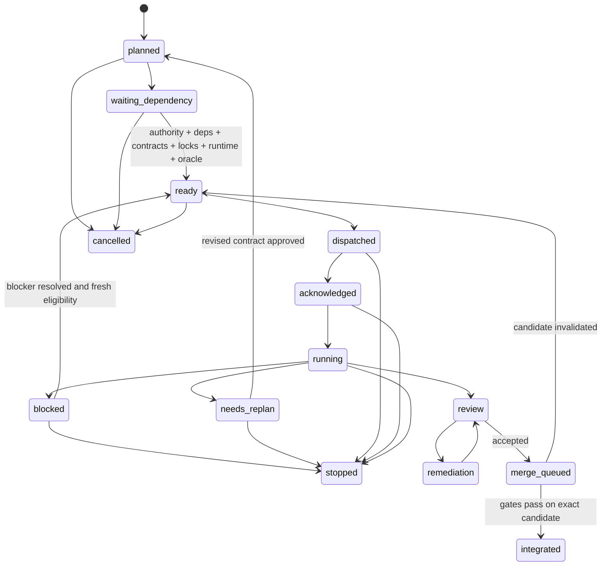

# Protocol task và worker

> **Trạng thái:** `PROPOSED ARCHITECTURE EXPERIMENT — NO NEW IMPLEMENTATION AUTHORITY`

## 1. Nguồn trạng thái

Orca là execution plane và communication plane bắt buộc. Trạng thái task đến từ record Orca + Git candidate + evidence machine-readable, không suy từ dòng cuối terminal. Dely chạy bên trong task được cấp quyền và không tạo worker con ngoài dispatch do Control quản lý.

Mọi message phải mang:

```yaml
protocol_version: "1.0.0"
run_id: string
task_id: string
dispatch_id: string
worker_terminal_id: string
sequence: integer
sent_at: RFC3339
lease_id: string|null
fencing_tokens: {resource_id: integer}
type: heartbeat|status|ask|escalation|worker_done
body: object
```

Message thiếu ID, sequence lùi, dispatch không khớp hoặc fencing token cũ bị từ chối fail closed.

## 2. Máy trạng thái task



### Ý nghĩa bắt buộc

| Trạng thái | Điều kiện |
|---|---|
| `planned` | Có proposal nhưng chưa đủ eligibility |
| `waiting_dependency` | Chờ predecessor/authority/contract/runtime có tên |
| `ready` | Predicate eligibility đã được scheduler chứng minh |
| `dispatched` | Orca đã ghi dispatch và lease, chưa có ACK |
| `acknowledged` | Worker xác nhận exact task/scope/baseline/lease |
| `running` | Worker đang làm trong owned scope |
| `blocked` | Phụ thuộc tạm thời, không cần đổi contract/scope |
| `needs_replan` | Cần đổi scope, architecture, acceptance hoặc ownership |
| `review` | Candidate task đã commit; không có worker sửa cùng tree |
| `remediation` | Original implementer sửa finding trong contract, một pass/finding |
| `merge_queued` | Review accepted; chờ tích hợp tuần tự |
| `integrated` | Merge và gate đạt trên exact integrated HEAD |
| `stopped` | Authority/safety/failure dừng có chủ ý |
| `cancelled` | Chưa tạo candidate hoặc candidate được bảo toàn riêng, không tiếp tục |

Không có cạnh `waiting_dependency → dispatched`, `blocked → running` hoặc `review → integrated` trực tiếp.

## 3. Dispatch và ACK

Trước dispatch, Control ghi execution envelope:

- authority ref và exact baseline commit;
- branch/worktree và protected dirty paths;
- owned/forbidden paths;
- requirement/contract/invariant refs;
- exact locks, lease expiry và fencing token;
- acceptance rows cùng counterexample;
- runtime prerequisites;
- evidence paths;
- implement/review model route;
- commit/push/publication authority riêng biệt.

Worker ACK đúng một lần, nêu exact `task_id`, `dispatch_id`, baseline và owned path digest. ACK không khớp làm dispatch `NO_ACK`; không cho worker sửa file.

## 4. Heartbeat, check và status

### Heartbeat

Worker gửi heartbeat khi có active lease và còn chạy. Heartbeat gồm:

- phase hiện tại;
- last progress sequence;
- path đang sở hữu;
- acceptance instrument gần nhất;
- blocker nếu có;
- requested renewal duration.

Heartbeat không phải completion, không tự gia hạn lease và không thay status report. Scheduler chỉ renew sau khi kiểm authority/visibility.

### Check

Control dùng Orca inbox `check` để nhận message. Không đọc terminal rồi đoán worker hoàn tất. Check có cursor/sequence; message đã xử lý được acknowledge để không áp dụng hai lần.

### Status

Worker gửi `status` khi đổi phase quan trọng, phát hiện STOP condition hoặc đạt checkpoint lâu. `status` phải phân biệt:

- tiến độ bình thường;
- `blocked_external`;
- `blocked_dependency`;
- `needs_replan`;
- `candidate_ready_for_review`.

`blocked` không đồng nghĩa process worker lỗi. Authentication/quota/harness crash không được giả thành blocked business state.

## 5. Ask và escalation

Worker dùng blocking `ask` khi câu trả lời quyết định tiếp tục hay dừng, đặc biệt:

- cần authority mới;
- cần sửa ngoài owned scope;
- contract/requirement mâu thuẫn;
- destructive/outward-facing action;
- external outcome unknown;
- runtime bắt buộc không khả dụng;
- counterexample không thể quan sát.

Sau `ask`, worker dừng mutation, giữ candidate và lease theo thời hạn. Không có trả lời trước expiry thì task chuyển `blocked`, lease hết hạn, mọi kết quả muộn bị fence.

Escalation tự động khi:

1. heartbeat quá hạn;
2. cùng blocker lặp hai lần;
3. lock wait vượt bound;
4. worker mất visibility;
5. remediation re-review vẫn không accept;
6. security/data-loss condition xuất hiện.

Control không tự trả lời câu hỏi thuộc user authority.

## 6. Wait và worker loss

- Chờ dependency: không giữ write lock/path lease; có thể giữ queue position.
- Chờ external provider trong một operation đã gửi: giữ operation identity, chuyển outcome unknown và reconcile trước retry.
- Chờ review: implementer không sửa candidate; lease mutation được đóng.
- Chờ merge: candidate pin bằng commit SHA; thay đổi làm review invalid.
- Terminal không phản hồi: kiểm Orca worker record, process và last message; không suy completion từ output.
- Worker replacement luôn nhận dispatch/lease/fencing token mới; không tiếp tục bằng token cũ.

## 7. Exactly-once `worker_done`

Mỗi dispatch được chấp nhận tối đa một `worker_done`. Message gồm:

```yaml
outcome: done|blocked|needs_replan|failed|cancelled
candidate_commit: git_sha|null
changed_paths: [path]
verification_refs: [artifact_or_command_record]
residue: string
handoff_complete: true
```

Quy tắc:

- dedupe key là `(run_id, task_id, dispatch_id, type=worker_done)`;
- duplicate giống byte được ACK idempotent nhưng không áp dụng lại;
- duplicate khác nội dung là protocol violation và escalation;
- `done` thiếu candidate/evidence hoặc scope check không chuyển task sang review;
- completion chỉ phát sinh từ valid `worker_done`, không từ terminal exit;
- sau `worker_done`, worker không mutation, message hoặc command nào nữa;
- lease được release sau khi Control xác minh receipt và reconcile resource.

## 8. Review/remediation protocol

Reviewer là phiên mới, không implement và không edit. Reviewer nhận approved contract, baseline, candidate SHA, diff và acceptance rows; tự tái chạy instrument và counterexample. Kết quả duy nhất:

- `ACCEPT`;
- `CHANGES_REQUESTED`;
- `BLOCKED`.

Finding trong contract đi một remediation pass bởi original implementer với lease mới; reviewer ban đầu re-review fix-only diff. Nếu không accept, task `needs_replan`; không lặp repair vô hạn. Architectural delivery thêm integration review độc lập sau khi mọi task review accepted.

## 9. Protocol invariants

- Một dispatch chỉ có một active worker.
- Một task không có hai state terminal.
- Sequence tăng đơn điệu theo dispatch.
- Old lease/recovery epoch/fencing token không mutation.
- Không heartbeat sau `worker_done`.
- Không review cùng working tree khi worker đang mutation.
- Không merge nếu candidate SHA khác SHA được review.
- Không chuyển task future/locked thành ready chỉ bằng message.
