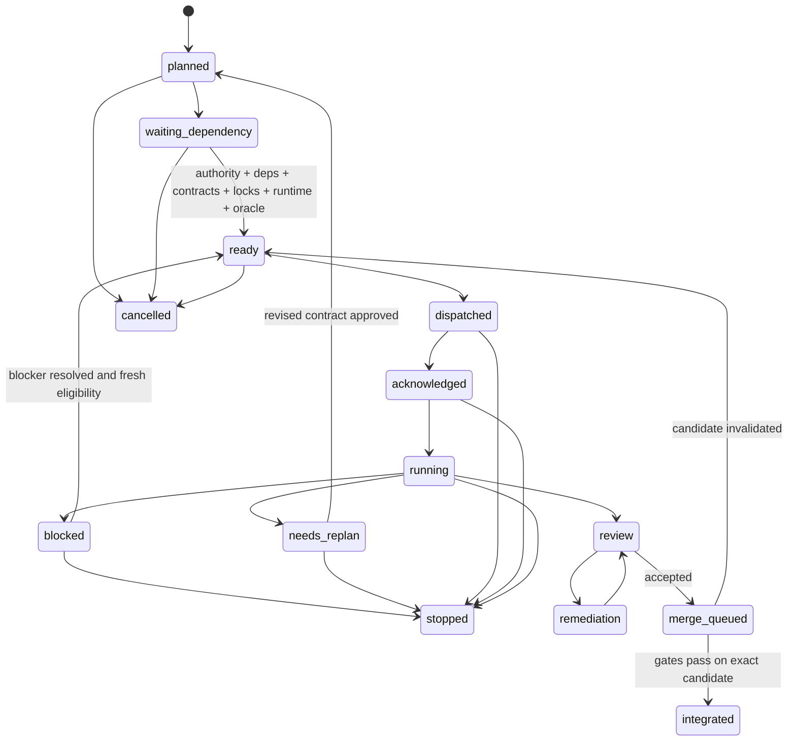

# Protocol task và worker

> **Trạng thái:** `PROPOSED ARCHITECTURE EXPERIMENT — NO NEW IMPLEMENTATION AUTHORITY`

## 1. Nguồn trạng thái

Orca là execution plane và communication plane bắt buộc. Trạng thái task đến từ record Orca + Git candidate + evidence machine-readable, không suy từ dòng cuối terminal. Dely chạy bên trong task được cấp quyền và không tạo worker con ngoài dispatch do Control quản lý.

### Tách biệt Delivery Ledger và Orca Execution Plane

- **Delivery Ledger Task ID** (ví dụ: `PD-PILOT-CONTROL`, `M3-A-TEMPLATE`): Định danh work package trong DAG và delivery ledger (`task-dag.yaml`). Thuộc quyền quản lý của Control.
- **Orca Execution Plane**:
  - `run_id`: Định danh run thực thi tổng thể trong Orca.
  - `task_id`: Định danh execution container / process trong Orca (ví dụ `task_576e006b5784`).
  - `dispatch_id`: Định danh phiên / attempt thực thi cụ thể của worker (ví dụ `ctx_ea3797c96ced`).
  - `worker_terminal_id`: Handle terminal của worker (ví dụ `term_299d71b8-d78c-41f9-ad72-2b25401fb60d`).
  - `dispatch_capability`: Token thẩm quyền dispatch do Orca cấp.
- **OrcaDeliveryAdapter** (do Control sở hữu): Thành phần chuyển ngữ giữa các sự kiện Orca CLI (`heartbeat`, `ask`, `escalation`, `worker_done`) và máy trạng thái delivery ledger. `worker_done` chỉ giải quyết attempt của dispatch, không trực tiếp đánh dấu `integrated`.

Mọi message qua protocol phải mang:

```yaml
protocol_version: "1.0.0"
run_id: string
delivery_task_id: string
orca_task_id: string
dispatch_id: string
worker_terminal_id: string
sequence: integer
sent_at: RFC3339
lease_id: string|null
fencing_tokens: {resource_id: integer}
type: heartbeat|status|ask|escalation|worker_done
body: object
```

Message thiếu ID, sequence lùi, dispatch không khớp hoặc fencing token cũ bị từ chối fail closed.

## 2. Máy trạng thái task



### Ý nghĩa bắt buộc

| Trạng thái | Điều kiện |
|---|---|
| `planned` | Có proposal nhưng chưa đủ eligibility |
| `waiting_dependency` | Chờ predecessor/authority/contract/runtime có tên |
| `ready` | Predicate eligibility đã được scheduler chứng minh |
| `dispatched` | Orca đã ghi dispatch và lease, chưa có ACK |
| `acknowledged` | Worker xác nhận exact task/scope/baseline/lease |
| `running` | Worker đang làm trong owned scope |
| `blocked` | Phụ thuộc tạm thời, không cần đổi contract/scope |
| `needs_replan` | Cần đổi scope, architecture, acceptance hoặc ownership |
| `review` | Candidate task đã commit; không có worker sửa cùng tree |
| `remediation` | Original implementer sửa finding trong contract, một pass/finding |
| `merge_queued` | Review accepted; chờ tích hợp tuần tự |
| `integrated` | Merge và gate đạt trên exact integrated HEAD |
| `stopped` | Authority/safety/failure dừng có chủ ý |
| `cancelled` | Chưa tạo candidate hoặc candidate được bảo toàn riêng, không tiếp tục |

Không có cạnh `waiting_dependency → dispatched`, `blocked → running` hoặc `review → integrated` trực tiếp.

## 3. Dispatch và ACK

Trước dispatch, Control ghi execution envelope:

- authority ref và exact baseline commit;
- branch/worktree và protected dirty paths;
- owned/forbidden paths;
- requirement/contract/invariant refs;
- exact locks, lease expiry và fencing token;
- acceptance rows cùng counterexample;
- runtime prerequisites;
- evidence paths;
- implement/review model route;
- commit/push/publication authority riêng biệt.

Worker ACK đúng một lần, nêu exact `task_id`, `dispatch_id`, baseline và owned path digest. ACK không khớp làm dispatch `NO_ACK`; không cho worker sửa file.

### Kiểm tra khói tương thích Harness (Tool-Execution Smoke Test)

Trước khi tiến hành sửa đổi hoặc mutation dưới lease được cấp, worker hoặc harness thực thi bắt buộc phải vượt qua bài kiểm tra khói thực thi công cụ:
- Xác nhận harness gọi đúng tên công cụ đầy đủ, không làm sụp tên công cụ có namespace (`functions.exec` -> `functions`). Không giả định thành công định tuyến (route success) đồng nghĩa với khả năng thực thi công cụ thực tế.
- Nếu smoke test thất bại: kích hoạt điều kiện `STOP` / `blocked_harness`, giải phóng và fence lease an toàn, chuyển task sang `blocked` không có candidate mutation, và yêu cầu can thiệp phục hồi từ Control hoặc con người; tuân thủ chính sách fail-closed tại `AGENTS.md`, nghiêm cấm tuyệt đối việc fallback sang Antigravity native hay tự ý chuyển đổi provider/harness.
- Không xem lỗi này là vĩnh viễn đối với Codex CLI; đây là một cổng kiểm tra động tại runtime (dynamic compatibility gate).

## 4. Heartbeat, check và status

### Heartbeat

Worker gửi heartbeat khi có active lease và còn chạy. Heartbeat gồm:

- phase hiện tại;
- last progress sequence;
- path đang sở hữu;
- acceptance instrument gần nhất;
- blocker nếu có;
- requested renewal duration.

Heartbeat không phải completion, không tự gia hạn lease và không thay status report. Scheduler chỉ renew sau khi kiểm authority/visibility.

### Check

Control dùng Orca inbox `check` để nhận message. Không đọc terminal rồi đoán worker hoàn tất. Check có cursor/sequence; message đã xử lý được acknowledge để không áp dụng hai lần.

### Status

Worker gửi `status` khi đổi phase quan trọng, phát hiện STOP condition hoặc đạt checkpoint lâu. `status` phải phân biệt:

- tiến độ bình thường;
- `blocked_external`;
- `blocked_dependency`;
- `needs_replan`;
- `candidate_ready_for_review`.

`blocked` không đồng nghĩa process worker lỗi. Authentication/quota/harness crash không được giả thành blocked business state.

## 5. Ask và escalation

Khi worker cần coordinator trả lời câu hỏi quyết định tiếp tục hay dừng, worker bắt buộc dùng lệnh `ask` qua Orca CLI:

```sh
orca orchestration ask --from <worker_terminal> --dispatch-capability <dcap> --question "<nội dung>" --options "<opt1,opt2>" --timeout-ms <ms>
```

Lệnh `ask` chặn worker đồng bộ cho tới khi coordinator phản hồi. Nếu timeout hoặc mất kết nối, worker không lặp lại câu hỏi trùng lặp mà resume theo message ID đã nhận.

Khi worker gặp blocker cần coordinator xử lý trước khi tiếp tục, worker gửi `escalation`:

```sh
orca orchestration send --from <worker_terminal> --dispatch-capability <dcap> --type escalation --subject "Blocked: <lý do>" --body "<chi tiết>" --task-id <orca_task_id> --dispatch-id <orca_dispatch_id>
```

Sau `ask` hoặc escalation, nếu lease hết hạn mà không có giải pháp, task chuyển `blocked`, mọi output muộn bị fence.

Escalation tự động khi:

1. heartbeat quá hạn;
2. cùng blocker lặp hai lần;
3. lock wait vượt bound;
4. worker mất visibility;
5. remediation re-review vẫn không accept;
6. security/data-loss condition xuất hiện.

Control không tự trả lời câu hỏi thuộc user authority.

## 6. Wait và worker loss

- Chờ dependency: không giữ write lock/path lease; có thể giữ queue position.
- Chờ external provider trong một operation đã gửi: giữ operation identity, chuyển outcome unknown và reconcile trước retry.
- Chờ review: implementer không sửa candidate; lease mutation được đóng.
- Chờ merge: candidate pin bằng commit SHA; thay đổi làm review invalid.
- Terminal không phản hồi: kiểm Orca worker record, process và last message; không suy completion từ output.
- Worker replacement luôn nhận dispatch/lease/fencing token mới; không tiếp tục bằng token cũ.

## 7. Exactly-once `worker_done` và Orca CLI Mapping

Lệnh Orca CLI `worker_done` chỉ hỗ trợ đúng hai giá trị outcome:
`--outcome succeeded` hoặc `--outcome failed`.

```sh
orca orchestration send --from <worker_terminal> --dispatch-capability <dcap> --type worker_done --subject "<short status>" --body "<3-sentence summary>" --task-id <orca_task_id> --dispatch-id <orca_dispatch_id> --outcome succeeded|failed
```

### Ý nghĩa và cơ chế chuyển đổi của `OrcaDeliveryAdapter`

1. **`worker_done` chỉ settle execution attempt (dispatch)**: Nó ghi nhận phiên làm việc của worker kết thúc. Nó KHÔNG tự động chuyển trạng thái delivery task sang `integrated`.
2. **Chuyển đổi thành công (`--outcome succeeded`)**:
   - `OrcaDeliveryAdapter` kiểm tra execution envelope, candidate commit SHA, committed diff + dirty overlay scope, và evidence.
   - Nếu hợp lệ, `OrcaDeliveryAdapter` lập tức giải phóng toàn bộ active mutation lease của dispatch đó (đảm bảo nguyên tắc Section 6: khi chờ review, implementer không giữ mutation lease), sau đó chuyển delivery task sang `review` (chưa phải `integrated`).
   - Sau khi reviewer độc lập xác nhận `ACCEPT`, task chuyển sang `merge_queued`.
   - Sau khi các integration gate tuần tự PASS trên exact candidate HEAD, task mới trở thành `integrated`.
3. **Chuyển đổi thất bại hoặc blocker (`--outcome failed`)**:
   - Khi worker gặp lỗi không thể phục hồi hoặc blocker cần re-plan, worker gửi `worker_done --outcome failed` (hoặc escalation).
   - `OrcaDeliveryAdapter` chuyển trạng thái delivery task sang `blocked` hoặc `needs_replan`.
   - Toàn bộ live lease của dispatch đó bị hủy / giải phóng.
4. **Tiếp tục sau blocker / re-plan cần Fresh Dispatch**:
   - Khi nguyên nhân chặn được giải quyết, delivery task được chuyển về `ready` (nếu đủ eligibility).
   - Khi dispatch lại, hệ thống cấp một **fresh dispatch** với `dispatch_id` hoàn toàn mới, active lease mới và monotonic fencing token mới. Tuyệt đối không tái sử dụng dispatch ID hoặc fencing token cũ!
5. **Từ chối kết quả trùng lặp hoặc quá hạn (Duplicate / Stale Result Rejection)**:
   - Một dispatch đã settled chỉ nhận đúng một lần `worker_done`.
   - Kết quả gửi lại từ dispatch cũ, hoặc mang fencing token cũ hơn token hiện hành, bị từ chối fail-closed.
   - Dedupe key là `(run_id, delivery_task_id, dispatch_id, type=worker_done)`.
6. **Không tái sử dụng Orca task ID và dispatch ID trên toàn hệ thống (Global Non-Reuse)**:
   - Orca task ID và dispatch ID là duy nhất trên toàn bộ vòng đời hệ thống, bao gồm cả các attempt đã hoàn tất (`settled`).
   - Nghiêm cấm ghi đè dispatch binding (`Duplicate dispatch binding overwrite`) hoặc tái sử dụng ID giữa các lần dispatch.
7. **Ràng buộc Candidate Commit với actual HEAD Git**:
   - Khởi tạo dispatch bắt buộc đối chiếu `candidate_commit` và `approved_candidate_commit` với commit `HEAD` thực tế trong Git DAG (`git rev-parse HEAD`). Sai lệch commit bị từ chối fail-closed.
8. **Ràng buộc Intended Dispatch vô điều kiện**:
   - Khi dispatch chỉ định `intended_dispatch_id`, lease liên kết bắt buộc phải khớp chính xác với `intended_dispatch_id` đó. Mọi nỗ lực bypass (như `ctx_init`) bị cấm triệt để.
9. **Fencing theo từng Live Allocation Slot cho Capacity Lock**:
   - Lock dạng `capacity` phân bổ vị trí theo từng slot riêng biệt (`LOCK_ID:slot_N`).
   - Mỗi slot có bộ đếm monotonic fencing token độc lập. Các holder song song giữ token hợp lệ đồng thời mà không xung đột; khi slot được thu hồi và tái cấp phát, bộ đếm slot tăng lên ngăn chặn worker cũ gửi kết quả quá hạn.
10. **Chống nới rộng thời hạn và từ chối lock không khai báo**:
    - Không được vượt quá thời hạn `lease_seconds` đã công bố trong cấu hình lock tại thời điểm chiếm giữ hoặc gia hạn.
    - Mọi lock chưa khai báo trong registry đều bị từ chối tại `acquire_lease`, `create_dispatch` và toàn bộ DAG.
11. **Máy trạng thái thực thi Harness quan sát được**:
    - Harness tuân thủ chu trình: `IDLE -> RUNNING -> SUCCESS | FAILURE | STOP_BLOCKED`.
    - Đối số trong `HarnessExecutionResult` được thẩm định kiểu dữ liệu nghiêm ngặt (`success: bool`, `execution_time_ms >= 0`, `status: PASS|STOP`).
    - Từ chối các trường mâu thuẫn (`success=True` với `status="STOP"` hoặc `fallback_required=True`; `success=False` với `status="PASS"` hoặc bất kỳ yêu cầu/đích đến fallback sang native provider nào). Trạng thái fallback và mọi hình thức fallback native bị từ chối fail-closed theo chính sách tại `AGENTS.md`.
12. **Durable Ledger/Registry dùng chung (`SharedOrcaExecutionRegistry`)**:
    - Task ID và dispatch ID của Orca được lưu vết qua registry dùng chung giữa các adapter instance, bảo đảm tính duy nhất toàn cục và chống tái sử dụng ID trên toàn hệ thống.
13. **Intended Dispatch bắt buộc không rewrite lease (`No Lease Rewrite`)**:
    - Khi dispatch chỉ định `intended_dispatch_id`, lease liên kết bắt buộc phải khớp chính xác với `intended_dispatch_id` đó. Mọi nỗ lực bypass bị cấm triệt để.
14. **Xử lý Harness Failure theo Định danh Trước, Thu Hồi Đúng Lease Đã Ràng Buộc (`Identity-First Fail-Closed Harness Failure`)**:
    - `OrcaDeliveryAdapter.handle_harness_failure()` thực hiện kiểm tra định danh trước fail-closed: kiểm tra dispatch tồn tại trong registry bền vững, thuộc đúng delivery task, chưa bị settle, là active dispatch hiện hành của task, và task đang trong vòng đời thực thi hợp lệ (`dispatched`, `acknowledged`, `running`) trước khi có bất kỳ tác động phụ nào.
    - Chỉ giải phóng đúng các lease được gán trực tiếp cho dispatch đã xác thực (`clean_did`), tuyệt đối không giải phóng nhầm lease của dispatch khác hoặc của task theo `delivery_task_id`.
    - Bất kỳ lỗi kiểm tra nào (spoof dispatch ID, cross-task dispatch, settled/duplicate dispatch, stale dispatch sau khi replan/redispatch) hoặc lỗi lưu trữ đĩa (persistence failure) đều bị từ chối fail-closed và bảo đảm không để lại tác động phụ một phần; lease của active dispatch mới hoàn toàn được giữ nguyên vẹn.
    - Khi harness failure hợp lệ được xác thực: dispatch được settle trong registry bền vững, task chuyển sang `blocked`, các tài nguyên thuộc dispatch đó được giải phóng/fence an toàn, và nội dung commit candidate được bảo toàn nguyên vẹn.
15. **Chính sách Bằng chứng Định tuyến Machine-Readable và Execution Envelope Policy**:
    - Mọi dispatch bắt buộc xuất phát từ `dely dispatch`, nghiêm cấm direct Orca `worker-start`.
    - Route `implement` và `review` bắt buộc dùng `provider: 9router`. Nghiêm cấm Antigravity native và các provider không khai báo.
    - `harness`, `model`, và `effort` bắt buộc là các trường riêng biệt. Nghiêm cấm các slug gộp như `cx/gpt-5.6-sol-high`.
    - Bằng chứng `launch.requested` và `launch.effective` đơn lẻ là KHÔNG ĐỦ; dispatch chỉ hợp lệ khi có bằng chứng terminal/archive trực tiếp xác nhận đúng route harness/provider, và cơ sở dữ liệu sử dụng 9Router ghi nhận đúng request backend (`google` / `openai` qua 9Router) sau khi dispatch được tạo (`recorded_after_dispatch: true`).
    - Bằng chứng phải ở dạng machine-readable và tuyệt đối không commit secret, token, credential hoặc đường dẫn cơ sở dữ liệu cục bộ khả biến.
    - Tham số `intended_dispatch_id` là bắt buộc khi tạo dispatch; bắt buộc phải khớp chính xác với `active_lease.dispatch_id`. Cấm tuyệt đối hành vi ghi đè lease dispatch ID.
14. **Chứng minh đầy đủ tập hợp Lock đã khai báo (`declared_task_locks`)**:
    - Khi tạo dispatch, worker bắt buộc phải chứng minh đầy đủ lease hợp lệ cho mọi lock trong `declared_task_locks` của task (qua `lease_ids`), cấm dùng một lease đại diện.
15. **Slot Reservation và Fencing cho Capacity đa đơn vị (`units > 1`)**:
    - Phân bổ, bảo lưu và cấp monotonic fencing token riêng cho từng slot trong mảng `allocated_slots`.
16. **Kiểm tra va chạm phân vùng đối xứng (`Symmetric Namespace Overlap`)**:
    - Va chạm phân vùng được kiểm tra đối xứng hai chiều: namespace cha chặn namespace con và namespace con chặn namespace cha (`namespaces_overlap`).
17. **Giới hạn gia hạn tích lũy (`max_cumulative_seconds` và `max_renewals`)**:
    - Gia hạn lease bị chặn nếu tổng thời gian gia hạn tích lũy vượt quá `max_cumulative_seconds` hoặc số lần gia hạn vượt quá `max_renewals`.
18. **Cấm tái chiếm giữ lease cho task đã tích hợp và từ chối ID rỗng**:
    - Task đã được đánh dấu tích hợp (`mark_task_integrated`) bị cấm vĩnh viễn không được tái chiếm giữ lease. Từ chối fail-closed mọi định danh rỗng/whitespace ở mọi thao tác lock/lease/dispatch.
19. **Bền vững tiến trình qua Shared Execution Registry lưu đĩa nguyên tử**:
    - `SharedOrcaExecutionRegistry` hỗ trợ lưu đĩa bền vững (`storage_path`) với ghi đĩa atomic (`.tmp` + `fsync` + `os.replace`) và khóa tệp cross-process (`_FileLock`).
    - Tính duy nhất của task ID và dispatch ID tồn tại qua quá trình restart tiến trình; đường dẫn mặc định luôn dùng shared registry, cấm tạo registry in-memory mới ngầm trong production path.
20. **Xác thực thế hệ từng slot trong Capacity đa slot và chặn tái sử dụng bất đối xứng**:
    - Mỗi slot sở hữu thế hệ tăng đơn điệu độc lập. Lease đa slot chỉ hợp lệ khi toàn bộ các slot đều giữ đúng token hiện hành.
    - Bất kỳ sự tái cấp phát bất đối xứng của một slot đơn lẻ đều lập tức vô hiệu hóa lease cũ.
21. **Bắt buộc tuyến vòng đời tác vụ đầy đủ (Không bỏ qua ACK hoặc Running)**:
    - Bắt buộc tuân thủ đúng thứ tự: `ready -> dispatched -> acknowledged -> running -> worker_done`.
    - Cấm nhảy trực tiếp từ `dispatched` sang `running` hoặc sang `worker_done`. `handle_worker_done` chỉ chấp nhận tác vụ ở trạng thái `running`.
22. **Bắt buộc đăng ký `declared_task_locks` và chứng minh tập hợp lock khớp chính xác**:
    - Mọi tác vụ bắt buộc phải đăng ký `declared_task_locks` trước khi dispatch; cấm dispatch tác vụ chưa khai báo lock.
    - Tập hợp lock được chứng minh qua active leases bắt buộc phải trùng khớp hoàn toàn với `declared_task_locks` (không thiếu, không thừa).
23. **Cấm gán trực tiếp trạng thái trên Harness Execution State Machine**:
    - Thuộc tính `@current_state.setter` từ chối mọi nỗ lực gán trạng thái trực tiếp bằng cách raise `HarnessCompatibilityError`.
    - Mọi chuyển dịch trạng thái bắt buộc thông qua phương thức hợp lệ `transition()` hoặc `reset()`.
24. **Giao dịch nguyên tử đọc-sửa-ghi an toàn tiến trình trên Shared Execution Registry**:
    - Mọi thao tác cập nhật registry được bảo vệ bằng `_transaction(write=True)` phối hợp cùng `_FileLock` reentrant và ghi đĩa atomic (`.tmp` + `fsync` + `os.replace`). Từ chối `ProtocolViolationError` đối với duplicate `orca_task_id` và `dispatch_id`.
25. **Durable Default Registry**:
    - Khi `storage_path=None`, registry tự động sử dụng đường dẫn mặc định bền vững `DEFAULT_PRODUCTION_REGISTRY_PATH` (`runtime/orca-execution-registry.json`), loại bỏ nguy cơ mất dữ liệu khi restart tiến trình.
26. **Cấm vượt mặt vòng đời tác vụ qua `set_task_state`**:
    - `set_task_state` chỉ cho phép gán các trạng thái khởi tạo/phụ thuộc (`planned`, `ready`, v.v.), nghiêm cấm trực tiếp gán hoặc ghi đè các trạng thái vòng đời đang hoạt động (`dispatched`, `acknowledged`, `running`, `review`, `merge_queued`, `integrated`). Thuộc tính `task_states` là bản sao read-only.
27. **Xác thực Fencing từng Slot cho Multi-Slot Task**:
    - Mọi slot trong `allocated_slots` được kiểm tra độc lập và toàn diện, từ chối các slot không được cấp phát (`was not allocated`) và phát hiện tái cấp phát bất đối xứng (`asymmetric slot reallocation detected`).
28. **Từ chối báo cáo Attestation có commit Zero hoặc Topology sai lệch Git DAG**:
    - `check_attestation_report_freshness` từ chối các commit zero SHA, commit không tồn tại trong Git DAG, hoặc khi `wrapper_commit^` không khớp `parent_commit` trong topology Git.
29. **Cấm tái mở trạng thái terminal và cấm tua ngược `review`/`merge_queued` về `planned` qua `set_task_state`**:
    - `set_task_state` cấm tuyệt đối tái mở hoặc đột biến bất kỳ tác vụ nào đã ở trạng thái terminal (`integrated`, `cancelled`, `stopped`).
    - Cấm tuyệt đối hành vi tua ngược trạng thái `review`, `remediation` hoặc `merge_queued` về `planned` hoặc bất kỳ trạng thái khởi tạo nào. Toàn bộ thao tác đọc và đột biến trạng thái tác vụ được thực hiện nguyên tử qua `_task_state_lock`.
30. **Xác thực Freshness Attestation theo Đúng Cấu trúc Cây Git DAG Cho Phép**:
    - `check_attestation_report_freshness` bắt buộc báo cáo khớp chính xác một trong hai cấu trúc topology được phép: Direct HEAD (`candidate_commit == wrapper_commit == HEAD` và `parent_commit == HEAD^`) hoặc Parent-plus-wrapper (`candidate_commit == HEAD^`, `wrapper_commit == HEAD`, `parent_commit == HEAD^`).
    - Nghiêm cấm chấp nhận báo cáo dựa trên kiểm tra quan hệ thuộc tập hợp `{HEAD, HEAD^}`; từ chối dứt điểm trường hợp candidate/wrapper thuộc commit cha (`HEAD^`) và parent thuộc `HEAD^^` khi Git HEAD đang ở commit wrapper hiện hành.
31. **Đột biến Registry Phức hợp Nguyên tử Đa Tiến trình khi Tạo Dispatch**:
    - `create_dispatch` thực hiện đột biến phức hợp đăng ký dispatch binding và Orca task ID thông qua `register_dispatch_and_orca_task` trong duy nhất một giao dịch nguyên tử có khóa tệp đa tiến trình `_transaction(write=True)`.
    - Khi xảy ra xung đột (như tranh chấp trùng lặp `orca_task_id` giữa hai tiến trình), toàn bộ thay đổi được rollback sạch sẽ, tuyệt đối không để lại orphan dispatch binding tồn tại bền vững trên đĩa.
32. **Ngữ nghĩa Khai báo Wrapper HEAD và Loại trừ Bypass Tất cả HEAD^**:
    - `check_attestation_report_freshness` từ chối fail-closed nếu `candidate_commit`, `wrapper_commit` và `parent_commit` đều trỏ tới `HEAD^`, bảo toàn contract `parent-plus-wrapper` đòi hỏi wrapper phải là commit wrapper tại `HEAD`.
    - Hỗ trợ `wrapper_commit` khai báo tượng trưng `"HEAD"` (hoặc `"git:HEAD"`) hoặc exact 40-hex SHA khớp current checkout HEAD; validator suy ra `effective_wrapper` từ Git DAG, kiểm tra `effective_wrapper^ == parent_commit` và đối chiếu `bundle_sha256` mà không gây vòng lặp tự tham chiếu SHA.

## 8. Review/remediation protocol

Reviewer là phiên mới, không implement và không edit. Reviewer nhận approved contract, baseline, candidate SHA, diff và acceptance rows; tự tái chạy instrument và counterexample. Kết quả duy nhất:

- `ACCEPT`;
- `CHANGES_REQUESTED`;
- `BLOCKED`.

Finding trong contract đi một remediation pass bởi original implementer với lease mới; reviewer ban đầu re-review fix-only diff. Nếu không accept, task `needs_replan`; không lặp repair vô hạn. Architectural delivery thêm integration review độc lập sau khi mọi task review accepted.

## 9. Protocol invariants

- Một dispatch chỉ có một active worker.
- Một task không có hai state terminal.
- Sequence tăng đơn điệu theo dispatch.
- Old lease/recovery epoch/fencing token không mutation.
- Toàn bộ mutation lease phải được đóng ngay khi worker_done thành công, trước khi vào review.
- Không tái sử dụng Orca task ID hoặc dispatch ID trên toàn hệ thống (kể cả settled attempts) thông qua SharedOrcaExecutionRegistry bền vững tiến trình.
- Candidate commit bắt buộc khớp tuyệt đối với approved candidate và HEAD hiện hành của repository Git.
- Intended dispatch ID là bắt buộc và không ghi đè active lease dispatch ID.
- Dispatch bắt buộc chứng minh chính xác và đầy đủ toàn bộ tập hợp lock đã khai báo cho task (`declared_task_locks`).
- Bắt buộc tuân thủ chu trình vòng đời: `ready -> dispatched -> acknowledged -> running -> worker_done` mà không bỏ qua bước ACK hoặc running.
- Mọi capacity lease đa slot bắt buộc bảo lưu và xác thực thế hệ đơn điệu cho từng slot; phát hiện và từ chối tái cấp phát bất đối xứng.
- Không nới rộng thời hạn lease vượt quá định nghĩa đã khai báo và không gia hạn vượt quá max_cumulative_seconds hoặc max_renewals.
- Không cho phép lock không khai báo trong lock registry hoặc task DAG.
- Cấm tái chiếm giữ lease cho các task đã ở trạng thái integrated.
- Cấm các trường mâu thuẫn trong HarnessExecutionResult và cấm gán trực tiếp trạng thái bất hợp pháp trong HarnessExecutionStateMachine (chỉ chuyển qua transition hoặc reset).
- Không heartbeat sau `worker_done`.
- Không review cùng working tree khi worker đang mutation.
- Không merge nếu candidate SHA khác SHA được review.
- Không chuyển task future/locked thành ready chỉ bằng message.
- Route success không thay thế khả năng thực thi thực tế; bắt buộc vượt qua tool-execution smoke test trước mutation.
- Toàn bộ cập nhật registry phải an toàn tiến trình và bền vững trên đĩa.
- Vòng đời tác vụ không bị can thiệp qua `set_task_state`; cấm tái mở trạng thái terminal và cấm tua ngược review/merge_queued về planned; mutation nguyên tử.
- Fencing capacity đa slot kiểm tra toàn bộ slot và chống tái phân bổ bất đối xứng.
- Attestation report bắt buộc có commit thực tế và topo Git nhất quán, từ chối quan hệ thuộc tập hợp {HEAD, HEAD^} lỏng lẻo.
- Đột biến phức hợp khi dispatch là một giao dịch nguyên tử đa tiến trình duy nhất có rollback, không để lại orphan dispatch binding.

